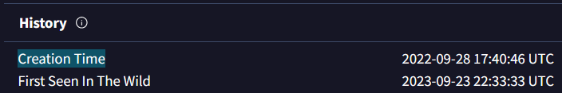
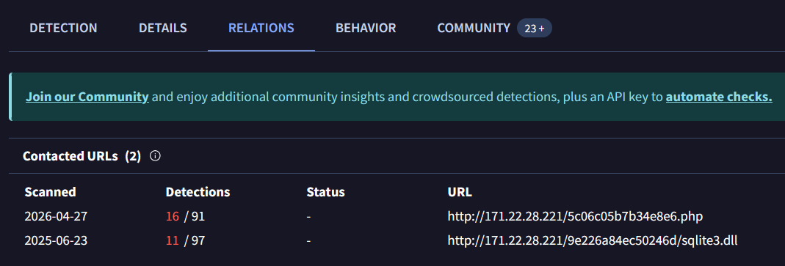
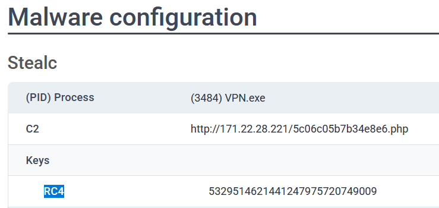
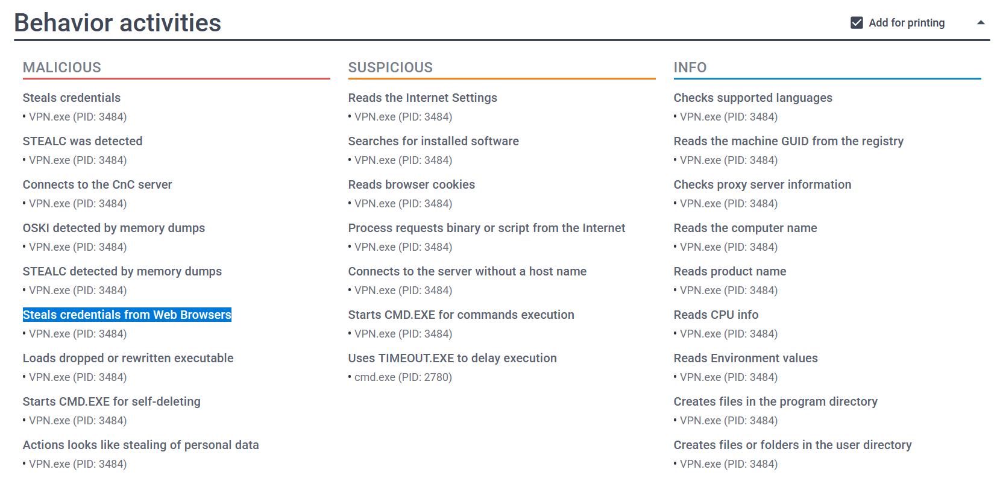
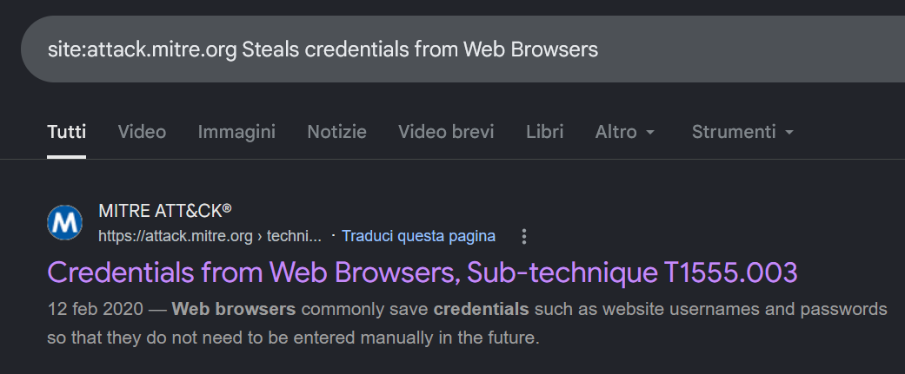
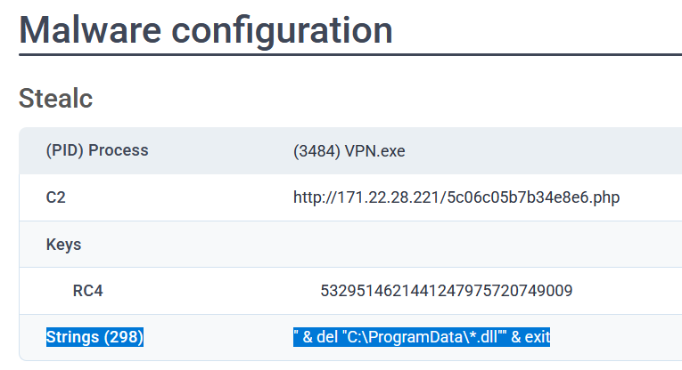
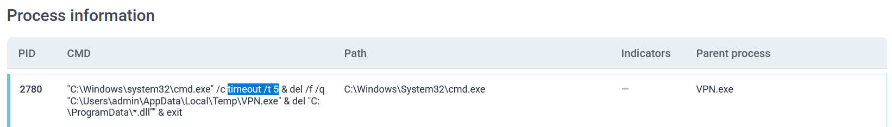

# WebStrike - PCAP Analysis (CyberDefenders)

## Scenario
The accountant at the company received an email titled "Urgent New Order" from a client late in the afternoon.
When he attempted to access the attached invoice, he discovered it contained false order information.
Subsequently, the SIEM solution generated an alert regarding downloading a potentially malicious file.
Upon initial investigation, it was found that the PPT file might be responsible for this download.
Could you please conduct a detailed examination of this file?

## References
- https://cyberdefenders.org/blueteam-ctf-challenges/oski/

### Q1 - Determining the creation time of the malware can provide insights into its origin. What was the time of malware creation?

I searched the malware on VirusTotal using the hash provided by CyberDefenders.

In the **History** section, VirusTotal reports the malware **Creation Time** as:

```text
2022-09-28 17:40:46 UTC
```
 

**Answer:** `2022-09-28 17:40`

### Q2 - Identifying the command and control (C2) server that the malware communicates with can help trace back to the attacker. Which C2 server does the malware in the PPT file communicate with?

I checked the **Relations** tab on VirusTotal for the malware hash.

Under **Contacted URLs**, the sample shows communication with this URL:

```text
http://171.22.28.221/5c06c05b7b34e8e6.php
```



This is the C2 endpoint because it is the contacted PHP URL, while the other contacted URL points to the downloaded/requested library:

```text
http://171.22.28.221/9e226a84ec50246d/sqlite3.dll
```

> [!NOTE]
> A C2, or command-and-control server, is the remote infrastructure used by malware to communicate with the attacker.
> It can be used to receive commands, download additional payloads, upload stolen data, or report that the infected machine is active.

**Answer:** `http://171.22.28.221/5c06c05b7b34e8e6.php`

### Q3 - Identifying the initial actions of the malware post-infection can provide insights into its primary objectives. What is the first library that the malware requests post-infection?

From the same VirusTotal **Relations** screenshot, the second contacted URL points directly to a DLL file:

```text
http://171.22.28.221/9e226a84ec50246d/sqlite3.dll
```

Since the question asks for the first library requested post-infection, the relevant artifact is the filename at the end of that URL.

The PHP URL is the C2 endpoint, while `sqlite3.dll` is the library requested by the malware after infection.

**Answer:** `sqlite3.dll`

### Q4 - By examining the provided Any.run report, what RC4 key is used by the malware to decrypt its base64-encoded string?

I opened the [Any.run report](https://any.run/report/a040a0af8697e30506218103074c7d6ea77a84ba3ac1ee5efae20f15530a19bb/d55e2294-5377-4a45-b393-f5a8b20f7d44) provided by CyberDefenders.

In the **Malware configuration** section, under **Stealc**, the report shows the malware process:

```text
(PID) Process: (3484) VPN.exe
```

The same section also lists the C2 endpoint:

```text
http://171.22.28.221/5c06c05b7b34e8e6.php
```



Under **Keys**, the report explicitly shows the RC4 key used by the malware.

This value is the key used to decrypt the malware’s base64-encoded string.

> [!NOTE]
> RC4 is an encryption method.
> In simple terms, the malware keeps some data hidden inside the file.
> To read it, it uses an RC4 key, which works like a technical password that turns unreadable data back into readable text.
> In this case, it helps recover hidden malware information such as URLs, configuration values, or commands.

**Answer:** `5329514621441247975720749009`

### Q5 - By examining the MITRE ATT&CK techniques displayed in the Any.run sandbox report, identify the main MITRE technique (not sub-techniques) the malware uses to steal the user’s password.

For this question, I started from the **Behavior activities** section in the Any.run report.

The relevant behavior was listed under **Malicious** as:

```text
Steals credentials from Web Browsers
```



To map that behavior to MITRE ATT&CK, I searched directly inside the official MITRE ATT&CK website with:

```text
site:attack.mitre.org Steals credentials from Web Browsers
```


Google returned the MITRE page for:

```text
Credentials from Web Browsers, Sub-technique T1555.003
```

Before jumping to the final value, I opened and read the MITRE page to confirm the relationship between the technique and the sub-technique.

The page shows that **Credentials from Web Browsers** is only the sub-technique:

```text
T1555.003
```

The question specifically asks for the **main MITRE technique**, not the sub-technique, so I used the parent technique:

```text
T1555
```

**Answer:** `T1555`

### Q6 - By examining the child processes displayed in the Any.run sandbox report, which directory does the malware target for the deletion of all DLL files?

You do not strictly need to rely on the **child processes** section for this question.

In the Any.run **Malware configuration** section, the decrypted strings already expose the self-deletion command:

```text
& del "C:\ProgramData\*.dll" & exit
```


This command deletes every `.dll` file inside:

```text
C:\ProgramData
```

The `*.dll` part means “all files ending with `.dll`”, while `C:\ProgramData\` is the targeted directory.

The child processes can still be used as confirmation, but the directory is already clearly recoverable from the malware configuration strings.

**Answer:** `C:\ProgramData`

### Q7 - Understanding the malware's behavior post-data exfiltration can give insights into its evasion techniques. By analyzing the child processes, after successfully exfiltrating the user's data, how many seconds does it take for the malware to self-delete?

In the **Process information** section, the child process `cmd.exe` shows the self-deletion command executed by `VPN.exe`.

The relevant part is:

```text
timeout /t 5
```


This means the command waits **5 seconds** before continuing.

After that delay, it deletes the malware executable from the temp directory:

```text
del /f /q "C:\Users\admin\AppData\Local\Temp\VPN.exe"
```

Then it deletes the DLL files from `C:\ProgramData`:

```text
del "C:\ProgramData\*.dll"
```

**Answer:** `5`
