# Intel101 - Threat Intel (CyberDefenders)

## Scenario

This exercise focuses on Open-Source Intelligence (OSINT) as a method for mining and analyzing publicly available data.
It aims to enhance skills in producing valuable insights when investigating external threats in the role of a security blue team analyst.
Through practical application, participants will learn to effectively gather and interpret information to improve overall security measures.

## References

* [https://cyberdefenders.org/blueteam-ctf-challenges/intel101/](https://cyberdefenders.org/blueteam-ctf-challenges/intel101/)

### Q1 - Who is the Registrar for jameskainth.com?

From the WHOIS lookup for `jameskainth.com`, the **Registrar Information** section shows:

```text
NameCheap, Inc.
```

<a href="screenshots/034-intel101-threat-intel-cyberdefender-image.png">
  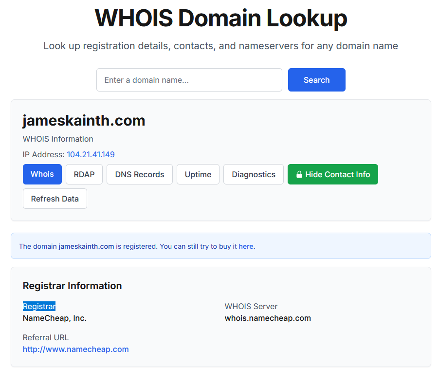
</a>

**Answer:** `NameCheap`

### Q2 - What is the Zoom meeting id of the British Prime Ministers Cabinet Meeting?

I searched on Google for:

```text
British Prime Ministers Cabinet Meeting Zoom
```

<a href="screenshots/034-intel101-threat-intel-cyberdefender-image-1.png">
  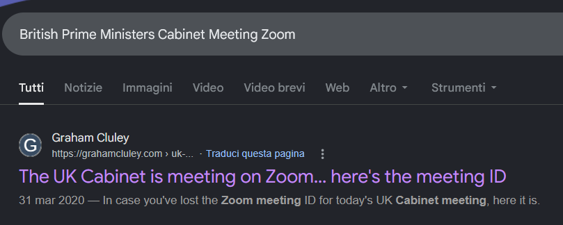
</a>

The result led to an article about the UK Cabinet meeting on Zoom, and the image itself shows the meeting ID in the top-left corner:

```text
Zoom Meeting ID: 539-544-323
```

<a href="screenshots/034-intel101-threat-intel-cyberdefender-image-2.png">
  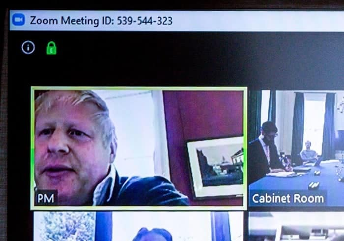
</a>

Since CyberDefenders requires a numeric answer, I removed the hyphens.

**Answer:** `539544323`

### Q3 - In 1998 specifically on February 12th, Champlain was planning on adding an exciting new building to its campus. Back then, it was called “The Information Commons”. Can you find a picture of what the inside would look like? Submit the SHA256 hash.

The main difficulty was the Google search.

Searching directly for the terms from the question returned direct answers and write-ups from the lab, so I avoided using those results.

For that reason, I treated the date in the question as the real lead and used the **Wayback Machine** instead.

<a href="screenshots/034-intel101-threat-intel-cyberdefender-image-3.png">
  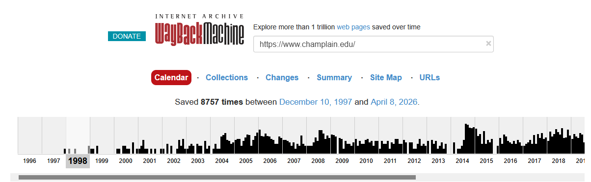
</a>

I searched the archived `champlain.edu` website around:

```text
February 12, 1998
```

<a href="screenshots/034-intel101-threat-intel-cyberdefender-image-4.png">
  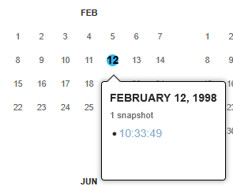
</a>

<a href="screenshots/034-intel101-threat-intel-cyberdefender-image-5.png">
  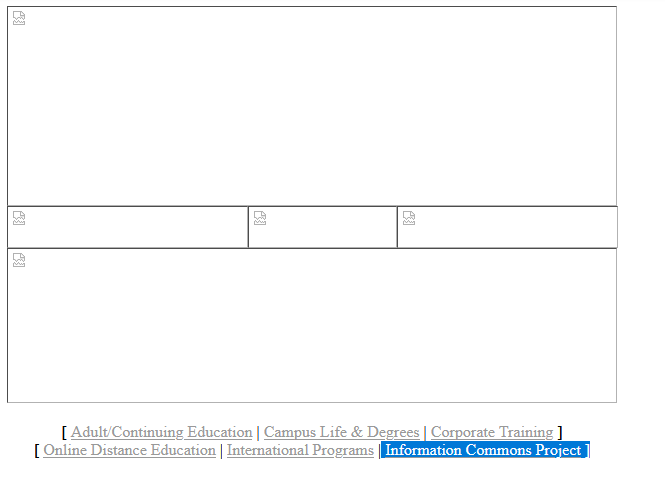
</a>

On that archived page, I found the link:

```text
Information Commons Project
```

<a href="screenshots/034-intel101-threat-intel-cyberdefender-image-6.png">
  
</a>

Opening it showed the old project page for:

```text
Champlain College Information Commons
New Technology/Library Building
```

The question asked for a picture of what the **inside** would look like, so I ignored the exterior rendering and used the interior rendering shown lower on the page.

I downloaded the image file:

```text
inside1.jpg
```

Then I generated the SHA256 hash from that image file using an online tool.

<a href="screenshots/034-intel101-threat-intel-cyberdefender-image-7.png">
  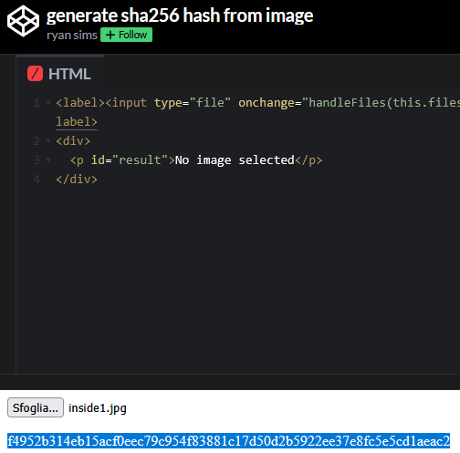
</a>

**Answer:** `f4952b314eb15acf0eec79c954f83881c17d50d2b5922ee37e8fc5e5cd1aeac2`

### Q4 - In 2019 UVM’s Ichthyology Class Had to Name their fish for class. Can you find out what the last person on the public roster named their fish?

I first searched for the UVM Ichthyology course and identified the relevant course page from the Rubenstein Ecosystem Science Laboratory.

<a href="screenshots/034-intel101-threat-intel-cyberdefender-image-8.png">
  
</a>

Since the question referred to a 2019 public roster, I checked the archived UVM pages using the **Wayback Machine**.

<a href="screenshots/034-intel101-threat-intel-cyberdefender-image-9.png">
  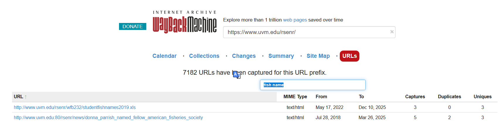
</a>

There were many archived URLs, so I used the URL filter with:

```text
fish name
```

This narrowed the results down to the relevant spreadsheet:

```text
studentfishnames2019.xls
```

I downloaded the file, uploaded it to Google Drive, and opened it with Google Sheets.

<a href="screenshots/034-intel101-threat-intel-cyberdefender-image-10.png">
  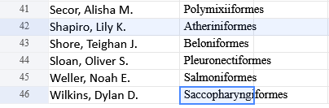
</a>

In the spreadsheet, the last person on the public roster was:

```text
Wilkins, Dylan D.
```

**Answer:** `Saccopharyngiformes`

### Q5 - Can you identify the state from which this picture was taken? See the attached photo.

This question is probably harder now than it was supposed to be years ago.

Google Lens did not give me a useful match, so I switched approach.

The question asks for the **state**, so I assumed it was referring to a U.S. state. Since the image clearly showed a dinosaur-themed place, I treated “dinosaur parks / dinosaur lands in the United States” as the next lead.

It was not guaranteed, but it was a reasonable path to follow.

<a href="screenshots/034-intel101-threat-intel-cyberdefender-image-12.png">
  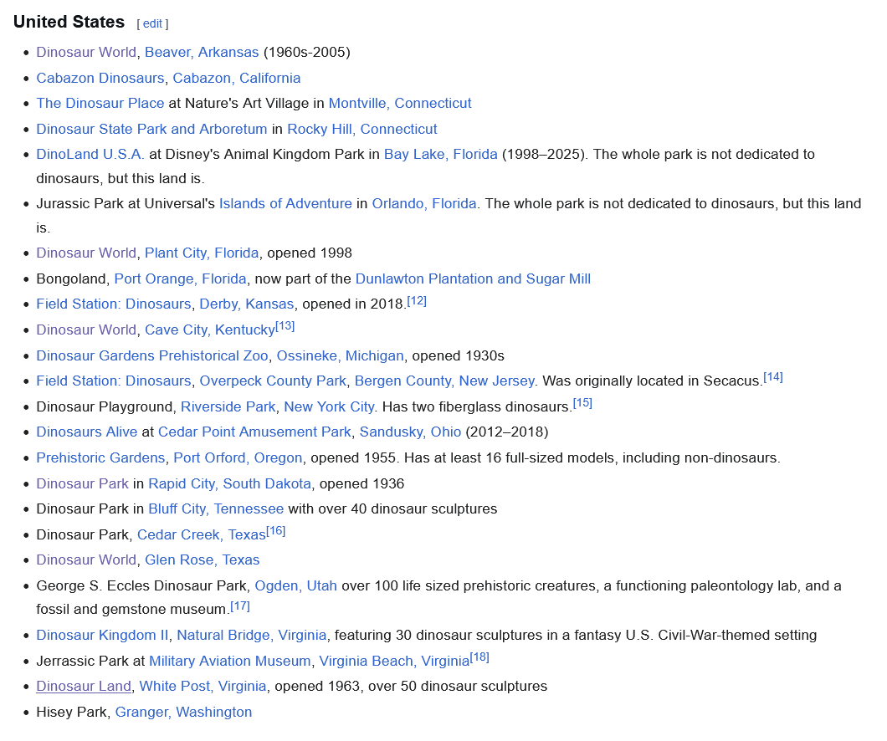
</a>

I found a list on Wikipedia of dinosaur-themed parks in the United States and started checking them one by one, using Google Lens alongside manual comparison.

After about one hour, I finally found the matching location.

<a href="screenshots/034-intel101-threat-intel-cyberdefender-image-11.png">
  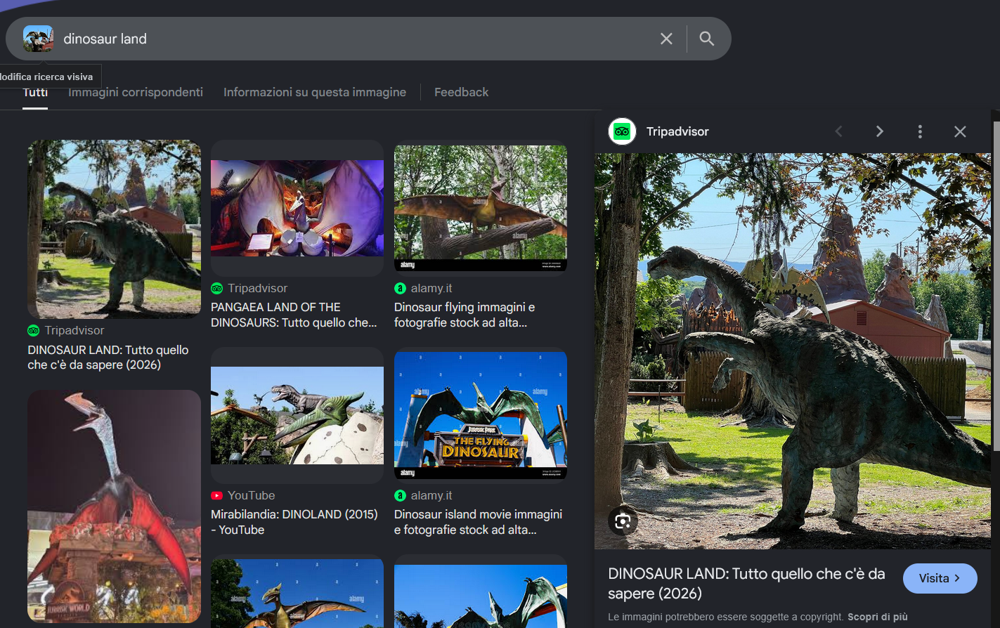
</a>

Of course, it was almost at the end of the list.

The matching place was:

```text
Dinosaur Land, White Post, Virginia
```

Since the question asks for the state, the answer is:

```text
Virginia
```

**Answer:** `Virginia`
