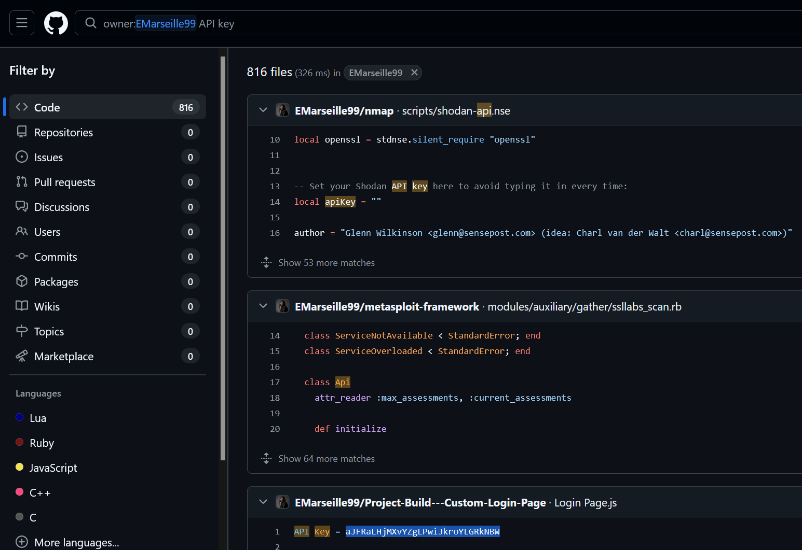
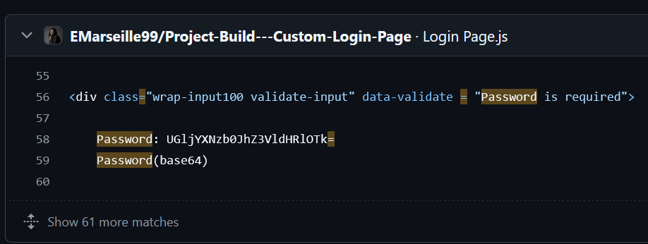
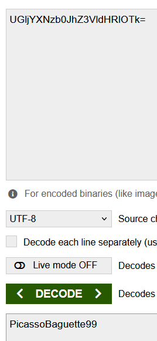
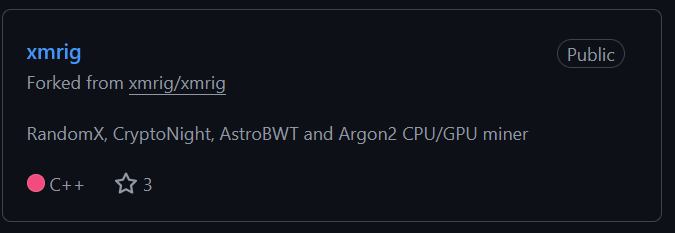
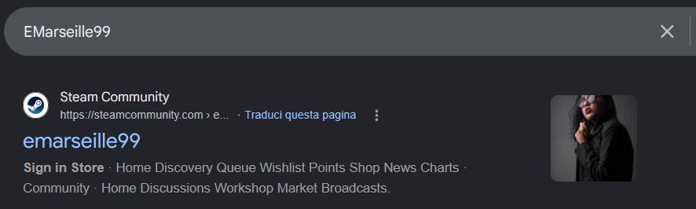
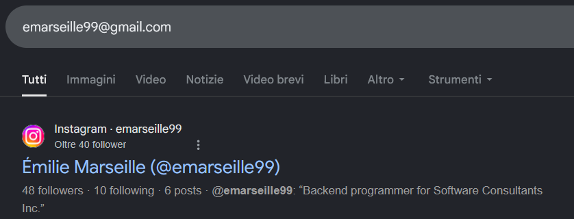
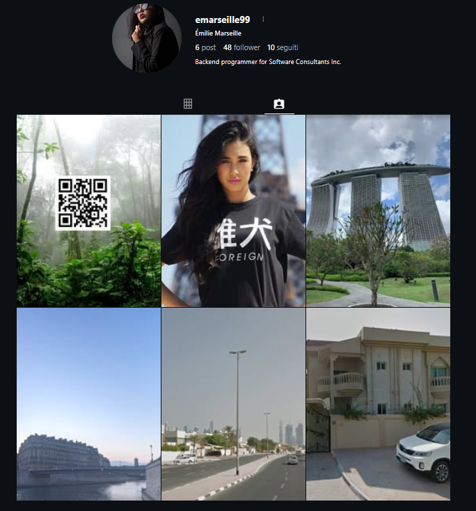
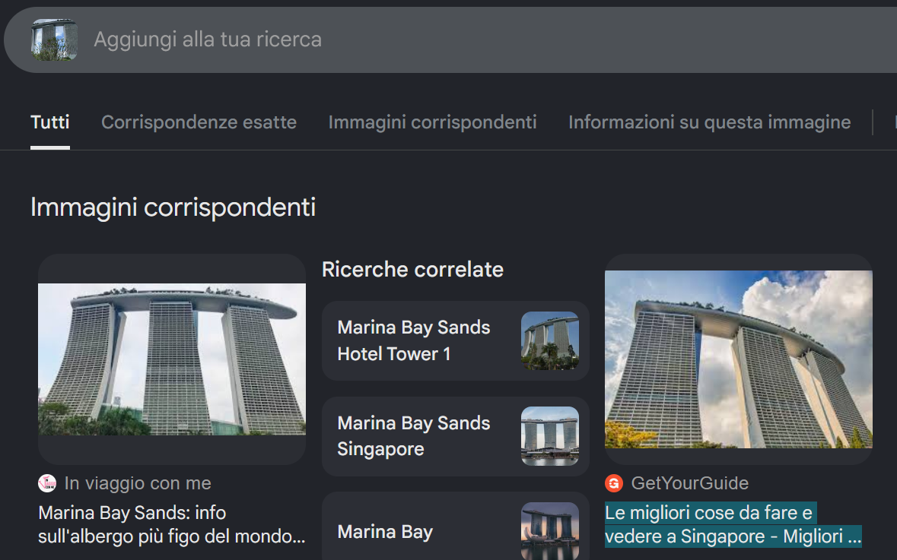
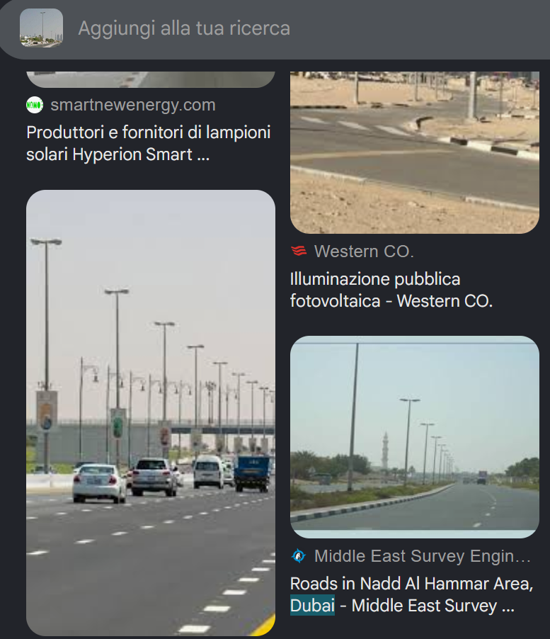
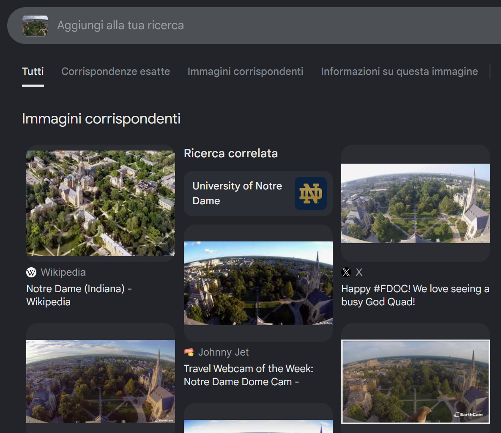

# Lespion - Threat Intel (CyberDefenders)

## Scenario

You have been tasked by a client whose network was compromised and brought offline to investigate the incident and determine the attacker's identity.

Incident responders and digital forensic investigators are currently on the scene and have conducted a preliminary investigation. 
Their findings show that the attack originated from a single user account, probably, an insider.
Investigate the incident, find the insider, and uncover the attack actions.

## References

* https://cyberdefenders.org/blueteam-ctf-challenges/lespion/

> [!CAUTION]
> This lab does not feel very useful from a practical OSINT or investigative point of view.
>
> Most answers can be found through basic Google searches, direct username lookups, or obvious profile correlation.

### Q1 - File -> Github.txt: What API key did the insider add to his GitHub repositories?

I opened the insider's GitHub profile and used the search bar to look for:

```text
API key
```
<a href="screenshots/035-lespion-threat-intel-cyberdefender-image.png">
  
</a>

At first, several results were just generic references to API keys, like comments or empty variables.

After scrolling through the results, the relevant match became clear: in the custom login page project, the file actually contained a hardcoded value next to `API Key`.

Unlike the other matches, this was not just a placeholder or a generic reference. It was the exposed API key.

**Answer:** `aJFRaLHjMXvYZgLPwiJkroYLGRkNBW`

### Q2 - File -> Github.txt: What plaintext password did the insider add to his GitHub repositories?
````markdown
I searched for:

```text
password =
````

I could probably have guessed that the value might appear as `Password:` instead of `password =`, but there was no need to overthink it here.

<a href="screenshots/035-lespion-threat-intel-cyberdefender-image-1.png">
  
</a>

While scrolling through the results, the `Login Page.js` file immediately stood out because it clearly matched the context of a login page.

In that same result, the password value was visible, and the line right below it showed `Password(base64)`.

That was the useful clue: the password was not plaintext yet, but Base64 encoded, so it had to be decoded first.

After decoding the Base64 value, the plaintext password was revealed.

<a href="screenshots/035-lespion-threat-intel-cyberdefender-image-2.png">
  
</a>

**Answer:** `PicassoBaguette99`

### Q3 - File -> Github.txt: What cryptocurrency mining tool did the insider use?

The answer was visible directly from the repository list.

<a href="screenshots/035-lespion-threat-intel-cyberdefender-image-3.png">
  
</a>

The insider had a public repository named `xmrig`, forked from `xmrig/xmrig`.
The repository description also explicitly described it as a CPU/GPU miner, so there was no need for deeper investigation here.

**Answer:** `xmrig`

### Q4 - On which gaming website did the insider have an account?

I searched the username directly on Google:

```text
EMarseille99
```
<a href="screenshots/035-lespion-threat-intel-cyberdefender-image-6.png">
  
</a>

This was the most basic lookup possible.

The result immediately showed a Steam Community profile with the same username, so there was no real need for deeper OSINT or correlation.

**Answer:** `Steam`

### Q5 - What is the link to the insider Instagram profile?

I simply copied the email address and pasted it into Google.

```text
emarseille99@gmail.com
```
<a href="screenshots/035-lespion-threat-intel-cyberdefender-image-5.png">
  
</a>

The search result immediately pointed to the Instagram profile associated with the same identity.
Opening the profile confirmed the match, because it showed the same handle and the same email address.

<a href="screenshots/035-lespion-threat-intel-cyberdefender-image-4.png">
  
</a>

**Answer:** `https://www.instagram.com/emarseille99/`

### Q6 - Which country did the insider visit on her holiday?

I used a website that allows viewing public Instagram profiles anonymously and opened the insider's profile.

<a href="screenshots/035-lespion-threat-intel-cyberdefender-image-8.png">
  
</a>

From there, I checked the visible posts and one image clearly showed a recognizable building.
To confirm it, I used image search on that picture, and the results matched `Marina Bay Sands` in Singapore.

<a href="screenshots/035-lespion-threat-intel-cyberdefender-image-7.png">
  
</a>

So the holiday location was not hard to infer: the post points directly to Singapore.

**Answer:** `Singapore`

### Q7 - Which city does the insider family live in?

Two images from the same Instagram profile pointed toward Dubai.

After checking the visible posts, I used image search on the road/building-related pictures.

At least two of them had clear Dubai-related matches or references in the results, including one result pointing to the `Nadd Al Hammar Area, Dubai`.

<a href="screenshots/035-lespion-threat-intel-cyberdefender-image-9.png">
  
</a>

That was enough to connect the profile activity to Dubai and answer the question.

**Answer:** `Dubai`

### Q8 - File -> office.jpg: You have been provided with a picture of the building in which the company has an office. Which city is the company located in?

I used Google Lens again on the provided `office.jpg`.

<a href="screenshots/035-lespion-threat-intel-cyberdefender-image-10.png">
  
</a>

The image search results matched the building with `Birmingham New Street`.

Since the question asks for the city where the company office is located, the relevant part is the city name, not the full station name.

**Answer:** `Birmingham`

### Q9 - File -> Webcam.png: With the intel, you have provided, our ground surveillance unit is now overlooking the person of interest suspected address. They saw them leaving their apartment and followed them to the airport. Their plane took off and landed in another country. Our intelligence team spotted the target with this IP camera. Which state is this camera in?

I used Google Lens again on the provided `Webcam.png`.

<a href="screenshots/035-lespion-threat-intel-cyberdefender-image-11.png">
  
</a>

The image search results matched the webcam view with the University of Notre Dame.

Since Notre Dame is located in Indiana, the state where the camera is located is Indiana.

**Answer:** `Indiana`

