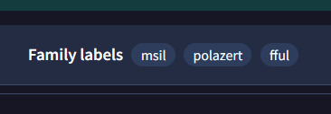
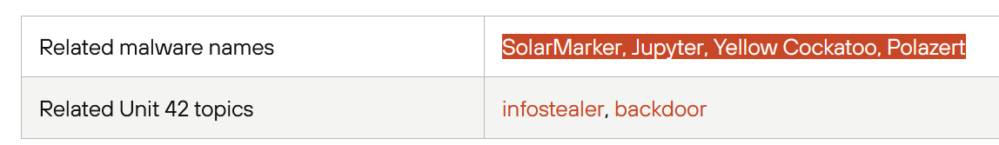
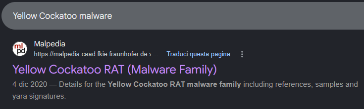
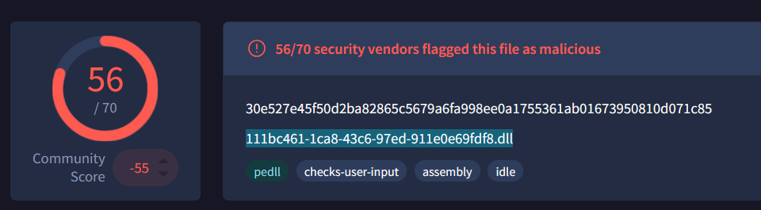
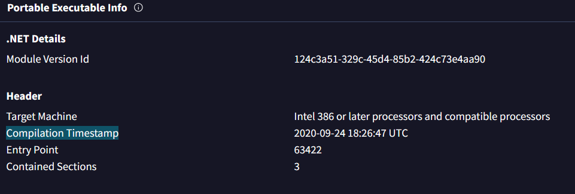
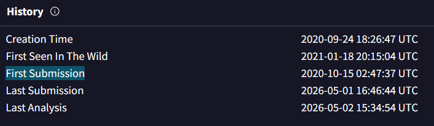
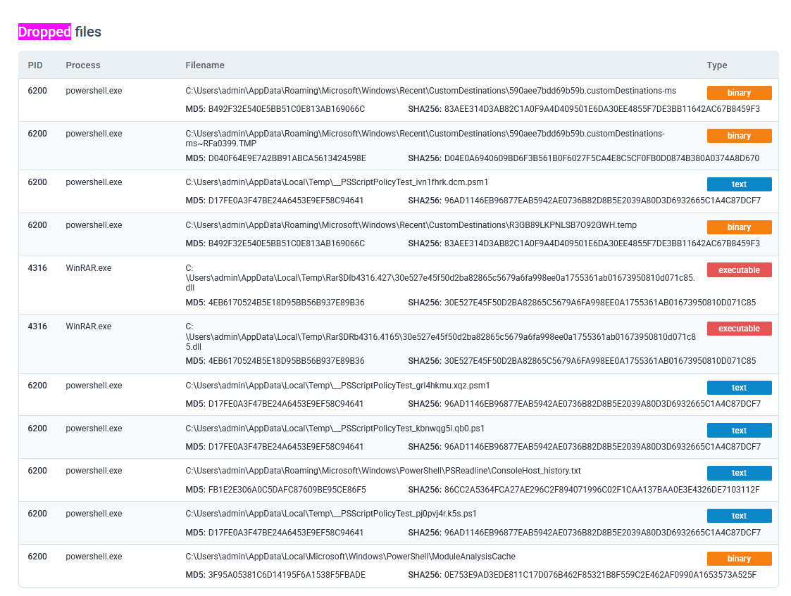
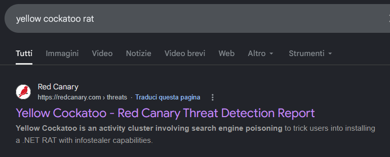
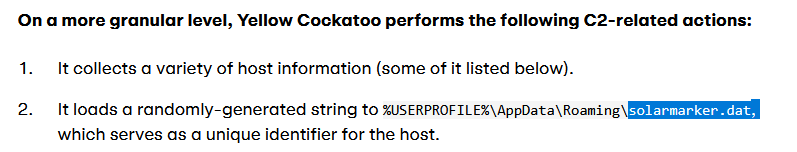
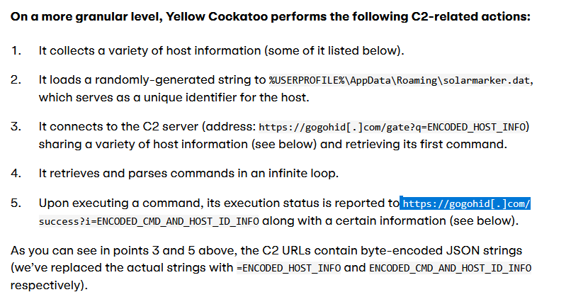

# Yellow RAT - Threat Intel (CyberDefenders)

## Scenario

During a regular IT security check at GlobalTech Industries, abnormal network traffic was detected from multiple workstations.
Upon initial investigation, it was discovered that certain employees' search queries were being redirected to unfamiliar websites.
This discovery raised concerns and prompted a more thorough investigation.
Your task is to investigate this incident and gather as much information as possible.

## References

* [https://cyberdefenders.org/blueteam-ctf-challenges/yellow-rat/](https://cyberdefenders.org/blueteam-ctf-challenges/yellow-rat/)

### Q1 - Understanding the adversary helps defend against attacks. What is the name of the malware family that causes abnormal network traffic?

I first went to VirusTotal and checked the detection names for the sample.

At first I looked at the family labels:

```text
msil
polazert
fful
```

<a href="screenshots/036-yellow-rat-threat-intel-cyberdefender-image-1.png">
  
</a>

`msil` looked too generic, because it only describes the .NET/MSIL nature of the sample.

So I focused on `polazert`, since it was the most specific label and looked more useful for pivoting.

From there I searched for `polazert` and found pages that linked it to related malware names such as:

```text
SolarMarker
Jupyter
Yellow Cockatoo
Polazert
```

<a href="screenshots/036-yellow-rat-threat-intel-cyberdefender-image.png">
  
</a>

I did not just pick the first result blindly.

I opened and read the pages to understand whether those names were actually referring to the same malware family or just random related tags.

The Malpedia result made the connection clearer, because it explicitly identified:

```text
Yellow Cockatoo RAT
```

as the malware family.

<a href="screenshots/036-yellow-rat-threat-intel-cyberdefender-image-2.png">
  
</a>

This also matched the expected masked format in the lab: three words, with the last one being `RAT`.

**Answer:** `Yellow Cockatoo RAT`

### Q2 - As part of our incident response, knowing common filenames the malware uses can help scan other workstations for potential infection. What is the common filename associated with the malware discovered on our workstations?

For Q2, I went back to VirusTotal and checked the same sample again.

This time I focused less on the family name and more on the file information shown directly on the sample page.

VirusTotal showed the filename associated with the malware sample as:

```text
111bc461-1ca8-43c6-97ed-911e0e69fdf8.dll
```

<a href="screenshots/036-yellow-rat-threat-intel-cyberdefender-image-3.png">
  
</a>

That matched the question asking for the common filename associated with the malware discovered on the workstations.

**Answer:** `111bc461-1ca8-43c6-97ed-911e0e69fdf8.dll`

### Q3 - Determining the compilation timestamp of malware can reveal insights into its development and deployment timeline. What is the compilation timestamp of the malware that infected our network?

For this question I went into:

```text
VirusTotal -> Details
```

Then I checked the PE metadata section:

```text
Portable Executable Info
```

Inside that section, I looked under:

```text
Header
```

<a href="screenshots/036-yellow-rat-threat-intel-cyberdefender-image-4.png">
  
</a>

Since the lab field expects the format `YYYY-MM-DD HH:MM`, I used the timestamp without seconds.

**Answer:** `2020-09-24 18:26`

### Q4 - Understanding when the broader cybersecurity community first identified the malware could help determine how long the malware might have been in the environment before detection. When was the malware first submitted to VirusTotal?

After checking the PE metadata for the compilation timestamp, I scrolled further up and looked at the sample history section:

```text
VirusTotal -> Details -> History
```

<a href="screenshots/036-yellow-rat-threat-intel-cyberdefender-image-5.png">
  
</a>

In that section, I focused on the field:

```text
First Submission
```

This was the value needed for the question, because it asks when the malware was first submitted to VirusTotal, not when it was compiled.

Since the lab expects the format `YYYY-MM-DD HH:MM`, I used the timestamp without seconds.

**Answer:** `2020-10-15 02:47`

### Q5 - To completely eradicate the threat from Industries' systems, we need to identify all components dropped by the malware. What is the name of the .dat file that the malware dropped in the AppData folder?

I first checked the sandbox-style information on VirusTotal and ANY.RUN.

<a href="screenshots/036-yellow-rat-threat-intel-cyberdefender-image-6.png">
  
</a>

I looked at the dropped files, because the question was asking for a `.dat` file dropped in the `AppData` folder.

The problem was that, in the dropped files list I had, I could not clearly see that `.dat` file.

At that point I could have kept digging through the sandbox artifacts, file actions, process activity, and dropped-file tables, but it did not look very efficient.

Since I already knew the malware family was:

```text
Yellow Cockatoo RAT
```

<a href="screenshots/036-yellow-rat-threat-intel-cyberdefender-image-8.png">
  
</a>

I pivoted from the malware name itself instead.

I searched on Google for analyses of Yellow Cockatoo outside VirusTotal / ANY.RUN and opened threat reports about the malware.

One of the reports explained the initial check-in behavior with the C2.

<a href="screenshots/036-yellow-rat-threat-intel-cyberdefender-image-11.png">
  
</a>

In that section, it showed that the malware sends a `hwid` value, and that this value is stored under:

```text
%USERPROFILE%\AppData\Roaming\solarmarker.dat
```

That matched the question directly, because it asked for the `.dat` file dropped in the AppData folder.

**Answer:** `solarmarker.dat`

### Q6 - It is crucial to identify the C2 servers with which the malware communicates to block its communication and prevent further data exfiltration. What is the C2 server that the malware is communicating with?

At this point, I kept reading the same external analysis instead of going back to blindly digging through VirusTotal or ANY.RUN.

The report was describing what Yellow Cockatoo does during its C2 communication, so it was directly useful for the last question.

In the C2-related actions section, it clearly said that the malware connects to this C2 server:

```text
https://gogohid[.]com/gate?q=ENCODED_HOST_INFO
```

<a href="screenshots/036-yellow-rat-threat-intel-cyberdefender-image-9.png">
  
</a>

Then it also reports command execution status back to:

```text
https://gogohid[.]com/success?i=ENCODED_CMD_AND_HOST_ID_INFO
```

So the important part was not the full URL path, but the C2 domain used by the malware.

This was enough to answer the last question, because the report explicitly tied that domain to Yellow Cockatoo’s C2 communication.

**Answer:** `https://gogohid.com`
