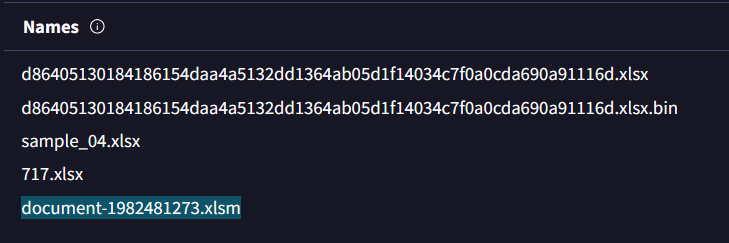
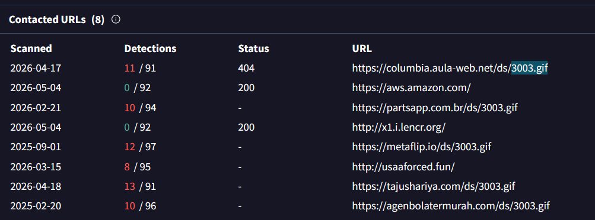
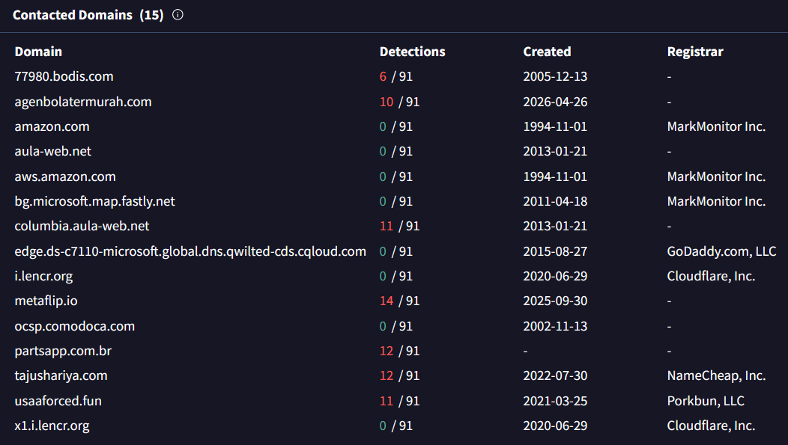
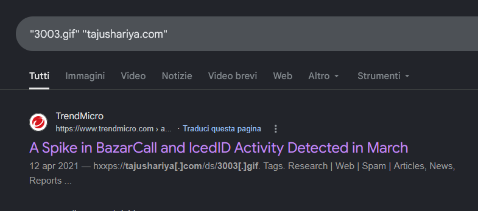
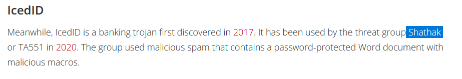
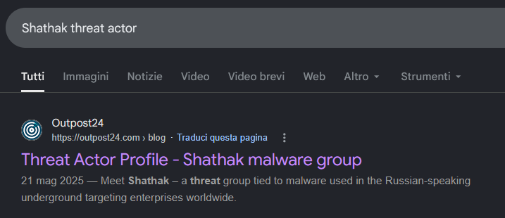
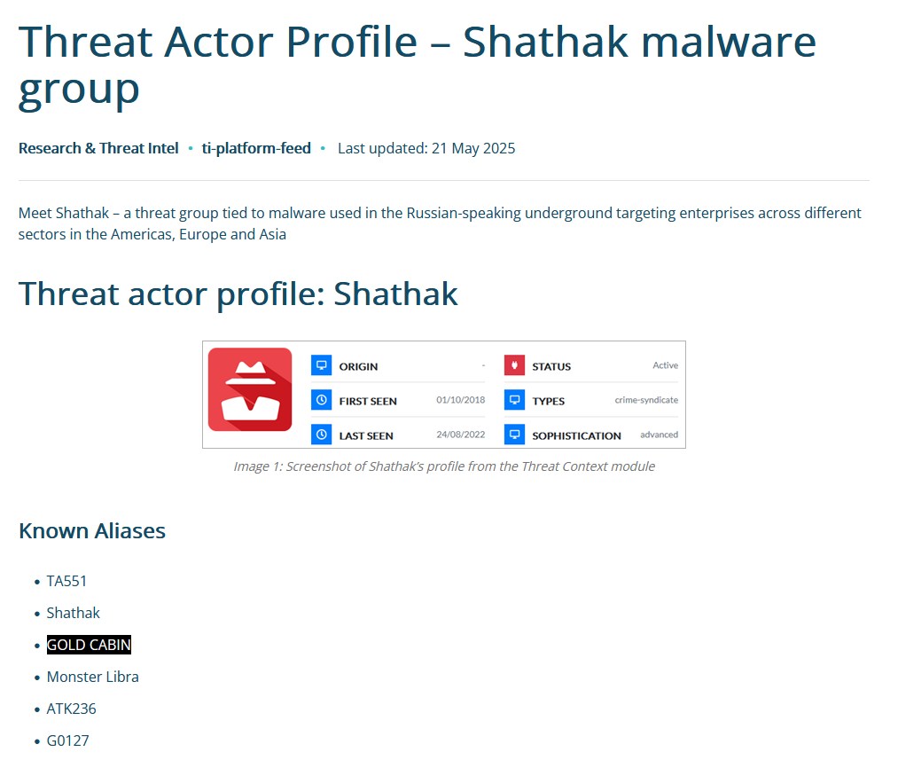
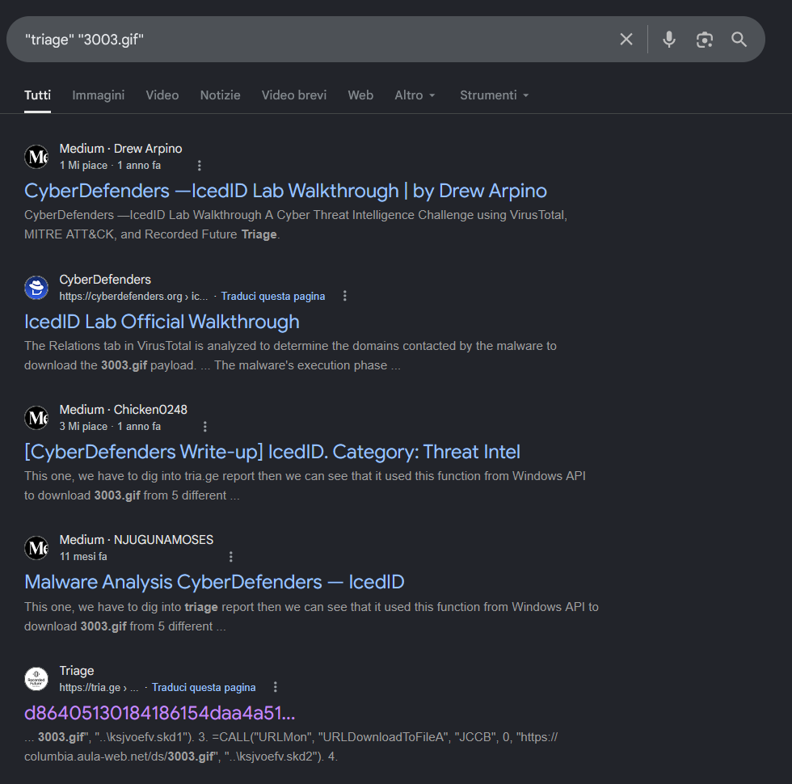
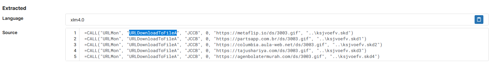

# IcedID - Threat Intel (CyberDefenders)

## Scenario

A cyber threat group was identified for initiating widespread phishing campaigns to distribute further malicious payloads. 
The most frequently encountered payloads were IcedID.
You have been given a hash of an IcedID sample to analyze and monitor the activities of this advanced persistent threat (APT) group.

## References

* https://cyberdefenders.org/blueteam-ctf-challenges/icedid/

### Q1 - What is the name of the file associated with the given hash?

I started from the hash provided by the lab and searched it on VirusTotal.

Once I opened the sample page, I went to:

```text
VirusTotal -> Details -> Names
```

<a href="screenshots/037-iceid-threat-intel-cyberdefender-image.png">
  
</a>

In the `Names` section, VirusTotal listed several filenames associated with that hash.

Among them, the filename that matched the expected format was:

```text
document-1982481273.xlsm
```

**Answer:** `document-1982481273.xlsm`

### Q2 - Can you identify the filename of the GIF file that was deployed?

For Q2, I first checked the dropped files section, because the question was asking for a deployed GIF file.

I did not find the GIF filename there, so I switched to another section instead.

I went to:

```text
VirusTotal -> Relations
```

Then I checked the contacted URLs.

<a href="screenshots/037-iceid-threat-intel-cyberdefender-image-1.png">
  
</a>

In that section, several URLs were related to the same GIF filename.

Since the question asks for the filename of the GIF file that was deployed, the relevant value was the filename itself, not the full URL.

**Answer:** `3003.gif`

### Q3 - How many domains does the malware look to download the additional payload file in Q2?

For Q3, I stayed in the same section:

```text
VirusTotal -> Relations -> Contacted URLs
```

The question specifically asks how many domains the malware looks at to download the additional payload file from Q2, so I filtered mentally only the contacted URLs that contained the GIF filename:

```text
3003.gif
```

Those URLs pointed to five different domains.

**Answer:** `5`

### Q4 - From the domains mentioned in Q3, a DNS registrar was predominantly used by the threat actor to host their harmful content, enabling the malware's functionality. Can you specify the Registrar INC?

For the next question, I used the same logic chain from the previous ones.

Q4 says to base the answer on the domains from Q3, and Q3 was based on the GIF file from Q2.

So I went through the domains that were contacted for:

```text
3003.gif
```

one by one.

In the contacted domains table, most of the domains related to that GIF did not have a registrar clearly listed.

<a href="screenshots/037-iceid-threat-intel-cyberdefender-image-2.png">
  
</a>

The one that stood out was:

```text
tajushariya.com
```

For that domain, VirusTotal showed the registrar as:

```text
NameCheap, Inc.
```
Since the lab answer format did not require the full company suffix, I used only the registrar name.

**Answer:** `NameCheap`

### Q5 - Could you specify the threat actor linked to the sample provided?

This question was a bit more interesting, because it was not just “go to VirusTotal and read the right section”.

At first, I tried the simple approach: I copied the filename and searched it together with:

```text
threat actor
```

That did not really work.

So I went a bit more specific and searched using one of the indicators connected to the GIF payload and its domain:

<a href="screenshots/037-iceid-threat-intel-cyberdefender-image-3.png">
  
</a>

That led me to a Trend Micro report about BazarCall and IcedID activity.

I gave it a quick read and found that the report mentioned IcedID being used by the threat group:

```text
Shathak
```
<a href="screenshots/037-iceid-threat-intel-cyberdefender-image-4.png">
  
</a>

That also matched what I had already seen while reading around the VirusTotal-related information, so it was not a random result.

After that, I searched the group itself more directly:

<a href="screenshots/037-iceid-threat-intel-cyberdefender-image-5.png">
  
</a>

From there I found a threat actor profile for Shathak.

Reading that page, I checked the aliases used for the same actor, and the list included:

```text
TA551
Shathak
GOLD CABIN
Monster Libra
ATK236
G0127
```
<a href="screenshots/037-iceid-threat-intel-cyberdefender-image-6.png">
  
</a>

Among those names, the one that matched CyberDefenders’ expected answer format was:

```text
GOLD CABIN
```

**Answer:** `Gold Cabin`

### Q6 - In the Execution phase, what function does the malware employ to fetch extra payloads onto the system?

For the last question, I first tried searching more generally for the malware behavior and the execution phase.

That gave me useful material to understand how IcedID works, but it also created some noise.

Some sources were describing other parts of the malware chain, like process injection or post-infection behavior, not the specific function used by this sample to fetch the extra payload.

So I changed the query and searched in a more targeted way using the artifact I already had from Q2:

<a href="screenshots/037-iceid-threat-intel-cyberdefender-image-7.png">
  
</a>

That worked better, because `3003.gif` was the payload filename from the previous questions, and `triage` was likely to expose the sandbox report where the extracted macro/code was visible.

This led me directly to results about the same CyberDefenders IcedID lab and to the Triage report.

<a href="screenshots/037-iceid-threat-intel-cyberdefender-image-8.png">
  
</a>

In the extracted XLM 4.0 macro code, the same function was used multiple times to download `3003.gif` from different domains:

```text
URLDownloadToFileA
```

So the earlier searches were useful to understand the malware, but the actual answer came from narrowing the search around the specific payload artifact.

**Answer:** `URLDownloadToFileA`
