# Red Stealer - Threat Intel (CyberDefenders)

## Scenario

You are part of the Threat Intelligence team in the SOC (Security Operations Center).
An executable file has been discovered on a colleague's computer, and it's suspected to be linked to a Command and Control (C2) server, indicating a potential malware infection.
Your task is to investigate this executable by analyzing its hash.
The goal is to gather and analyze data beneficial to other SOC members, including the Incident Response team, to respond to this suspicious behavior efficiently.

## References

* https://cyberdefenders.org/blueteam-ctf-challenges/red-stealer/

### Q1 - Categorizing malware enables a quicker and clearer understanding of its unique behaviors and attack vectors. What category has Microsoft identified for that malware in VirusTotal?

I started from the hash provided by the lab and searched it on VirusTotal.

Once I opened the sample page, I went to:

```text
VirusTotal -> Detection
```

Then I searched for the Microsoft detection, because the question specifically asks what category Microsoft identified for the malware.

<a href="screenshots/038-red-stealer-threat-intel-cyberdefender-image.png">
  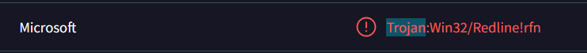
</a>

Microsoft classified it as:

```text
Trojan:Win32/Redline!rfn
```

**Answer:** `Trojan`

### Q2 - Clearly identifying the name of the malware file improves communication among the SOC team. What is the file name associated with this malware?

For Q2, I did not need to go too deep into the VirusTotal details.

The main filename was already visible near the top of the report.

VirusTotal usually shows the primary filename directly in that section, and in this case it showed:


<a href="screenshots/038-red-stealer-threat-intel-cyberdefender-image-1.png">
  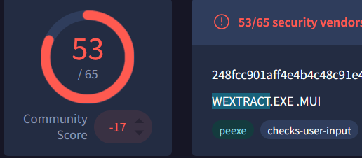
</a>

```text
WEXTRACT.EXE.MUI
```

Since the question says not to include the file extension in the name, I removed the extension part.

**Answer:** `WEXTRACT`

### Q3 - Knowing the exact timestamp of when the malware was first observed can help prioritize response actions. Newly detected malware may require urgent containment and eradication compared to older, well-documented threats. What is the UTC timestamp of the malware's first submission to VirusTotal?

This time I went to:

```text
VirusTotal -> Details -> History
```
<a href="screenshots/038-red-stealer-threat-intel-cyberdefender-image-2.png">
  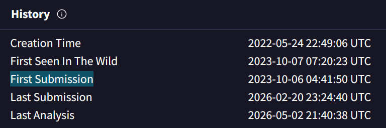
</a>

The question asks for the UTC timestamp of the malware’s first submission to VirusTotal, so the relevant field was:

```text
First Submission
```

VirusTotal showed:

```text
2023-10-06 04:41:50 UTC
```

Since the lab expects the format `YYYY-MM-DD HH:MM`, I used the timestamp without seconds.

**Answer:** `2023-10-06 04:41`

### Q4 - Understanding the techniques used by malware helps in strategic security planning. What is the MITRE ATT&CK technique ID for the malware's data collection from the system before exfiltration?

For this question, I moved to the behavioral information, because MITRE ATT&CK techniques are usually shown there.

The question mentions data collection before exfiltration, so I focused on the MITRE tactic:

```text
Collection
```

Under `Collection`, VirusTotal showed three techniques:

<a href="screenshots/038-red-stealer-threat-intel-cyberdefender-image-3.png">
  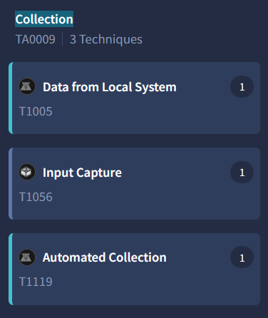
</a>

At that point I matched the question wording with the short technique descriptions.

Since the question asks about the malware’s data collection from the system before exfiltration, the technique that fit best was:

```text
Data from Local System
```

with the MITRE ATT&CK ID:

```text
T1005
```
> [!NOTE]
> For extra confirmation, this can also be checked on the dedicated MITRE ATT&CK page for the technique.

**Answer:** `T1005`

### Q5 - Following execution, which social media-related domain names did the malware resolve via DNS queries?

I went to the VirusTotal relations section:

```text
VirusTotal -> Relations -> Contacted Domains
```
<a href="screenshots/038-red-stealer-threat-intel-cyberdefender-image-6.png">
  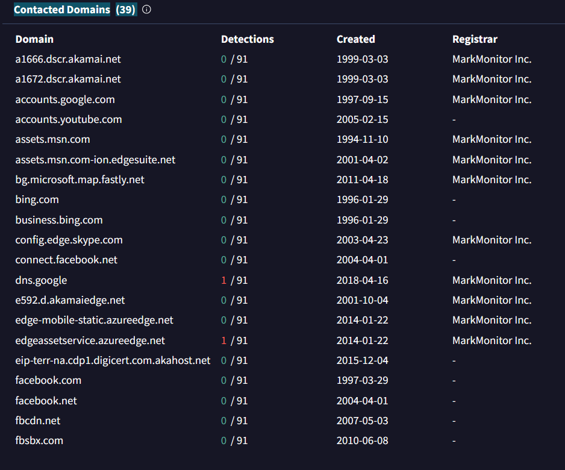
</a>

The question asks for the social media-related domain names resolved via DNS queries, so I looked through the contacted domains and focused only on the social media domains.

In the list, the relevant entries were:

```text
facebook.com
facebook.net
```

I did not use facebook.net as the final answer, because that is more of an infrastructure-related domain connected to Facebook/Meta, while the question was asking for the social media-related domain name itself.

**Answer:** `facebook.com`

### Q6 - Once the malicious IP addresses are identified, network security devices such as firewalls can be configured to block traffic to and from these addresses. Can you provide the IP address and destination port the malware communicates with?

For Q6, I went back to the behavior section in VirusTotal.

While looking at the MITRE behavior, I noticed the `Command and Control` tactic, and under it there was:

```text
Application Layer Protocol
```
<a href="screenshots/038-red-stealer-threat-intel-cyberdefender-image-4.png">
  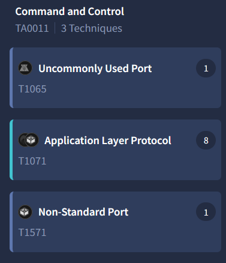
</a>

For anyone with a basic networking background, this is a good place to look for IPs or domains, because C2 communication usually means the malware is talking to some external infrastructure over an application-layer protocol.

So if the question asks for the IP address and destination port the malware communicates with, the C2-related behavior is directly relevant.

Opening that behavior entry, VirusTotal clearly showed:

<a href="screenshots/038-red-stealer-threat-intel-cyberdefender-image-5.png">
  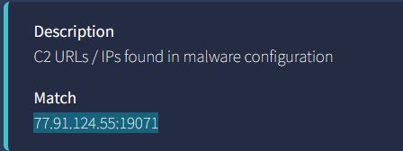
</a>

and the match was:

```text
77.91.124.55:19071
```

So the IP is the C2 host, meaning attacker-controlled infrastructure used by the malware for command and control communication.

**Answer:** `77.91.124.55:19071`

### Q7 - YARA rules are designed to identify specific malware patterns and behaviors. Using MalwareBazaar, what's the name of the YARA rule created by "Varp0s" that detects the identified malware?

I simply searched on Google for:

```text
MalwareBazaar 248FCC901AFF4E4B4C48C91E4D78A939BF681C9A1BC24ADDC3551B32768F907B
```

The MalwareBazaar page for the sample appeared immediately in the results, so I opened it.

From there, I looked for the section:

```text
YARA Signatures
```
<a href="screenshots/038-red-stealer-threat-intel-cyberdefender-image-7.png">
  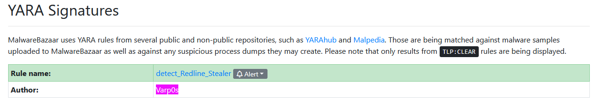
</a>

In that section, MalwareBazaar showed a YARA rule created by:

```text
Varp0s
```

The rule name was:

```text
detect_Redline_Stealer
```

**Answer:** `detect_Redline_Stealer`

### Q8 - Understanding which malware families are targeting the organization helps in strategic security planning for the future and prioritizing resources based on the threat. Can you provide the different malware alias associated with the malicious IP address according to ThreatFox?

I used ThreatFox because the question specifically asks for the alias according to ThreatFox.

Before searching, I checked the ThreatFox search syntax.

<a href="screenshots/038-red-stealer-threat-intel-cyberdefender-image-8.png">
  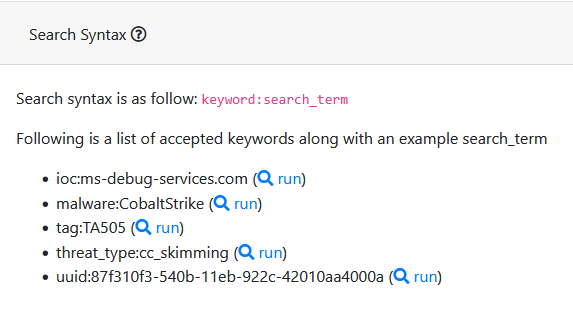
</a>


Since I had already found the C2 IP and port earlier, I searched for the IOC directly with:

```text
ioc:77.91.124.55:19071
```

This was the most direct way, but the same result could also have been found by searching only the IP or by pivoting from the malware family.

ThreatFox returned the IOC entry associated with: 77.91.124.55:19071.

<a href="screenshots/038-red-stealer-threat-intel-cyberdefender-image-9.png">
  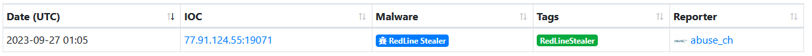
</a>

I opened the entry and checked the details.

In the IOC details, the malware was listed as:

```text
RedLine Stealer
```

and the `Malware alias` field showed:

```text
RECORDSTEALER
```

<a href="screenshots/038-red-stealer-threat-intel-cyberdefender-image-10.png">
  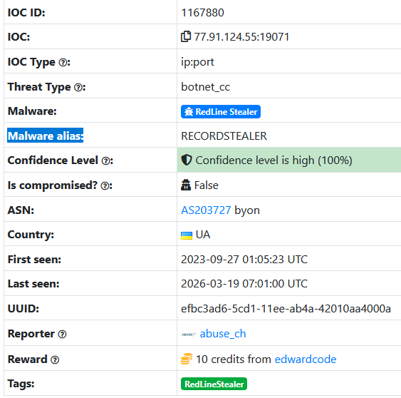
</a>


That was the alias requested by the question.

**Answer:** `RECORDSTEALER`

### Q9 - By identifying the malware's imported DLLs, we can configure security tools to monitor for the loading or unusual usage of these specific DLLs. Can you provide the DLL utilized by the malware for privilege escalation?

For Q9, I went back to:

```text
VirusTotal -> Behavior
```

Since the question was asking about privilege escalation, I looked specifically at the `Privilege Escalation` tactic.

<a href="screenshots/038-red-stealer-threat-intel-cyberdefender-image-11.png">
  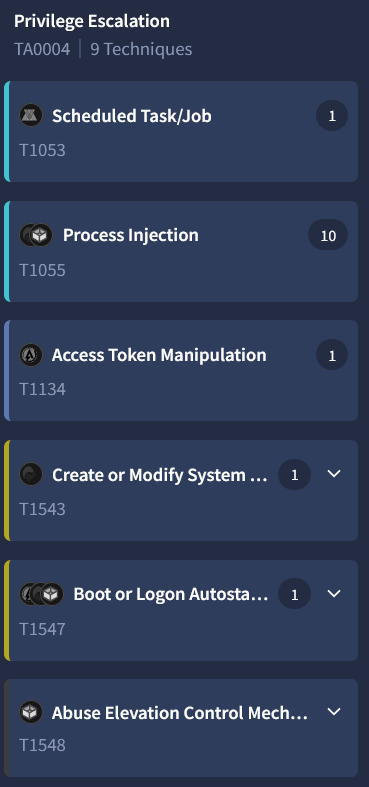
</a>

There were several techniques listed there, but the one that clearly matched the question was:

```text
Access Token Manipulation
```
<a href="screenshots/038-red-stealer-threat-intel-cyberdefender-image-12.png">
  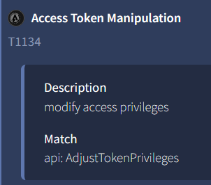
</a>

The short description said:

```text
modify access privileges
```

That matched the wording of the question, because it was asking about the DLL used by the malware for privilege escalation.

Opening that entry, VirusTotal showed the matched API:

```text
AdjustTokenPrivileges
```

At that point I searched that API on Google:

```text
api: AdjustTokenPrivileges
```
<a href="screenshots/038-red-stealer-threat-intel-cyberdefender-image-13.png">
  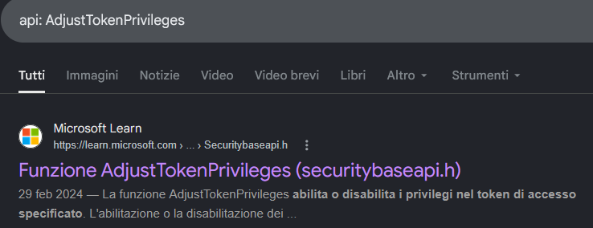
</a>

The Microsoft Learn page for `AdjustTokenPrivileges` showed the technical details of the function.

In the requirements table, the DLL listed for that function was:

```text
Advapi32.dll
```
<a href="screenshots/038-red-stealer-threat-intel-cyberdefender-image-14.png">
  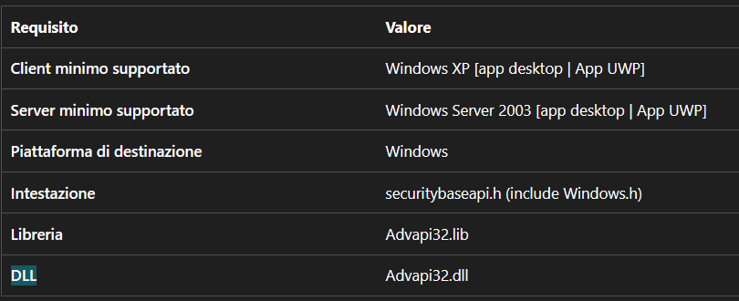
</a>

**Answer:** `Advapi32.dll`