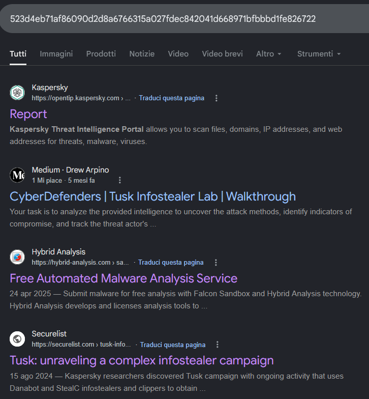
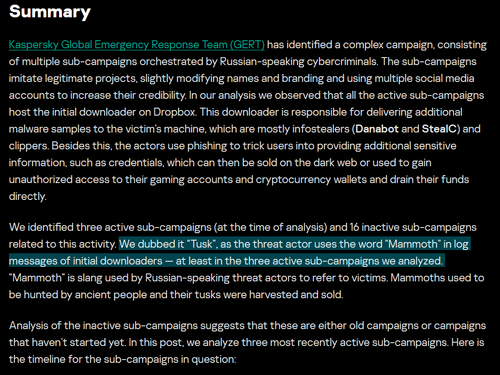
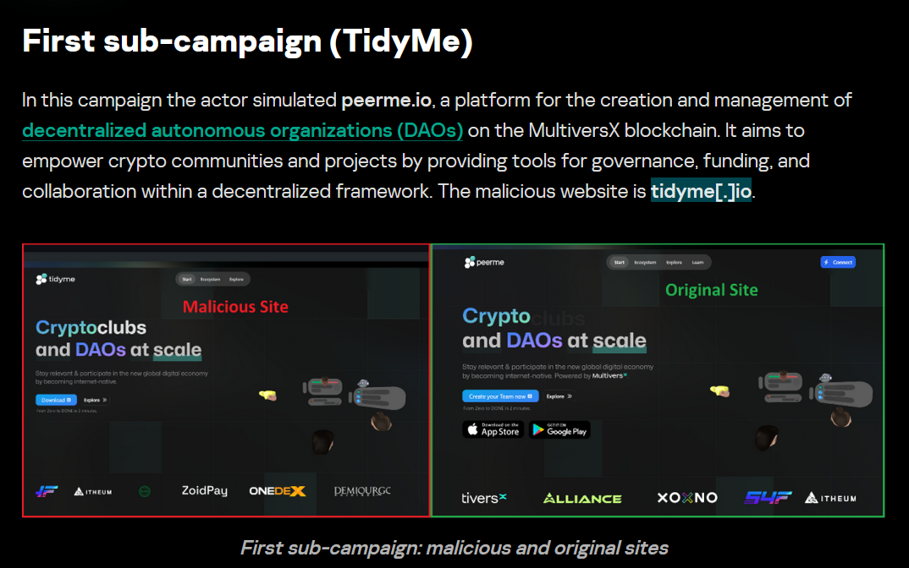
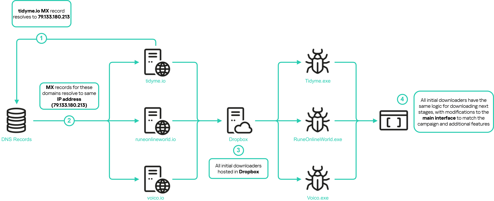
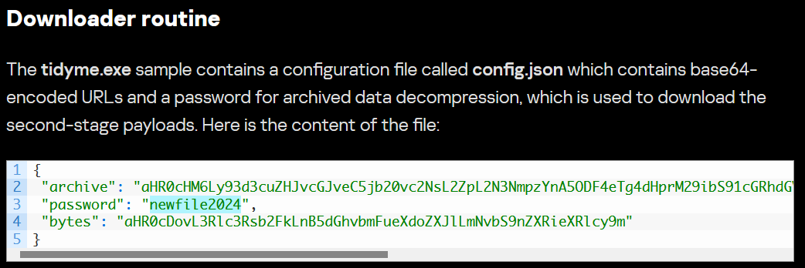
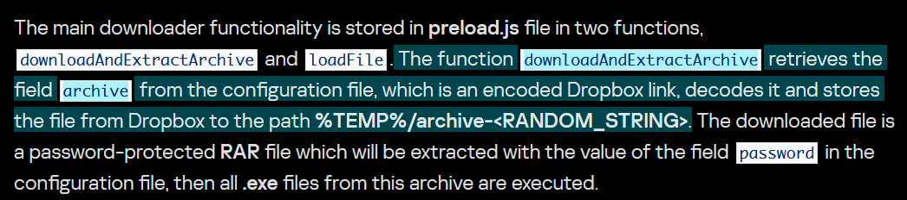
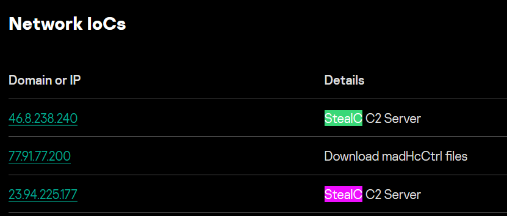
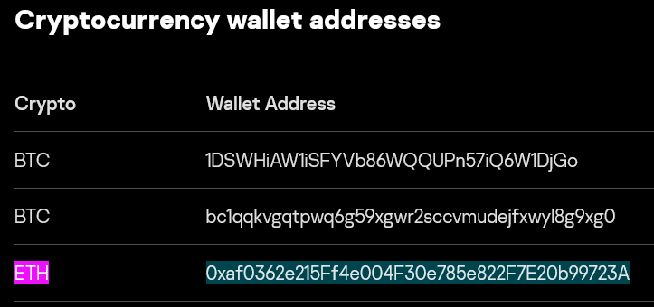

# Tusk Infostealer - Threat Intel (CyberDefenders)

## Scenario
A blockchain development company detected unusual activity when an employee was redirected to an unfamiliar website while accessing a DAO management platform. Soon after, multiple cryptocurrency wallets linked to the organization were drained. 
Investigators suspect a malicious tool was used to steal credentials and exfiltrate funds.

Your task is to analyze the provided intelligence to uncover the attack methods, identify indicators of compromise, and track the threat actor’s infrastructure.

## References

* https://cyberdefenders.org/blueteam-ctf-challenges/tusk-infostealer/


### Q1 - In KB, what is the size of the malicious file?

For Q1, I started from the hash provided by the lab and searched it on VirusTotal.

Once I opened the sample page, I went to:

```text
VirusTotal -> Details
```

Then I checked the `Basic properties` section, because the question asks for the file size in KB.

<a href="screenshots/039-tusk-infostealer-threat-intel-cyberdefender-image.png">
  
</a>

In that section, VirusTotal showed:

```text
File size: 921.36 KB (943472 bytes)
```

Since the question asks specifically for the size in KB, I used only the KB value.

**Answer:** `921.36`

### Q2 - What word do the threat actors use in log messages to describe their victims, based on the name of an ancient hunted creature?

I did not find this information directly inside VirusTotal.

So I searched the sample hash on Google and looked for external analysis around the campaign.

<a href="screenshots/039-tusk-infostealer-threat-intel-cyberdefender-image-1.png">
  
</a>

That led me to the Securelist/Kaspersky report about the Tusk infostealer campaign.

The report explained the campaign context and why Kaspersky called it `Tusk`.

In the summary, it says that the threat actor uses the word:

```text
Mammoth
```

<a href="screenshots/039-tusk-infostealer-threat-intel-cyberdefender-image-2.png">
  
</a>

in log messages of the initial downloaders.

The report also explains the reason behind the term: `Mammoth` is slang used by Russian-speaking threat actors to refer to victims, and mammoths were ancient creatures hunted by humans.

That matched the question directly, because it asks for the word used in log messages to describe victims, based on an ancient hunted creature.

**Answer:** `Mammoth`

### Q3 - The threat actor set up a malicious website to mimic a platform designed for creating and managing decentralized autonomous organizations (DAOs) on the MultiversX blockchain (peerme.io). What is the name of the malicious website the attacker created to simulate this platform?

I stayed on the same Securelist/Kaspersky report and kept reading the campaign analysis.

The question mentions the platform `peerme.io`, so I looked for the section where the report describes the sub-campaign that mimicked PeerMe.

In the first sub-campaign section, called:

```text
First sub-campaign (TidyMe)
```

the report explains that the actor simulated `peerme.io`, which is a platform for creating and managing DAOs on the MultiversX blockchain.

<a href="screenshots/039-tusk-infostealer-threat-intel-cyberdefender-image-3.png">
  
</a>

In the same paragraph, it clearly states that the malicious website was:

```text
tidyme[.]io
```

The screenshot comparison also confirmed this, because the malicious site is shown on the left and the original PeerMe site is shown on the right.

Since CyberDefenders asks for the malicious website name, I used the defanged domain from the report.

**Answer:** `tidyme.io`

### Q4 - Which cloud storage service did the campaign operators use to host malware samples for both macOS and Windows OS versions?

I stayed on the same Securelist/Kaspersky report.

The answer was already mentioned in the summary, where the report says that all active sub-campaigns hosted the initial downloader on:

```text
Dropbox
```

But the diagram made the concept clearer.

<a href="screenshots/039-tusk-infostealer-threat-intel-cyberdefender-image-4.png">
  
</a>

It shows the flow from the campaign domains, such as:

```text
tidyme.io
runeonlineworld.io
voico.io
```

to Dropbox, and then from Dropbox to the initial downloader executables:

```text
Tidyme.exe
RuneOnlineWorld.exe
Voico.exe
```

So the cloud storage service used to host the malware samples was Dropbox.

> [!NOTE]
> This report is very well written. It does not just list indicators, it also explains the campaign flow clearly enough to understand how the infrastructure, downloaders, and payload delivery are connected.

**Answer:** `Dropbox`

### Q5 - The malicious executable contains a configuration file that includes base64-encoded URLs and a password used for archived data decompression, enabling the download of second-stage payloads. What is the password for decompression found in this configuration file?

I stayed in the downloader routine section of the same report.

The report explains that the `tidyme.exe` sample contains a configuration file called:

```text
config.json
```
<a href="screenshots/039-tusk-infostealer-threat-intel-cyberdefender-image-5.png">
  
</a>

This file contains base64-encoded URLs and a password used for archived data decompression.

In the displayed `config.json` content, the password field was:

```text
"password": "newfile2024"
```

So the decompression password found in the configuration file was:

```text
newfile2024
```

**Answer:** `newfile2024`

### Q6 - What is the name of the function responsible for retrieving the field archive from the configuration file?

For Q6, I could have added several screenshots from the report, because the downloader routine is explained in more detail across the analysis.

But in this lab the goal is just to answer the questions, not to rewrite the full technical analysis from the report.

Since the report is not mine, I kept it simple and used the summary paragraph that directly explains the relevant function.

<a href="screenshots/039-tusk-infostealer-threat-intel-cyberdefender-image-6.png">
  
</a>

The report says that the main downloader functionality is stored in:

```text
preload.js
```

inside two functions:

```text
downloadAndExtractArchive
LoadFile
```

The question asks for the function responsible for retrieving the `archive` field from the configuration file.

In the report, this is stated directly:

```text
downloadAndExtractArchive
```

This function retrieves the encoded Dropbox link from the `archive` field, decodes it, downloads the file, and then uses the password from the configuration to extract the archive.

**Answer:** `downloadAndExtractArchive`

### Q7 - In the third sub-campaign carried out by the operators, the attacker mimicked an AI translator project. What is the name of the legitimate translator, and what is the name of the malicious translator created by the attackers?

This question was also pretty straightforward.

I stayed in the same report and went to the section dedicated to the third sub-campaign:

```text
Third sub-campaign (Voico)
```
<a href="screenshots/039-tusk-infostealer-threat-intel-cyberdefender-image-7.png">
  
</a>

The report directly says that the attacker was simulating an AI translator project named:

```text
YOUS
```

The legitimate website was:

```text
yous.ai
```

while the malicious website created by the attackers was:

```text
voico[.]io
```

**Answer:** `yous.ai voico.io`

### Q8 - The downloader is tasked with delivering additional malware samples to the victim's machine, primarily infostealers like StealC and Danabot. What are the IP addresses of the StealC C2 servers used in the campaign?

For Q8, I went to the `Network IoCs` section.

<a href="screenshots/039-tusk-infostealer-threat-intel-cyberdefender-image-8.png">
  
</a>

The question asks specifically for the IP addresses of the StealC C2 servers used in the campaign, so I ignored the entries that were not marked as StealC C2.

In the table, the relevant entries were:

```text
46.8.238.240
23.94.225.177
```

The other IP was related to downloading `madHcCtrl` files, so it was not the StealC C2 answer.

**Answer:** `46.8.238.240, 23.94.225.177`

### Q9 - What is the address of the Ethereum cryptocurrency wallet used in this campaign?

At that point I had already read enough of the report to know that the Ethereum wallet was mentioned somewhere, but I did not want to manually scroll through the whole page again.

So I used `Ctrl + F` and searched for:

```text
Ethereum
```

If the exact search did not immediately catch the section, I shortened the search term by removing a few letters and searching more generally.

That brought me to the part of the report where the campaign’s Ethereum wallet address was listed.

<a href="screenshots/039-tusk-infostealer-threat-intel-cyberdefender-image-10.png">
  
</a>

Then I copied the wallet address from there.

**Answer:** `0xaf0362e215Ff4e004F30e785e822F7E20b99723A`


