# MBuchus - Threat Intel (CyberDefenders)

## Scenario
In March 2024, the security team at a mid-sized investment advisory firm noticed a wave of support tickets from employees reporting system slowdowns and suspicious pop-ups after searching for financial recovery tools online. 
Internal traffic logs showed multiple connections to an unfamiliar domain, treasurybanks.org, shortly before endpoints began exhibiting abnormal behavior.
Preliminary threat intelligence suggests this domain is part of a broader infrastructure serving malicious content under the guise of legitimate financial assistance.

Your task is to investigate artifacts from one of the compromised endpoints to uncover the attack chain. 
Determine how the initial access was gained, what was downloaded, and how attacker infrastructure—including certificates, domains, and cloud providers—played a role in the campaign. 

## References

* https://cyberdefenders.org/blueteam-ctf-challenges/mbuchus/

### Q1 - What type of malicious advertising method was used to initially lure victims to the fake financial websites?


For Q1, I searched for:

```text
"treasurybanks.org"
```

<a href="screenshots/040-mbuchus-threat-intel-cyberdefender-image.png">
  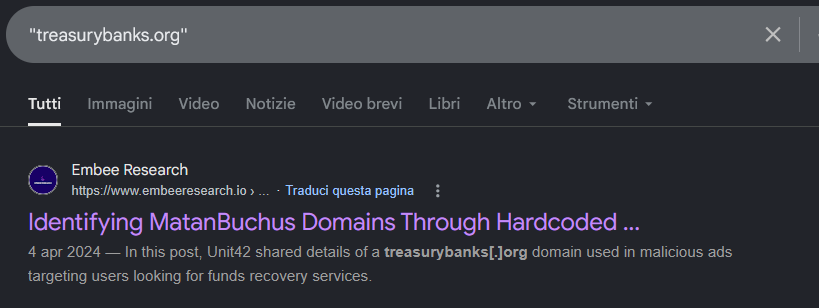
</a>


The first useful result was the Embee Research article about identifying Matanbuchus domains through hardcoded subdomains.

In the initial intelligence section, the article says that Unit42 shared details of a `treasurybanks[.]org` domain used in malicious ads targeting users looking for fund recovery services.

<a href="screenshots/040-mbuchus-threat-intel-cyberdefender-image-1.png">
  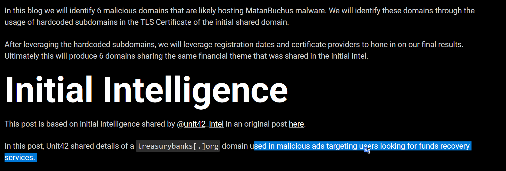
</a>


So I used that sentence as the key evidence.

The question asks what malicious advertising method was used to initially lure victims to the fake financial websites.

Since the domain was explicitly tied to malicious ads, I inferred that the expected answer was:

```text
Malvertising
```

**Answer:** `Malvertising`

> [!NOTE]
> Malvertising means malicious advertising.
> In practice, attackers use ads, sponsored results, or ad-like lures to redirect users toward malicious or fraudulent websites.
> In this case, the malicious ads targeted users looking for fund recovery services and led them toward fake financial websites.


### Q2 - What filename was downloaded by users who visited the fraudulent fund recovery site?

I kept using Google Search.

After searching around the `treasurybanks.org` domain and the Matanbuchus campaign, the Unit42 GitHub page appeared as the second result:

```text
https://github.com/PaloAltoNetworks/Unit42-timely-threat-intel/blob/main/2024-03-26-IOCs-for-Matanbuchus-infection-with-Danabot.txt
```

At the same time, I also had VirusTotal open in parallel because I was looking for other information about the domain and the related artifacts.

While doing that, I noticed that VirusTotal was also showing a page of related results, so that was another valid way to pivot and reach similar information.

<a href="screenshots/040-mbuchus-threat-intel-cyberdefender-image-3.png">
  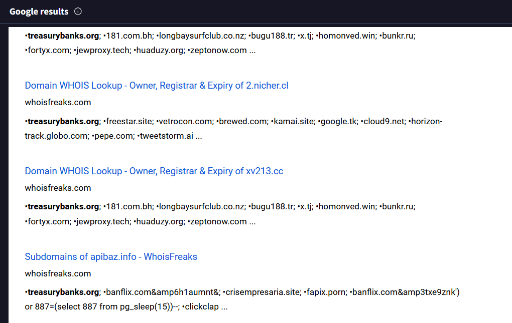
</a>

So both paths worked.

In my case, I got to the filename through Google Search first, because the GitHub IOC file was immediately visible in the results and was faster to open.

Inside the Unit42 IOC file, the `MALWARE AND ARTIFACTS` section listed the filename directly:

```text
q-report-53394.zip
```

<a href="screenshots/040-mbuchus-threat-intel-cyberdefender-image-2.png">
  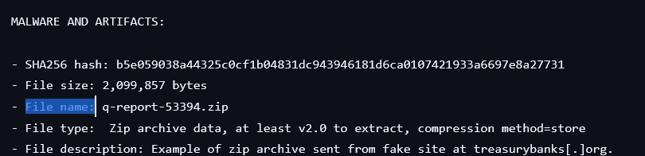
</a>


This was useful because, in the article I had opened before, the filename appeared only inside screenshots and was obscured.

**Answer:** `q-report-53394.zip`


### Q3 - Which malware family was identified inside the ZIP archive downloaded by users?

For Q3, I used the first article I had opened during the investigation.

The page was specifically about identifying MatanBuchus domains, and in the introduction it says that the malicious domains were likely hosting **MatanBuchus** malware.

<a href="screenshots/040-mbuchus-threat-intel-cyberdefender-image-4.png">
  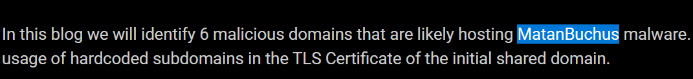
</a>

**Answer:** `MatanBuchus`

### Q4 - What is the primary function of the malware delivered in this campaign?

For Q4, I searched the malware family on Malpedia instead of going deeper into the sample behavior.

Since the previous answer already identified the family as **Matanbuchus**, I looked up Matanbuchus directly on Malpedia.

<a href="screenshots/040-mbuchus-threat-intel-cyberdefender-image-5.png">
  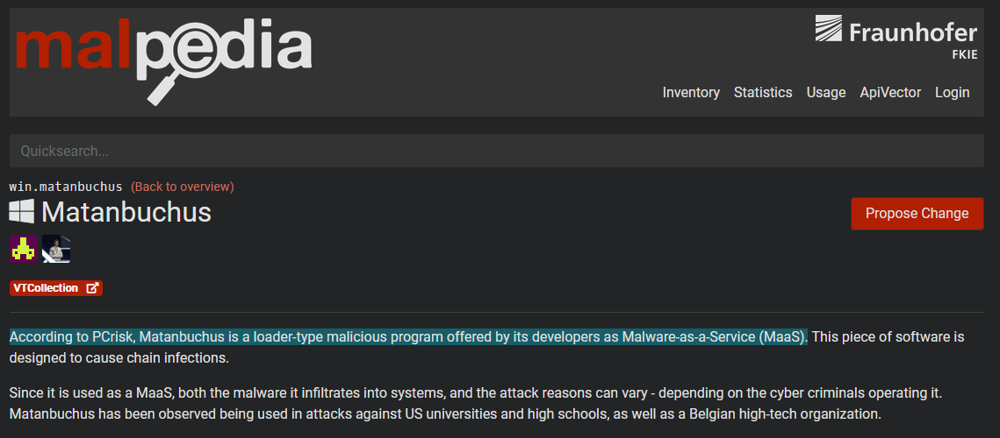
</a>

The page describes it as a **loader-type malicious program** and says it is designed to cause chain infections.

That was enough for this question, because the wording asks for the primary function of the malware, not for a full behavior analysis or the next payload.

**Answer:** `Loader`

### Q5 - What is the SHA-256 fingerprint of the TLS certificate used by the `treasurybanks.org` domain and its subdomains?

I first checked the article I had already opened, because it was the main reference I was using for the campaign.

That page had the certificate information, but the visible fingerprint there was only the SHA-1 value.

I also checked VirusTotal, but I still could not find the SHA-256 fingerprint clearly there.

So I used another online tool, `crt.sh`, because at that point it seemed like the quickest and most direct way to get the certificate fingerprint.

On `crt.sh`, I searched for `treasurybanks.org` and checked the certificate entries.

<a href="screenshots/040-mbuchus-threat-intel-cyberdefender-image-6.png">
  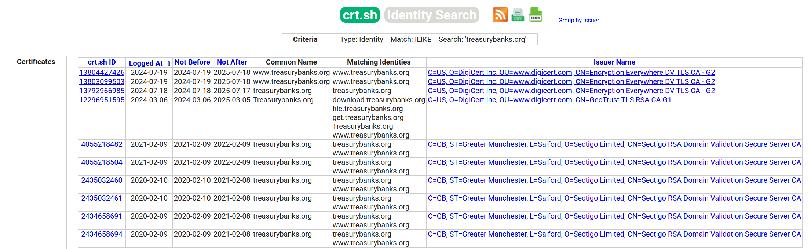
</a>

The important part was not just finding any certificate for the domain, because there were multiple certificates listed.

I needed the one that matched the question: the certificate used by `treasurybanks.org` and its subdomains.

So I selected the certificate entry that included:

```text
download.treasurybanks.org
file.treasurybanks.org
get.treasurybanks.org
Treasurybanks.org
www.treasurybanks.org
```

That matched the domain and subdomains mentioned in the question.

Inside that certificate page, the `Certificate Fingerprints` section showed the SHA-256 fingerprint directly:

<a href="screenshots/040-mbuchus-threat-intel-cyberdefender-image-7.png">
  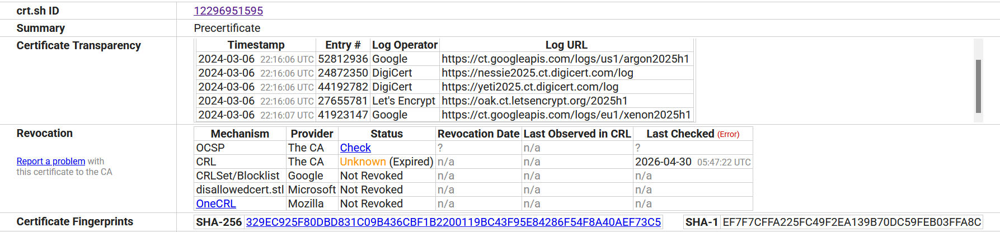
</a>

**Answer:** `329EC925F80DBD831C09B436CBF1B2200119BC43F95E84286F54F8A40AEF73C5`

### Q6 - What legitimate command-line tool filename was copied to the Temp directory before the JavaScript payload executed?

For this question, I went back to the GitHub page that had the infection chain details and the malware/artifact list.

I checked the `MALWARE AND ARTIFACTS` section again, because the question asks for a legitimate command-line tool filename copied to the Temp directory before the JavaScript payload executed.

In that section, one artifact had this file location:

```text
C:\Users\Admin\AppData\Local\Temp\TNheBOJElq.exe
```

So the file was clearly inside the user’s `Temp` directory.

Right below that, the file description said it was a copy of:

```text
C:\Windows\system32\curl.exe
```
<a href="screenshots/040-mbuchus-threat-intel-cyberdefender-image-8.png">
  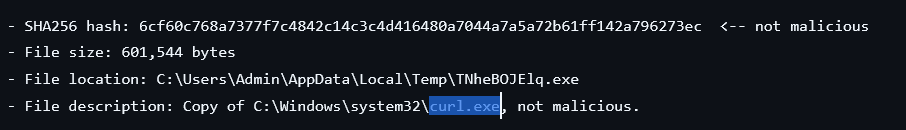
</a>

So I inferred that the legitimate command-line tool was:

```text
curl.exe
```

That also makes sense in context, because `curl.exe` is a legitimate command-line tool used to make HTTP/HTTPS requests, download files, send data, and interact with URLs from the terminal.

The artifact is marked as not malicious, which makes sense.

`curl.exe` is not malicious by nature.

The malicious part is how it is abused in the infection chain: attackers can copy or use it to download payloads, contact infrastructure, or support the next stage of execution.

**Answer:** `curl.exe`

### Q7 - Which Certificate Authority issued the valid SSL certificates used across the campaign domains?

I went back to the same certificate page on `crt.sh`.

This time I checked the certificate details more directly, not just the fingerprint section.

In the `Issuer` field, the certificate shows:

```text
commonName = GeoTrust TLS RSA CA G1
organizationName = DigiCert Inc
countryName = US
```

Since the question asks which Certificate Authority issued the valid SSL certificates, I used the `Issuer` information.

The `commonName` clearly points to:

```text
GeoTrust TLS RSA CA G1
```
<a href="screenshots/040-mbuchus-threat-intel-cyberdefender-image-9.png">
  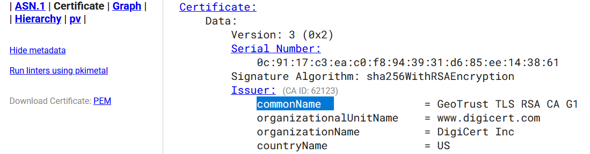
</a>

> [!NOTE]
> A Certificate Authority is the organization that issues and signs SSL/TLS certificates.
> In this certificate, the issuer section tells us which authority signed it.
> Here, the issuer common name is `GeoTrust TLS RSA CA G1`, so the CA name to extract is `GeoTrust`.

**Answer:** `GeoTrust`

### Q8 - When was the `treasurybanks.org` domain registered according to the current WHOIS information displayed on `VirusTotal`?

I went to VirusTotal, as the question specifically asks for the current WHOIS information displayed there.

In the WHOIS section for `treasurybanks.org`, the entry showed the domain details, including the `Creation Date`.

The creation date was listed as:

```text
2023-07-18T14:12:27Z
```
<a href="screenshots/040-mbuchus-threat-intel-cyberdefender-image-10.png">
  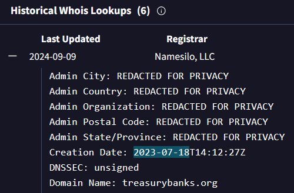
</a>

Since the question asks when the domain was registered, I used the date part.

**Answer:** `2023-07-18`

### Q9 - Which cloud infrastructure provider hosted the IP that served the `treasurybanks.org` site?

I went back to Matthew’s research write-up:

```text
https://www.embeeresearch.io/tls-certificates-for-threat-intel-dns/
```

This was the same page I had already used earlier to identify the malware family.

I simply kept scrolling through the article and reading the later sections.

Near the end, after the domain and certificate analysis, the article also showed the infrastructure details for the IP ranges tied to the campaign.

<a href="screenshots/040-mbuchus-threat-intel-cyberdefender-image-12.png">
  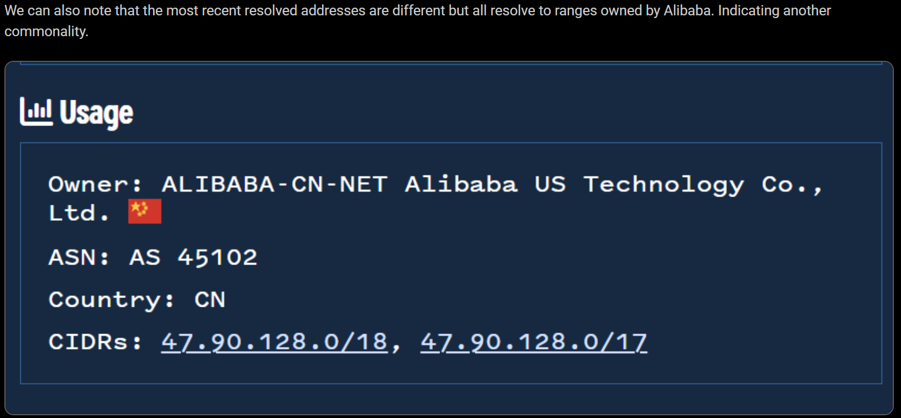
</a>

There, the owner information pointed to Alibaba:

```text
Owner: ALIBABA-CN-NET Alibaba US Technology Co., Ltd.
ASN: AS45102
Country: CN
CIDRs: 47.90.128.0/18, 47.90.128.0/17
```

So from that infrastructure ownership, I inferred that the cloud provider hosting the IP used by `treasurybanks.org` was Alibaba Cloud.

**Answer:** `Alibaba Cloud`


### Q10 - What autonomous system (ASN) was associated with an earlier IP address tied to `treasurybanks.org` Before it changed to another infrastructure?

For Q10, I checked the passive DNS history on VirusTotal for `treasurybanks.org`.

There were several historical resolutions, so I had to look at the older IPs, not only the most recent infrastructure.

<a href="screenshots/040-mbuchus-threat-intel-cyberdefender-image-11.png">
  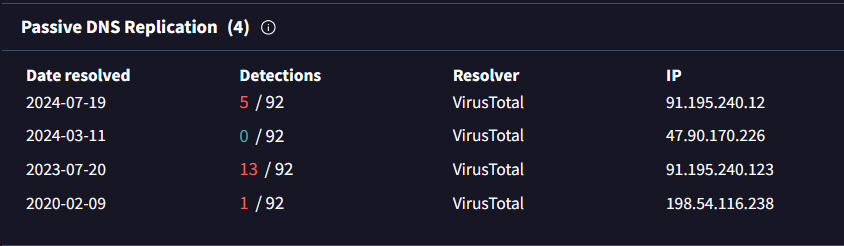
</a>

In the passive DNS section, one earlier IP tied to the domain was:

```text
198.54.116.238
```

This was the oldest resolution shown in the list.

After that, I did a quick Google search for:

```text
198.54.116.238 asn
```
<a href="screenshots/040-mbuchus-threat-intel-cyberdefender-image-13.png">
  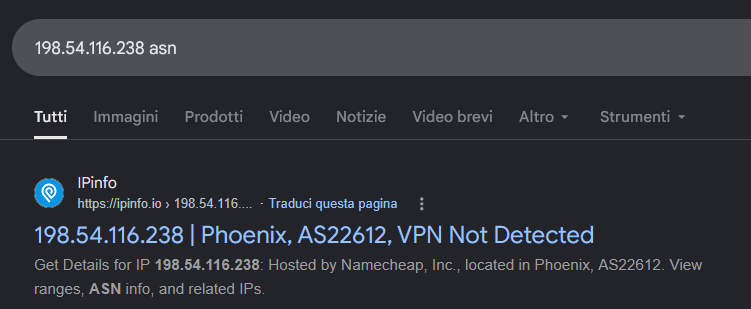
</a>

The answer was already visible in the search result title from IPinfo:

```text
198.54.116.238 | Phoenix, AS22612
```

So I used that ASN as the answer.

**Answer:** `AS22612`

### Q11 - One attacker-controlled domain had a name that hinted at something astro-related and resolved to a network device login panel, unlike the campaign's other phishing domains. Based on historical DNS records, who was the first recorded IP address owner associated with this domain in 2011?

For this question, I first followed the Embee Research article again instead of starting randomly from the domain list.

In the article, there was one domain that clearly stood out from the others:

```text
astrologytop.com
```

<a href="screenshots/040-mbuchus-threat-intel-cyberdefender-image-15.png">
  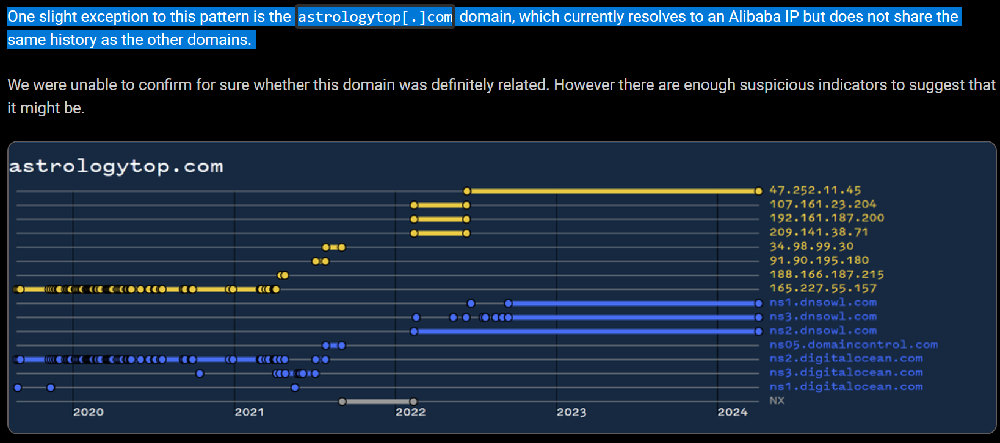
</a>

The article says that this domain was a slight exception because it currently resolved to an Alibaba IP, but did not share the same history as the other campaign domains.

The name also matched the hint in the question, because `astrology` is clearly astro-related.

After that, I used **ViewDNS.info → IP History**, a tool that shows the historical IP addresses a domain has been hosted on, together with the geographic location and the IP address owner. ([ViewDNS][1])

I entered:

```text
astrologytop.com
```
<a href="screenshots/040-mbuchus-threat-intel-cyberdefender-image-16.png">
  
</a>

and checked the historical IP results.

<a href="screenshots/040-mbuchus-threat-intel-cyberdefender-image-14.png">
  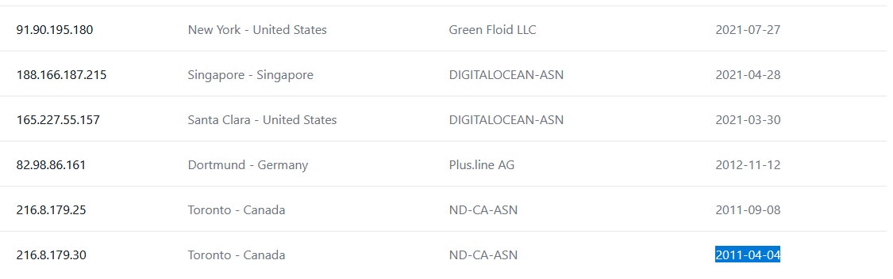
</a>

So I used that value directly, because the question asks for the first recorded IP address owner associated with the domain in 2011.

**Answer:** `ND-CA-ASN`

### Q12 - What registrar service did the attacker use to register the `treasurybanks.org` domain?

For Q12, I kept using **ViewDNS.info**, the same tool I had used for the previous question.

This time I searched `treasurybanks.org` in the **IP History** section.

The results showed two historical IP addresses for the domain, and one of them had the IP address owner listed very clearly:

<a href="screenshots/040-mbuchus-threat-intel-cyberdefender-image-17.png">
  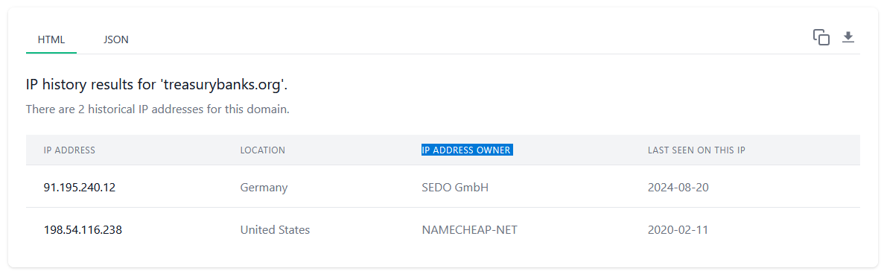
</a>

Since Namecheap is also a domain registrar service, this matched the value expected by the challenge.

So even though this was not a pure WHOIS registrar field, in this case the historical owner name pointed directly to the registrar/service name the lab wanted.

**Answer:** `Namecheap`

[1]: https://viewdns.info/iphistory/?utm_source=chatgpt.com "IP History"
