# T1584.004 - Threat Intel (CyberDefenders)

## Scenario
A multinational financial institution has reported a surge in phishing attempts targeting its executives.
A suspicious email containing a malicious attachment was opened, leading to unusual network activity.
The SOC team quickly flagged this incident and retrieved relevant indicators such as the sender’s email, file hash, and suspicious domains. 
Analysts must analyze the collected data within MISP, classify the event with appropriate tags, and determine if the incident correlates with known malware clusters.
By leveraging MISP’s event management and data feeds, the team will assess the threat’s impact and identify potential links to past attacks, ensuring proactive threat mitigation.

## References

* https://cyberdefenders.org/blueteam-ctf-challenges/t1584004/

### Q1 - What is the event ID assigned to the "Turla" threat group associated with Technique T1584 in MISP?

For Q1, I started from the fact that the question was asking for a MISP event ID, not directly for the name of a technique or a threat group.

So I searched inside MISP for:

```text
Turla
```

This returned multiple events related to Turla, so I did not just take the first result.

I checked the tags/clusters of the returned events and looked for the one that was also linked to the MITRE ATT&CK technique mentioned in the question:

```text
Compromise Infrastructure - T1584
```
<a href="screenshots/041-t1584.004-threat-intel-cyberdefender-image.png">
  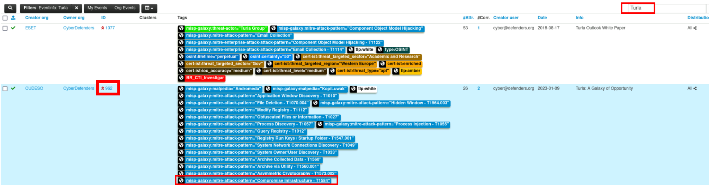
</a>

The correct event was:

```text
Turla: A Galaxy of Opportunity
```

In that same row, the MISP event ID was visible in the `ID` column:

```text
962
```

So the answer is the event ID of the Turla event associated with `T1584`.

**Answer:** `962`

### Q2 - What is the name of the owner organization of the event?

For the next question, we can answer it directly from the same MISP event row.

Since Q2 asks for the owner organization of the event, I just looked at the `Owner org` column for the event already identified in Q1.

<a href="screenshots/041-t1584.004-threat-intel-cyberdefender-image-1.png">
  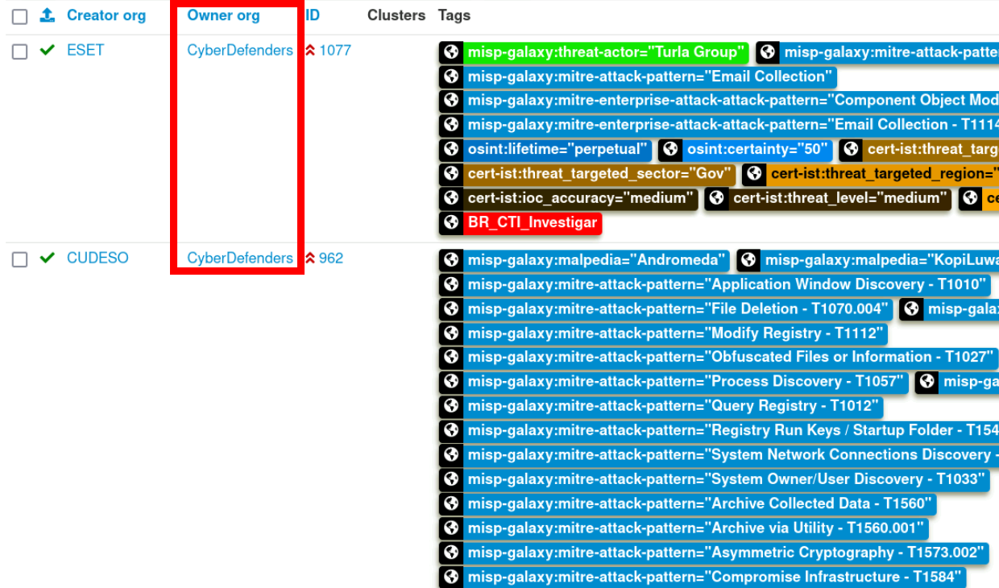
</a>

**Answer:** `CyberDefenders`

### Q3 - What is the threat level of the event?

I opened the same event identified in the previous questions by clicking on its MISP event ID:

```text
962
```

Once inside the event page, I checked the event metadata section.

There, MISP shows the field:

```text
Threat Level
```
<a href="screenshots/041-t1584.004-threat-intel-cyberdefender-image-2.png">
  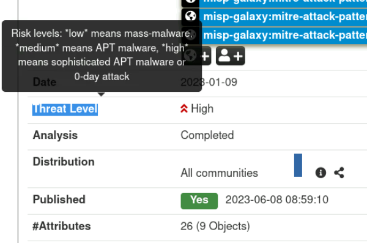
</a>

**Answer:** `High`


### Q4 - Who's the author of the YARA rule?

I stayed inside the same MISP event.

Since the event was already open from the previous questions, I simply scrolled further down through the attributes.

There, under the `Payload delivery` category, I found one of the YARA rules in the event attributes and checked its meta section.

The author field showed:

```text
author="Mandiant"
```

<a href="screenshots/041-t1584.004-threat-intel-cyberdefender-image-3.png">
  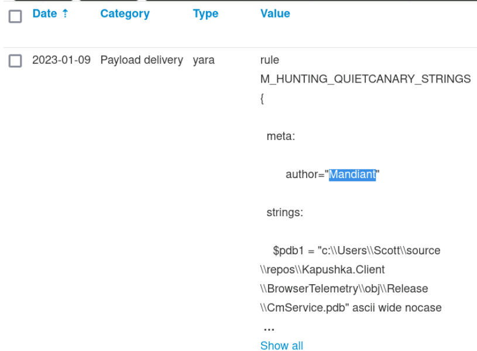
</a>

**Answer:** `Mandiant`

> [!NOTE]
> A YARA rule is a detection rule used to identify malware or suspicious files through strings, byte patterns, and logical conditions.
> In this event, it is placed under `Payload delivery` because it is related to detecting the delivered payload/malware connected to the Turla activity.


### Q5 - What is the condition of the M_APT_Kopiluwak_Recon_1 rule?

Just below the previous YARA rule, there was another `Payload delivery` attribute.

This one was the rule needed for the next question:

```text
M_APT_Kopiluwak_Recon_1
```
<a href="screenshots/041-t1584.004-threat-intel-cyberdefender-image-4.png">
  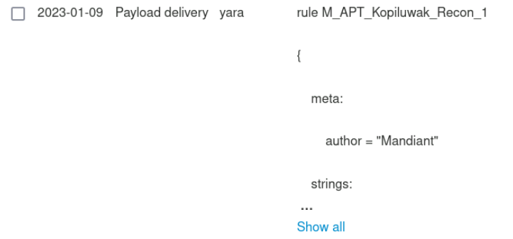
</a>

At first, MISP only showed a shortened preview of the rule, so I clicked:

```text
Show all
```

After expanding it, the full YARA rule became visible, including the `condition` section.

<a href="screenshots/041-t1584.004-threat-intel-cyberdefender-image-5.png">
  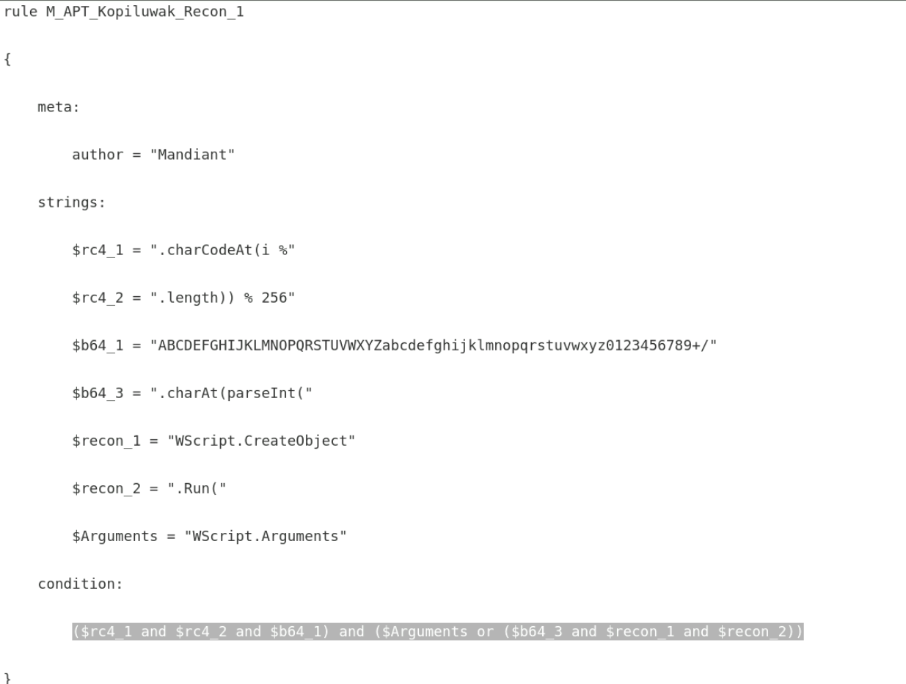
</a>

**Answer:** `($rc4_1 and $rc4_2 and $b64_1) and ($Arguments or ($b64_3 and $recon_1 and $recon_2))`


### Q6 - What is the name of the injected process that made a GET request?

I stayed inside the same MISP event and searched for:

```text
GET
```

The relevant object appeared immediately.

In the comment field, MISP shows that ANDROMEDA injected a process and that this process made a GET request to the domain.

<a href="screenshots/041-t1584.004-threat-intel-cyberdefender-image-6.png">
  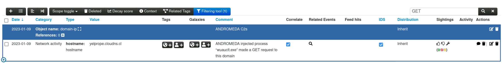
</a>

**Answer:** `wuauclt.exe`


### Q7 - What is the name of the executable that is responsible for the WinRAR self-extracting archive?

I stayed in the same event and searched for:

```text
rar
```

This immediately brought me to a file object whose comment says:

```text
WinRAR Self-Extracting Archive
```

Inside the same object, the `filename` attribute showed the executable responsible for it.

<a href="screenshots/041-t1584.004-threat-intel-cyberdefender-image-7.png">
  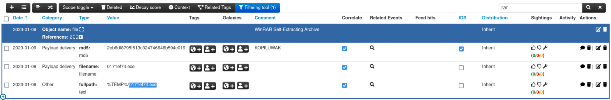
</a>

**Answer:** `0171ef74.exe`


### Q8 - What is the MD5 of the TrustedInstaller.exe?

I searched inside the same MISP event for:

```text
trusted
```

This immediately brought me to the file object related to:

```text
TrustedInstaller.exe
```

<a href="screenshots/041-t1584.004-threat-intel-cyberdefender-image-8.png">
  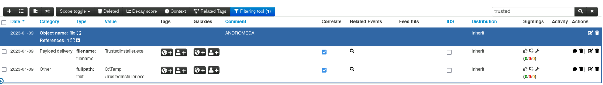
</a>

At first, the visible attributes only showed the filename and the full path, but not the MD5 hash.

So I clicked on the object reference, because the file had one linked reference/object.

<a href="screenshots/041-t1584.004-threat-intel-cyberdefender-image-9.png">
  
</a>

After opening the referenced file object, the MD5 attribute was visible.

<a href="screenshots/041-t1584.004-threat-intel-cyberdefender-image-10.png">
  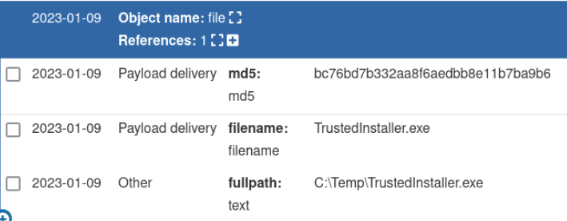
</a>

**Answer:** `bc76bd7b332aa8f6aedbb8e11b7ba9b6`

> [!NOTE]
> MD5 is a hash value used to identify a file by its content.
> In threat intelligence and malware analysis, it is commonly used as an IOC to reference a specific sample, even if MD5 is no longer considered secure for cryptographic integrity purposes.


### Q9 - What is the corresponding MITRE ATT&CK mitigation ID for Turla's technique of compromising servers?

I searched on Google for the MITRE ATT&CK technique ID:

```text
T1584.004
```

The first result pointed to the official MITRE ATT&CK page for:

```text
Compromise Infrastructure: Server
```

<a href="screenshots/041-t1584.004-threat-intel-cyberdefender-image-11.png">
  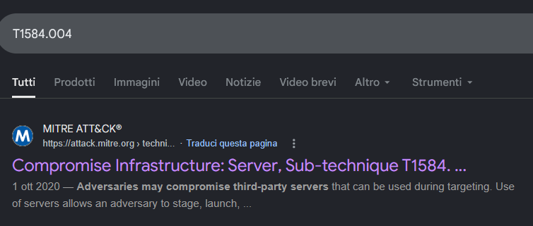
</a>

I opened the MITRE page and scrolled down to the `Mitigations` section.

There, MITRE lists the corresponding mitigation ID.

<a href="screenshots/041-t1584.004-threat-intel-cyberdefender-image-12.png">
  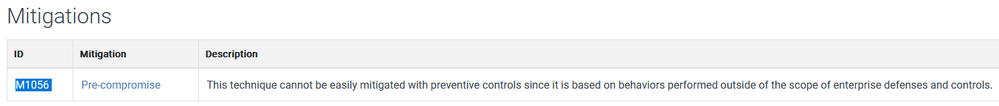
</a>

**Answer:** `M1056`
