# PhishStrike - Threat Intel (CyberDefenders)

## Scenario
As a cybersecurity analyst at an educational institution, you receive an alert about a phishing email targeting faculty members.
The email appears to be from a trusted contact and claims a $625,000 purchase, providing a link to download an invoice.
Your task is to investigate the email using Threat Intel tools.
Analyze the email headers and inspect the link for malicious content.
Identify any Indicators of Compromise (IOCs) and document your findings to prevent potential fraud and educate faculty on phishing recognition.

## References

* https://cyberdefenders.org/blueteam-ctf-challenges/phishstrike/

### Q1 - Identifying the sender's IP address with specific SPF and DKIM values helps trace the source of the phishing email. What is the sender's IP address that has an SPF value of softfail and a DKIM value of fail?

I opened the `.eml` file directly in Notepad++.

Since the question already gave the key values to look for, I used the search function and searched for:

```text
softfail
```

This brought me directly to the email authentication headers.

In the `Authentication-Results` header, the SPF result is shown as `softfail`, and on the same line the sender IP is explicitly listed.

Right below that, the DKIM result is also shown as `fail`, so this matched exactly what the question was asking for.

The same IP also appears again in the `Received-SPF` and `Received` headers, so I did not need to filter or inspect anything more complex for this one.

<a href="screenshots/042-phishstrike-threat-intel-cyberdefender-image.png">
  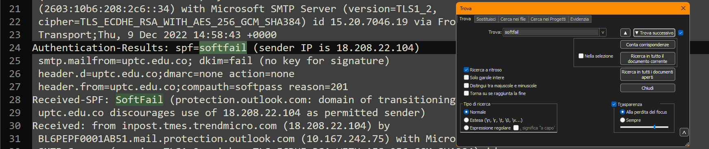
</a>

**Answer:** `18.208.22.104`


### Q2 - Understanding the return path of an email is essential for tracing its origin. What is the return path specified in this email?

I used the search function and searched for:

```text
return
```

This brought me directly to the `Return-Path` header.

The value was clearly visible on that line, so there was no need to inspect the full email body or open the message in an email client.

<a href="screenshots/042-phishstrike-threat-intel-cyberdefender-image-1.png">
  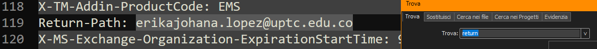
</a>

**Answer:** `erikajohana.lopez@uptc.edu.co`

### Q3 - Identifying the source of malware is critical for effective threat mitigation and response. What is the IP address of the server hosting the malicious file related to malware distribution?

After checking the headers, I moved into the email body to see what the phishing message was actually trying to deliver.

In the plain text part of the email, the message contains a fake commercial purchase receipt and points the user to an invoice document.

The interesting part is the URL:

```text
http://107.175.247.199/loader/install.exe
```
<a href="screenshots/042-phishstrike-threat-intel-cyberdefender-image-2.png">
  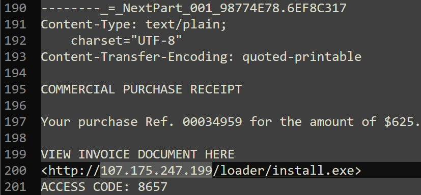
</a>

Since the question asks for the IP address of the server hosting the malicious file, I only needed the host part of that URL.

I also opened the email with an online `.eml` viewer just to get a quick graphical view of the message structure.

That made it easier to confirm that the URL was presented to the victim as the invoice/document link, but the actual IOC was already clearly visible in the raw `.eml` content.

<a href="screenshots/042-phishstrike-threat-intel-cyberdefender-image-3.png">
  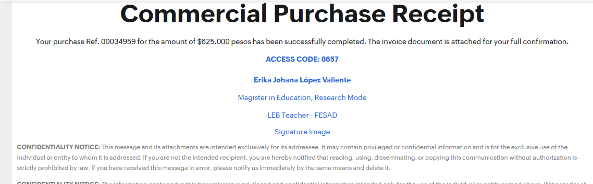
</a>

**Answer:** `107.175.247.199`

 
### Q4 - Identifying malware that exploits system resources for cryptocurrency mining is critical for prioritizing threat mitigation efforts. The malicious URL can deliver several malware types. Which malware family is responsible for cryptocurrency mining?

I searched the malicious URL found in the email:

```text
http://107.175.247.199/loader/install.exe
```

The search results already pointed to public malware analysis sources for that exact URL.

<a href="screenshots/042-phishstrike-threat-intel-cyberdefender-image-4.png">
  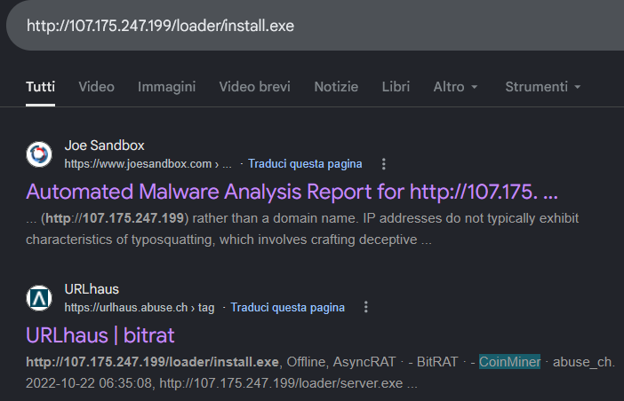
</a>

The useful result here was URLhaus, because the snippet showed multiple associated tags/families for the same URL.

Among the listed names, the one related to cryptocurrency mining was clearly `CoinMiner`.

So I did not treat the full list as the answer.

`AsyncRAT` and `BitRAT` are RAT families, while `CoinMiner` is the one matching the cryptocurrency mining part of the question.

**Answer:** `CoinMiner`

 
### Q5 - Identifying the specific URLs malware requests is key to disrupting its communication channels and reducing its impact. Based on the previous analysis of the cryptocurrency malware sample, what does this malware request the URL?

I opened the malicious URL I had found before and went back to the URLhaus result.

From the URLhaus entries, I identified the row matching my original URL:

```text
http://107.175.247.199/loader/install.exe
```

That entry had multiple tags, including `AsyncRAT`, `BitRAT`, and `CoinMiner`, so I focused on the CoinMiner-related payload.

<a href="screenshots/042-phishstrike-threat-intel-cyberdefender-image-5.png">
  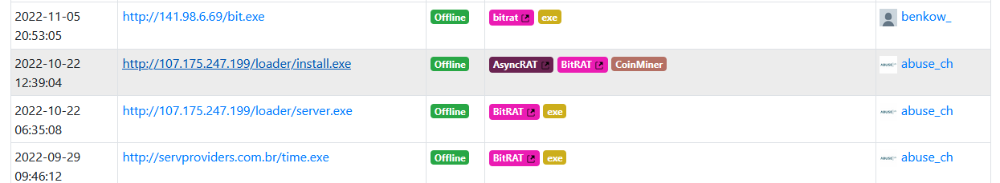
</a>

Then I opened the URLhaus page for that URL and checked the payload delivery section.

There were multiple payloads listed, but since the previous question was about the cryptocurrency mining malware, I copied the SHA-256 hash associated with the `CoinMiner` signature.

```text
453fb1c4b3b48361fa8a67dcedf1eaec39449cb5a146a7770c63d1dc0d7562f0
```

<a href="screenshots/042-phishstrike-threat-intel-cyberdefender-image-6.png">
  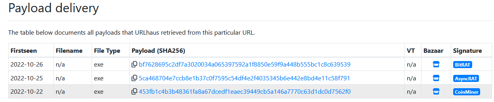
</a>

After that, I searched the SHA-256 hash on Google.

The results showed several malware analysis reports for the same sample.

I opened the available reports and used the one that looked more complete for this specific question, which was the VMRay report.

<a href="screenshots/042-phishstrike-threat-intel-cyberdefender-image-7.png">
  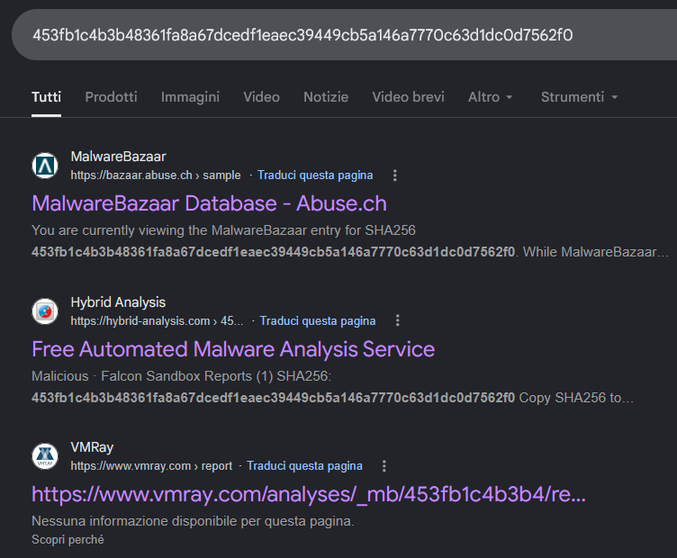
</a>

Inside the VMRay report, I went to the `Network` tab.

There, under the HTTP requests, the report showed the URL requested by the malware.

The request was a `GET` request to:

```text
http://ripley.studio/loader/uploads/Qanjttrbv.jpeg
```

<a href="screenshots/042-phishstrike-threat-intel-cyberdefender-image-8.png">
  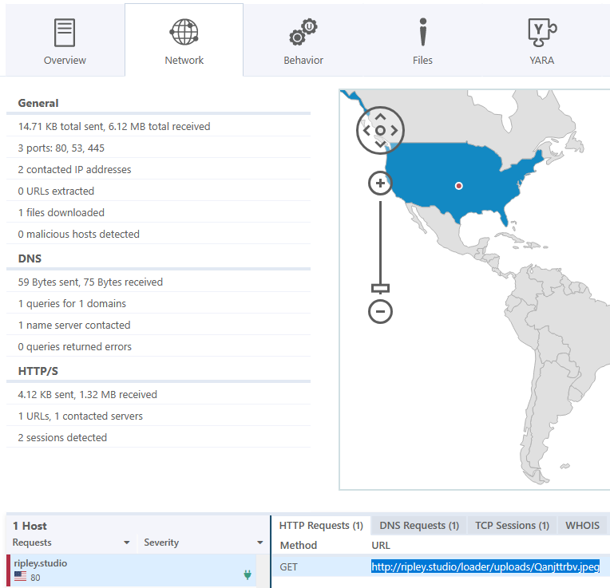
</a>

**Answer:** `http://ripley.studio/loader/uploads/Qanjttrbv.jpeg`


 
### Q6 - Understanding the registry entries added to the auto-run key by malware is crucial for identifying its persistence mechanisms. Based on the BitRAT malware sample analysis, what is the executable's name in the first value added to the registry auto-run key?

I continued from the URLhaus payload delivery table and focused on the BitRAT payload.

I copied the SHA-256 hash associated with the `BitRAT` signature:

```text
bf7628695c2df7a3020034a065397592a1f8850e59f9a448b555bc1c8c639539
```

<a href="screenshots/042-phishstrike-threat-intel-cyberdefender-image-9.png">
  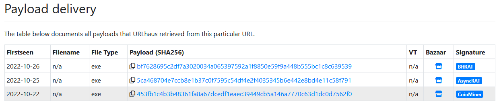
</a>

Then I searched the hash on Google.

The result pointed to a Joe Sandbox report for the same sample, so I opened it.

<a href="screenshots/042-phishstrike-threat-intel-cyberdefender-image-10.png">
  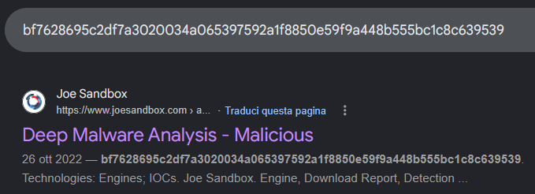
</a>

After opening the Joe Sandbox result, I went to the `Full Report`.

From there, I checked the high-level behavior distribution and focused on the `Registry` section, since the question was asking about the auto-run key and not only about dropped files.

<a href="screenshots/042-phishstrike-threat-intel-cyberdefender-image-11.png">
  
</a>

To avoid taking the executable name only from the registry chart, I also checked the dropped files section.

There, the same executable appeared under the user profile path:

```text
C:\Users\user\AppData\Roaming\Ozndcoodb\Jzwvix.exe
```

<a href="screenshots/042-phishstrike-threat-intel-cyberdefender-image-12.png">
  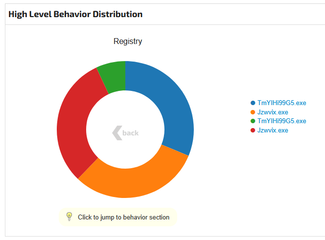
</a>

So the executable name used in the first autorun registry value was:

**Answer:** `Jzwvix.exe`

 
### Q7 - Identifying the SHA-256 hash of files downloaded from a malicious URL is essential for tracking and analyzing malware activity. Based on the BitRAT analysis, what is the SHA-256 hash of the file previously downloaded and added to the autorun keys?

I used the same Joe Sandbox report from the previous question.

Since Q6 had already pointed to the executable involved in the autorun behavior, I opened the details for that dropped file:

```text
C:\Users\user\AppData\Roaming\Ozndcoodb\Jzwvix.exe
```

In the file details page, Joe Sandbox showed the hash values for that executable.

The `SHA-256` field matched the BitRAT payload hash I had already seen in URLhaus, so this confirmed I was looking at the same file downloaded and used for persistence.

<a href="screenshots/042-phishstrike-threat-intel-cyberdefender-image-13.png">
  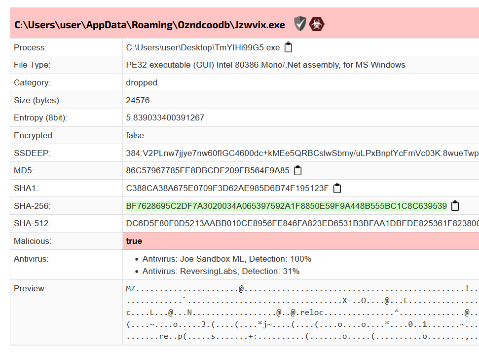
</a>

**Answer:** `BF7628695C2DF7A3020034A065397592A1F8850E59F9A448B555BC1C8C639539`

 
### Q8 - Analyzing the HTTP requests made by malware helps in identifying its communication patterns. What is the URL in the HTTP request used by the loader to retrieve the BitRAT malware?

I stayed in the same Joe Sandbox report and checked the contacted URLs.

At this point the answer was already pretty direct, because the question asks for the URL used by the loader to retrieve the BitRAT malware.

In the contacted URLs section, the report showed:

```text
http://107.175.247.199/loader/server.exe
```

<a href="screenshots/042-phishstrike-threat-intel-cyberdefender-image-14.png">
  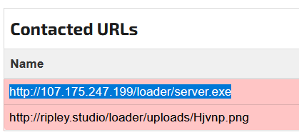
</a>

This also matched the previous URLhaus context, where `server.exe` was associated with BitRAT.

So I did not need to overcomplicate this part or inspect more sections of the report.


**Answer:** `http://107.175.247.199/loader/server.exe`

 
### Q9 - Introducing a delay in malware execution can help evade detection mechanisms. What is the delay (in seconds) caused by the PowerShell command according to the BitRAT analysis?

I stayed in the Joe Sandbox report and looked at the behavior/evasion-related sections.

The relevant section was:

```text
HIPS / PFW / Operating System Protection Evasion
```
There, Joe Sandbox flagged an encrypted PowerShell command line option and also showed the decoded command.

The decoded command was:

```text
Start-Sleep -Seconds 50
```
<a href="screenshots/042-phishstrike-threat-intel-cyberdefender-image-15.png">
  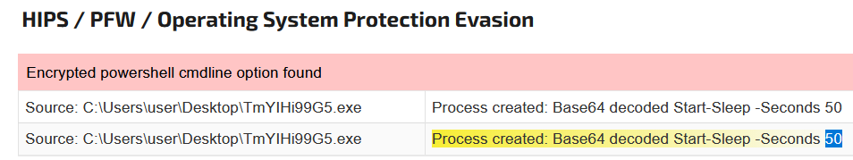
</a>

So the delay introduced by the PowerShell command was directly visible from the decoded behavior.

**Answer:** `50`

 
### Q10 - Tracking the command and control (C2) domains used by malware is essential for detecting and blocking malicious activities. What is the C2 domain used by the BitRAT malware?

For Q10, I had to change report/source.

The Google results were not giving me anything else useful for the C2 domain, so I went directly to Recorded Future Triage and searched the same BitRAT SHA-256 hash there:

```text
bf7628695c2df7a3020034a065397592a1f8850e59f9a448b555bc1c8c639539
```

Triage returned multiple reports, but I selected the one that matched the SHA-256 hash I had searched for.

<a href="screenshots/042-phishstrike-threat-intel-cyberdefender-image-16.png">
  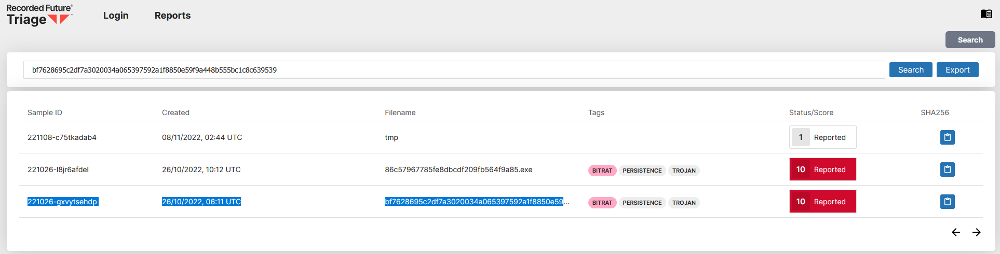
</a>

After opening the report, I selected the behavioral task, since the C2 information would be more likely to appear in the runtime/network behavior than in the static view.

<a href="screenshots/042-phishstrike-threat-intel-cyberdefender-image-17.png">
  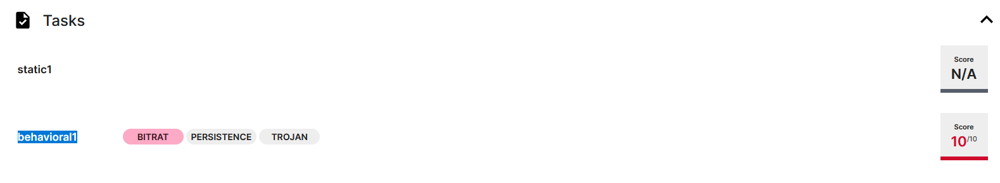
</a>

Then I checked the `Network` section.

The report showed the same loader-related HTTP requests seen before, but it also showed a DNS request for a separate domain:

```text
gh9st.mywire.org
```

The DNS response resolved it to an IP address, but the question asks for the C2 domain, so I used the domain name itself as the answer.

<a href="screenshots/042-phishstrike-threat-intel-cyberdefender-image-18.png">
  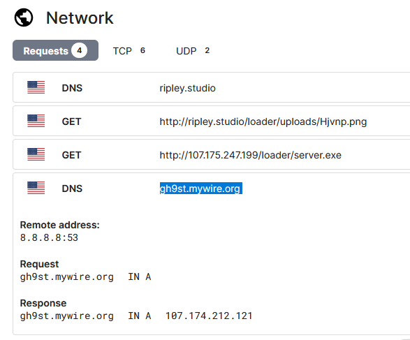
</a>

**Answer:** `gh9st.mywire.org`

### Q11 - Understanding how malware exfiltrates data is essential for detecting and preventing data breaches. According to the AsyncRAT analysis, what is the Telegram Bot ID used by this malware?

For Q11, I went back to the URLhaus payload delivery table and focused on the `AsyncRAT` payload this time.

I copied the SHA-256 hash associated with the `AsyncRAT` signature:

```text
5ca468704e7ccb8e1b37c0f7595c54df4e2f4035345b6e442e8bd4e11c58f791
```

<a href="screenshots/042-phishstrike-threat-intel-cyberdefender-image-19.png">
  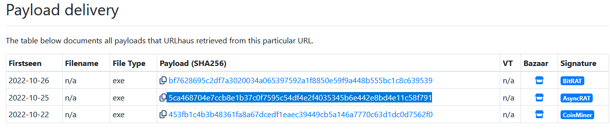
</a>

Then I searched that hash in Recorded Future Triage.

Triage returned multiple reports, but I selected the one that matched the SHA-256 hash I had searched for.

<a href="screenshots/042-phishstrike-threat-intel-cyberdefender-image-20.png">
  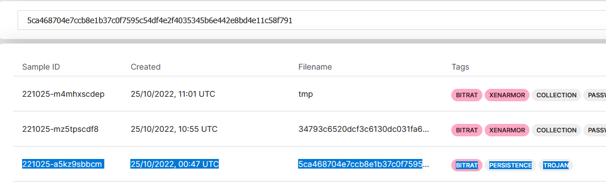
</a>

After opening the report, I selected the behavioral task.

Static information was not enough for this question, because the Telegram Bot ID appears in the network behavior.

<a href="screenshots/042-phishstrike-threat-intel-cyberdefender-image-21.png">
  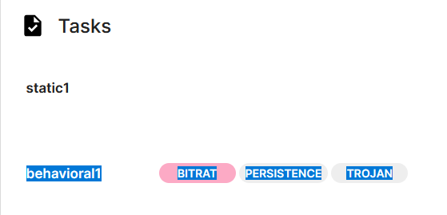
</a>

Then I checked the `Network` section.

There was a request to `api.telegram.org`, and the request URL contained the Telegram bot token:

```text
https://api.telegram.org/bot5610920260:AAHF8huJMzSwUso7E5WSzQWOBzo4GdubP4k/getUpdates?offset=-5
```

<a href="screenshots/042-phishstrike-threat-intel-cyberdefender-image-22.png">
  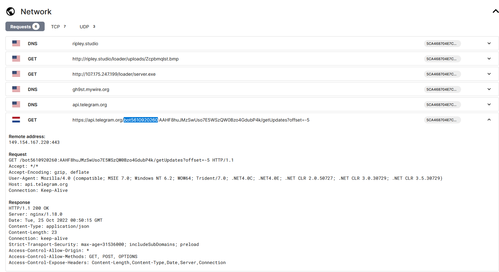
</a>

**Answer:** `bot5610920260`
