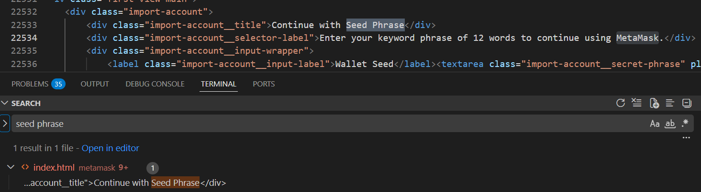
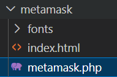
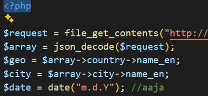
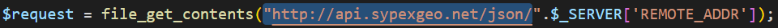
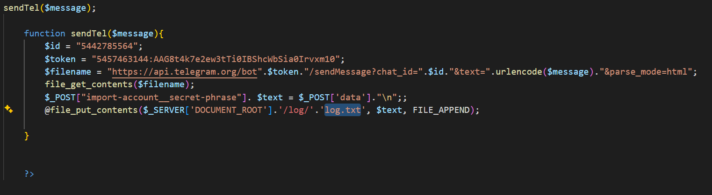
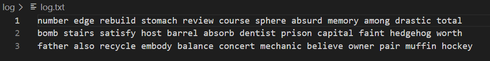
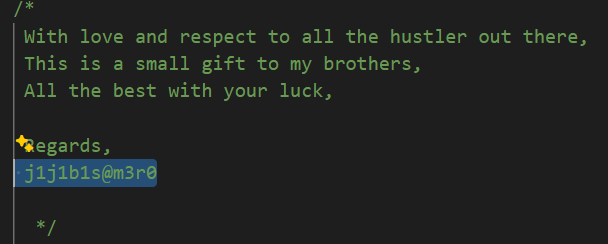

# GrabThePhisher - Threat Intel (CyberDefenders)

## Scenario
A decentralized finance (DeFi) platform recently reported multiple user complaints about unauthorized fund withdrawals.
A forensic review uncovered a phishing site impersonating the legitimate PancakeSwap exchange, luring victims into entering their wallet seed phrases.
The phishing kit was hosted on a compromised server and exfiltrated credentials via a Telegram bot.

Your task is to conduct threat intelligence analysis on the phishing infrastructure, identify indicators of compromise (IoCs), and track the attacker’s online presence, including aliases and Telegram identifiers, to understand their tactics, techniques, and procedures (TTPs).

## References

* https://cyberdefenders.org/blueteam-ctf-challenges/grabthephisher/

### Q1 - Which wallet is used for asking the seed phrase?

For Q1, once I extracted the CyberDefenders ZIP file, I opened the extracted folder directly in Visual Studio Code.

Since the question was asking which wallet was used to ask for the seed phrase, I searched across all files for:

```text
seed phrase
```

VS Code returned only one relevant result.

It pointed to `index.html`, inside the `metamask` folder, where the page text says:

```text
Enter your keyword phrase of 12 words to continue using MetaMask.
```

So the wallet name was already visible in the phishing kit code.

<a href="screenshots/043-grabthephisher-threat-intel-cyberdefender-image.png">
  
</a>

**Answer:** `MetaMask`


### Q2 - What is the file name that has the code for the phishing kit?

It is also easy to infer it from the file structure.

The `index.html` file is inside the `metamask` folder, together with `metamask.php`.

I am not adding a screenshot of the `metamask.php` content here, but a quick look at it can confirm the same answer again.

<a href="screenshots/043-grabthephisher-threat-intel-cyberdefender-image-1.png">
  
</a>

**Answer:** `metamask.php`

### Q3 - In which language was the kit written?

After identifying `metamask.php` as the file containing the phishing kit code, the language was already clear from both the file extension and the code syntax.

To avoid ambiguity, I opened the file and checked the content directly.

The file starts with PHP syntax and uses typical PHP functions and variables, such as:

```text
file_get_contents()
json_decode()
$array
$date
```

So the kit was written in PHP.

<a href="screenshots/043-grabthephisher-threat-intel-cyberdefender-image-2.png">
  
</a>

**Answer:** `PHP`


### Q4 - What service does the kit use to retrieve the victim's machine information?

I checked `metamask.php` to see how the kit was retrieving information about the victim.

The relevant line was direct enough:

```text
http://api.sypexgeo.net/json/
```
<a href="screenshots/043-grabthephisher-threat-intel-cyberdefender-image-3.png">
  
</a>

The kit uses `file_get_contents()` to query the Sypex Geo API and passes the victim IP through:

```text
$_SERVER['REMOTE_ADDR']
```

So the service used to retrieve the victim’s machine/location information was clearly visible in the code.

**Answer:** `Sypex Geo`


### Q5 - How many seed phrases were already collected?

I stayed in `metamask.php` and checked where the submitted seed phrase was being handled.

The function `sendTel($message)` sends the collected data to Telegram, but the same function also writes the submitted data locally into:

```text
/log/log.txt
```

The important part is that the file is written with `FILE_APPEND`, so every new submitted seed phrase is added to the same log file instead of replacing the previous content.

<a href="screenshots/043-grabthephisher-threat-intel-cyberdefender-image-4.png">
  
</a>

Then I opened `log.txt`.

The file contained three separate lines, and each line was a collected seed phrase.

<a href="screenshots/043-grabthephisher-threat-intel-cyberdefender-image-5.png">
  
</a>

So the number of seed phrases already collected was:

**Answer:** `3`


### Q6 - Could you please provide the seed phrase associated with the most recent phishing incident?

I used the same `log.txt` file from the previous question.

Since `metamask.php` writes new collected seed phrases using `FILE_APPEND`, the most recent entry should be the last one in the log.

So I only needed to copy the third seed phrase from the previous screenshot.

**Answer:** `father also recycle embody balance concert mechanic believe owner pair muffin hockey`

### Q7 - Which medium was used for credential dumping?

The same `sendTel()` screenshot already gives the direction of the answer, because the function name itself suggests that the collected data is being sent through Telegram.

If I continue reading the function, it becomes even clearer.

The code builds a request to the Telegram Bot API:

```text
https://api.telegram.org/bot.../sendMessage
```
**Answer:** `Telegram`

### Q8 - What is the token for accessing the channel?

I used the same `sendTel()` function again.

By reading the same screenshot, the token is directly visible in the code:

```text
$token = "5457463144:AAG8t4k7e2ew3tIi0IBShcWhSia0Irvxm10";
```
>[!NOTE]


**Answer:** `5457463144:AAG8t4k7e2ew3tIi0IBShcWhSia0Irvxm10`

### Q9 - What is the Chat ID for the phisher's channel?

I used the same `sendTel()` function again.

In the same code block, the Chat ID is directly visible here:

```text
$id = "5442785564";
```

**Answer:** `5442785564`

>[!NOTE]
>The token is basically the value used to identify/authenticate the Telegram bot used by the kit to send the message.
>So once the code builds the Telegram API request, this is the token placed after `/bot` in the URL.
>The Chat ID tells the Telegram Bot API where the message has to be sent.
>So, in this case:
>```text
>token   = identifies/authenticates the bot
>chat_id = identifies the chat/channel that receives the message
>```
>The request is then built using both values: the bot token and the Chat ID.

### Q10 - What are the allies of the phish kit developer?

For Q10, I stayed in `metamask.php`.

The answer was written directly in a comment inside `metamask.php`.

The comment looked like a small signature/message from the kit developer, and the relevant value appeared under `Regards`:

<a href="screenshots/043-grabthephisher-threat-intel-cyberdefender-image-6.png">
  
</a>

**Answer:** `j1j1b1s@m3r0`
