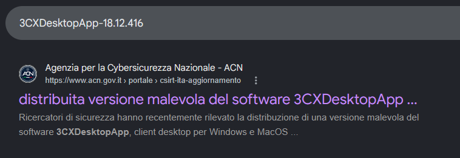
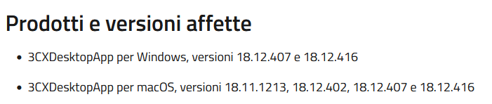
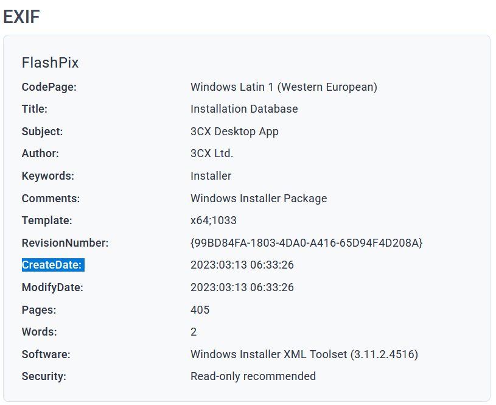
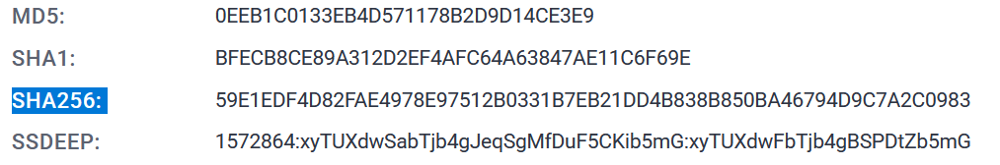
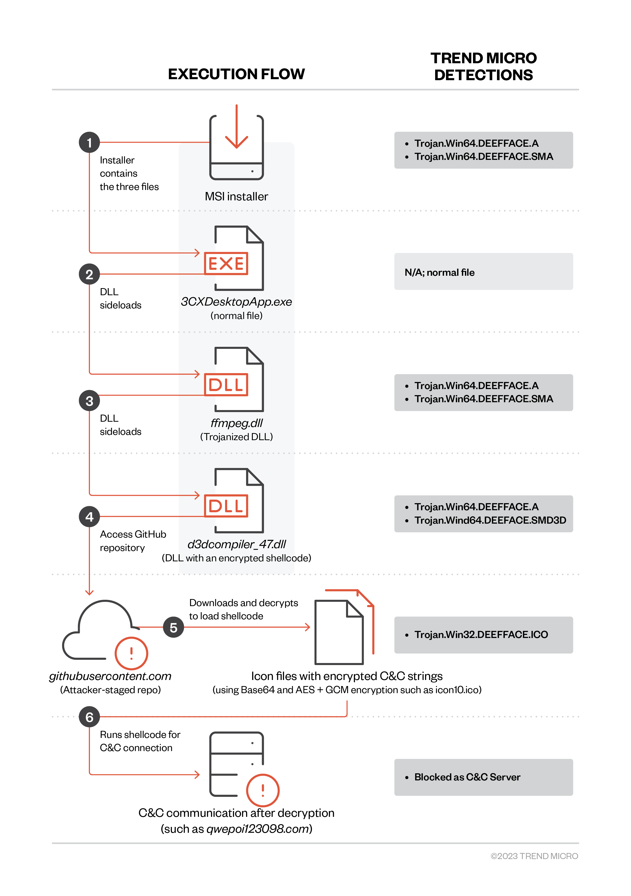
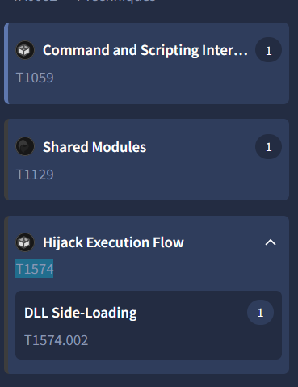
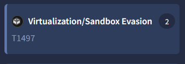
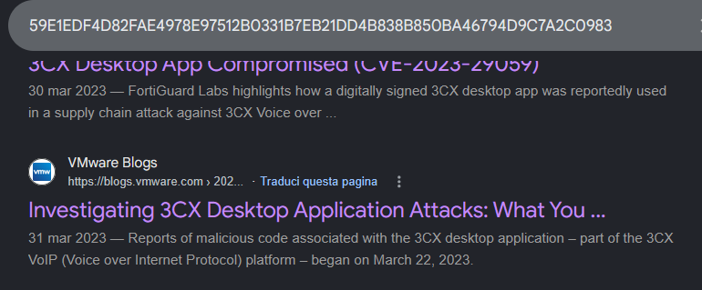
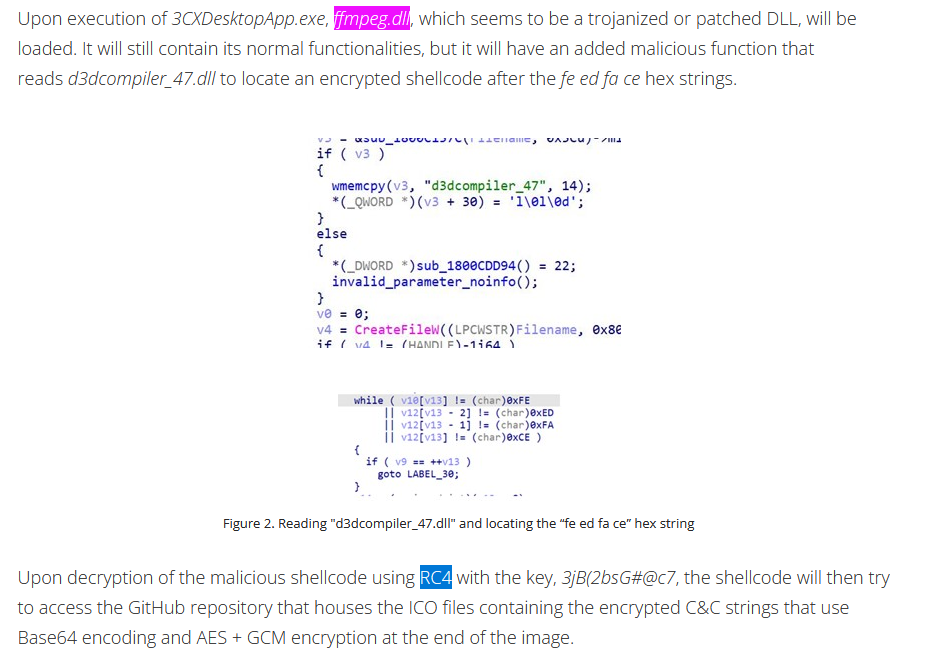
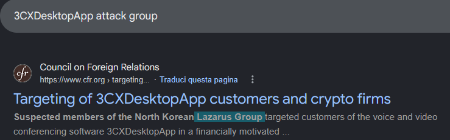

# 3CX Supply Chain - Threat Intel (CyberDefenders)

## Scenario
A large multinational corporation heavily relies on the 3CX software for phone communication, making it a critical component of their business operations.
After a recent update to the 3CX Desktop App, antivirus alerts flag sporadic instances of the software being wiped from some workstations while others remain unaffected. 
Dismissing this as a false positive, the IT team overlooks the alerts, only to notice degraded performance and strange network traffic to unknown servers.
Employees report issues with the 3CX app, and the IT security team identifies unusual communication patterns linked to recent software updates.

As the threat intelligence analyst, it's your responsibility to examine this possible supply chain attack. 
Your objectives are to uncover how the attackers compromised the 3CX app, identify the potential threat actor involved, and assess the overall extent of the incident. 

## References

* https://cyberdefenders.org/blueteam-ctf-challenges/3cx-supply-chain/

### Q1 - Understanding the scope of the attack and identifying which versions exhibit malicious behavior is crucial for making informed decisions if these compromised versions are present in the organization. How many versions of 3CX running on Windows have been flagged as malware?

I started from the version/name given by the lab and searched it on Google:

```text
3CXDesktopApp-18.12.416
```

The search result pointed to an ACN report about the malicious 3CXDesktopApp distribution, so I opened it.

<a href="screenshots/044-3cx-supply-chain-threat-intel-cyberdefender-image.png">
  
</a>

In the affected products and versions section, the report listed the Windows versions affected:

```text
18.12.407
18.12.416
```

So, for Windows, there were two flagged versions.

<a href="screenshots/044-3cx-supply-chain-threat-intel-cyberdefender-image-1.png">
  
</a>

**Answer:** `2`

### Q2 - Determining the age of the malware can help assess the extent of the compromise and track the evolution of malware families and variants. What's the UTC creation time of the `.msi` malware?

I continued from the same Google search results and scrolled until I found an ANY.RUN report for the `.msi` sample.

Inside the report, I checked the EXIF/metadata section.

The `CreateDate` field showed:

```text
2023:03:13 06:33:26
```

Since the lab input format asks for:

```text
YYYY-MM-DD HH:MM
```

I converted it to the required format and removed the seconds.

<a href="screenshots/044-3cx-supply-chain-threat-intel-cyberdefender-image-2.png">
  
</a>

**Answer:** `2023-03-13 06:33`

### Q3 - Executable files (`.exe`) are frequently used as primary or secondary malware payloads, while dynamic link libraries (`.dll`) often load malicious code or enhance malware functionality. Analyzing files deposited by the Microsoft Software Installer (`.msi`) is crucial for identifying malicious files and investigating their full potential. Which malicious DLLs were dropped by the `.msi` file?

For Q3, I was not fully satisfied with the information I had from ANY.RUN, so I copied the SHA-256 hash of the `.msi` sample and searched it on Google.

```text
59e1edf4d82fae4978e97512b0331b7eb21dd4b838b850ba46794d9c7a2c0983
```

<a href="screenshots/044-3cx-supply-chain-threat-intel-cyberdefender-image-3.png">
  
</a>

Then I scrolled through different reports until I found the Trend Micro analysis.

This report was much clearer for this specific question, because it showed the execution flow and listed the files contained/dropped by the MSI installer.

The diagram showed that the MSI installer contained three files:

```text
3CXDesktopApp.exe
ffmpeg.dll
d3dcompiler_47.dll
```

The `.exe` was marked as a normal file, while the two DLLs were shown as malicious/trojanized components.

<a href="screenshots/044-3cx-supply-chain-threat-intel-cyberdefender-image-4.png">
  
</a>

So the malicious DLLs dropped by the `.msi` file were:

**Answer:** `ffmpeg.dll,d3dcompiler_47.dll`

### Q4 - Recognizing the persistence techniques used in this incident is essential for current mitigation strategies and future defense improvements. What is the MITRE Technique ID employed by the `.msi` files to load the malicious DLL?

For Q4, instead of staying only on the previous reports, I used VirusTotal.

From my experience, when I need a quick view of MITRE techniques, VirusTotal usually shows them in a clearer and faster way.

So I pasted the same `.msi` SHA-256 hash into VirusTotal and checked the MITRE/behavior section.

There, VirusTotal mapped the behavior to:

```text
Hijack Execution Flow
```

and more specifically:

```text
DLL Side-Loading
```

The MITRE technique ID shown for DLL Side-Loading was:

```text
T1574.002
```

<a href="screenshots/044-3cx-supply-chain-threat-intel-cyberdefender-image-5.png">
  
</a>

**Answer:** `T1574.002`

### Q5 - Recognizing the malware type (`threat category`) is essential to your investigation, as it can offer valuable insight into the possible malicious actions you'll be examining. What is the threat category of the two malicious DLLs?

I used the same Trend Micro execution flow screenshot from before.

There was no need to look for a different artifact, because the detections were already written clearly next to the two malicious DLLs.

Both `ffmpeg.dll` and `d3dcompiler_47.dll` were detected as `Trojan` variants:

```text
Trojan.Win64.DEEFFACE.A
Trojan.Win64.DEEFFACE.SMA
Trojan.Win64.DEEFFACE.SMD3D
```

**Answer:** `Trojan`

### Q6 - As a threat intelligence analyst conducting dynamic analysis, it's vital to understand how malware can evade detection in virtualized environments or analysis systems. This knowledge will help you effectively mitigate or address these evasive tactics. What is the MITRE ID for the virtualization/sandbox evasion techniques used by the two malicious DLLs?

I stayed on VirusTotal.

In the `Discovery` / MITRE behavior section, VirusTotal directly showed the virtualization/sandbox evasion technique used by the DLLs.

The technique was listed as:

```text
Virtualization/Sandbox Evasion
```

with MITRE ID:

```text
T1497
```

<a href="screenshots/044-3cx-supply-chain-threat-intel-cyberdefender-image-6.png">
  
</a>

**Answer:** `T1497`

### Q7 - When conducting malware analysis and reverse engineering, understanding anti-analysis techniques is vital to avoid wasting time. Which hypervisor is targeted by the anti-analysis techniques in the `ffmpeg.dll` file?

I remembered seeing a VMware blog earlier while I was checking the reports from the Google results.

So I went back to the Google results for the same SHA-256 hash and opened the VMware blog:

```text
https://blogs.vmware.com/security/2023/03/investigating-3cx-desktop-application-attacks-what-you-need-to-know.html
```

<a href="screenshots/044-3cx-supply-chain-threat-intel-cyberdefender-image-7.png">
  
</a>

After reading the VMware documentation, it matched the question directly.

The anti-analysis checks in `ffmpeg.dll` were targeting VMware-related virtualization artifacts, so the hypervisor was:

**Answer:** `VMware`


### Q8 - Identifying the cryptographic method used in malware is crucial for understanding the techniques employed to bypass defense mechanisms and execute its functions fully. What encryption algorithm is used by the `ffmpeg.dll` file?

I went back to the Trend Micro report.

I used it again because the explanation was very clear, and since I had already read it earlier, I knew it had the section I needed for this question.

In the part about `ffmpeg.dll`, Trend Micro explains that the malicious shellcode is decrypted using:

```text
RC4
```

The report also shows the key used for that decryption, but the question only asks for the encryption algorithm.

<a href="screenshots/044-3cx-supply-chain-threat-intel-cyberdefender-image-8.png">
  
</a>

**Answer:** `RC4`

### Q9 - As an analyst, you've recognized some TTPs involved in the incident, but identifying the APT group responsible will help you search for their usual TTPs and uncover other potential malicious activities. Which group is responsible for this attack?

I did a direct search focused on attribution instead of continuing with the technical DLL details.

I searched for:

```text
3CXDesktopApp attack group
```

The result already pointed to the group responsible for the attack.

The snippet mentioned suspected members of the North Korean `Lazarus Group`, which matched the attribution the question was asking for.

<a href="screenshots/044-3cx-supply-chain-threat-intel-cyberdefender-image-9.png">
  
</a>

**Answer:** `Lazarus`