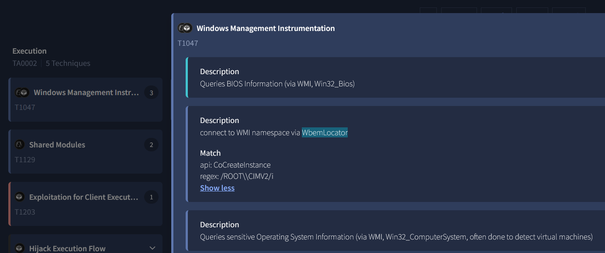
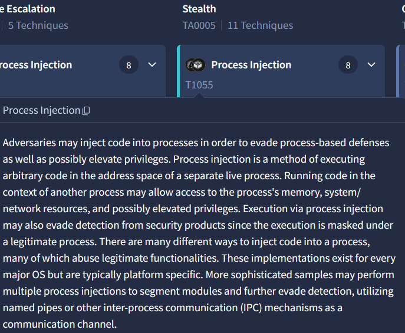
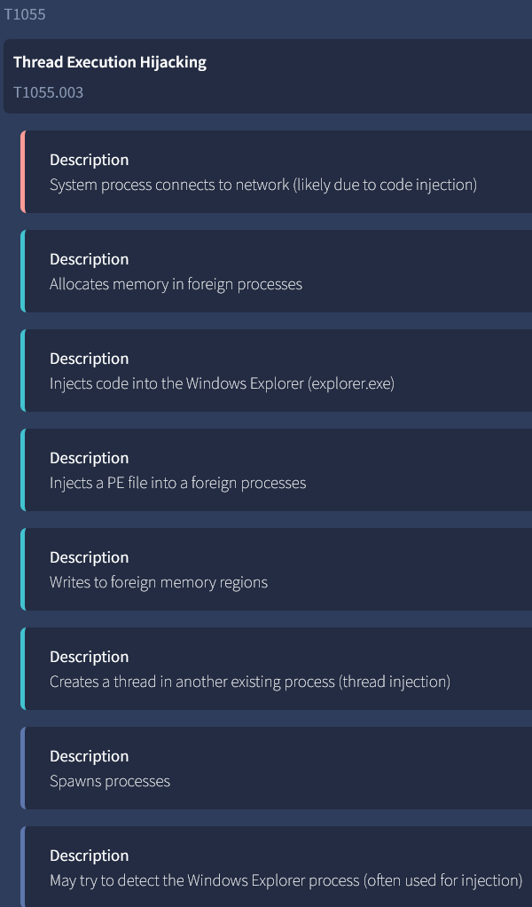
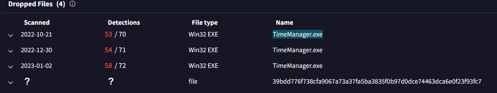
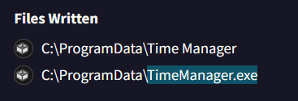
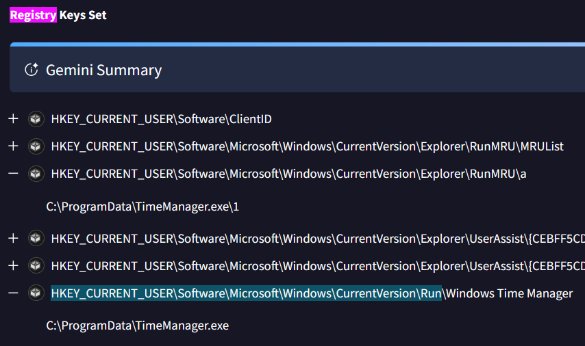

# Trickbot WIZARD SPIDER  - Threat Intel (CyberDefenders)

## Scenario
A financial organization has discovered suspicious activity indicating a possible malware infection targeting sensitive data. 
This discovery was made after noticing unauthorized access attempts to financial records.
As part of the threat intelligence team, your task is to analyze available intelligence to identify the malware’s persistence techniques, evasion methods, and command-and-control infrastructure. 
Gather key indicators to support threat hunting and incident response efforts.

## References

* https://cyberdefenders.org/blueteam-ctf-challenges/trickbot-wizard-spider/

### Q1 - During the analysis of the malware's interaction with system components, a crucial aspect is identifying its method of accessing system resources. Utilizing VirusTotal, identify how this malware connects with Windows Management Instrumentation (WMI). Specifically, which component does it utilize for this purpose?

I used VirusTotal as suggested by the question and checked the behavior/MITRE section.

Under `Windows Management Instrumentation`, VirusTotal showed multiple WMI-related behaviors.

The relevant one was the entry saying that the malware connects to the WMI namespace via:

```text
WbemLocator
```

So the component used to connect with WMI was directly visible in VirusTotal.

<a href="screenshots/045-trickbot-wizard-spider-threat-intel-cyberdefender-image.png">
  
</a>

**Answer:** `WbemLocator`

### Q2 - What is the MITRE ATT&CK technique ID used by the malware author to execute malicious code evasively?

I stayed in the VirusTotal `Behavior` section.

This time I moved to the `Stealth` category and noticed the `Process Injection` technique.

VirusTotal describes this as a way to execute code inside another live process, which matches the question because it asks about executing malicious code evasively.

<a href="screenshots/045-trickbot-wizard-spider-threat-intel-cyberdefender-image-1.png">
  
</a>

Then I expanded the technique details.

VirusTotal showed several related behaviors, including memory allocation in foreign processes, writing to foreign memory regions, and creating a thread in another existing process.

The main MITRE technique shown for this behavior was:

```text
Process Injection
T1055
```

<a href="screenshots/045-trickbot-wizard-spider-threat-intel-cyberdefender-image-2.png">
  
</a>

**Answer:** `T1055`


### Q3 - Based on the understanding of the technique used by the malware from the previous question, what is the process name used by the malware to execute malicious code evasively?

The previous VirusTotal screenshot already showed the behavior clearly. Under the `Process Injection` details, VirusTotal states that the malware:

```text
Injects code into the Windows Explorer (explorer.exe)
```

So the process used by the malware to execute code evasively was directly visible there.

<a href="screenshots/045-trickbot-wizard-spider-threat-intel-cyberdefender-image-3.png">
  
</a>

**Answer:** `explorer.exe`


### Q4 - Analyzing the malware's behavior can reveal its file-dropping activities. What is the executable file name that the malware drops during its operation?

I first went to the `Relations` section in VirusTotal.

There, under `Dropped Files`, VirusTotal listed multiple dropped files, and the executable name appeared clearly:

```text
TimeManager.exe
```

<a href="screenshots/045-trickbot-wizard-spider-threat-intel-cyberdefender-image-7.png">
  
</a>

I could also confirm the same thing in the `Behavior` section, under `Files Written`.

There, the malware writes the executable under:

```text
C:\ProgramData\TimeManager.exe
```

<a href="screenshots/045-trickbot-wizard-spider-threat-intel-cyberdefender-image-4.png">
  
</a>

**Answer:** `TimeManager.exe`


### Q5 - Investigating the malware's persistence tactics can help us understand how it maintains its active presence within our system. Which specific registry key is abused by the malware to ensure its continued operation after a system reboot or logoff?

We can already see from the MITRE view that registry activity is related to persistence, because VirusTotal shows `Modify Registry` under the `Persistence` category.

<a href="screenshots/045-trickbot-wizard-spider-threat-intel-cyberdefender-image-5.png">
  
</a>

But even without inspecting the MITRE strategy in detail, I used `CTRL+F` and searched for:

```text
Registry
```

This brought me directly to the `Registry Keys Set` section.

There, the relevant entry matched the dropped executable from the previous question:

```text
C:\ProgramData\TimeManager.exe
```

The malware sets it under the Windows `Run` key, which makes sense because this key is commonly abused to start something again after reboot or logoff.

<a href="screenshots/045-trickbot-wizard-spider-threat-intel-cyberdefender-image-6.png">
  
</a>

So the abused registry key was:

**Answer:** `HKEY_CURRENT_USER\Software\Microsoft\Windows\CurrentVersion\Run`


### Q6 - Examining the malware's network activity can uncover its command and control (C2) infrastructure. What is the malicious domain it communicates with?

I went back to the `Relations` section in VirusTotal.

As shown in the screenshot I used for Q4, there were multiple `TimeManager.exe` entries under the dropped files.

I clicked one of those `TimeManager.exe` entries, which opened the VirusTotal page dedicated to that specific dropped executable.

From there, I went again to the `Relations` section.

Under `Contacted Domains`, VirusTotal showed the malicious domain contacted by the file:

```text
obuhov2k.beget.tech
```

<a href="screenshots/045-trickbot-wizard-spider-threat-intel-cyberdefender-image-8.png">
  
</a>

**Answer:** `obuhov2k.beget.tech`
