# BRabbit - Threat Intel (CyberDefenders)

## Scenario
You are an investigator assigned to assist Drumbo, a company that recently fell victim to a ransomware attack.
The attack began when an employee received an email that appeared to be from the boss.
It featured the company’s logo and a familiar email address.
Believing the email was legitimate, the employee opened the attachment, which compromised the system and deployed ransomware, encrypting sensitive files. 
Your task is to investigate and analyze the artifacts to uncover information about the attacker.

## References

* https://cyberdefenders.org/blueteam-ctf-challenges/brabbit/

### Q1 - What is the suspicious email address that sent the attachment?

For Q1, the file package already included a text document warning to be careful and not open the file unless inside a controlled environment.

So I opened my Windows 11 virtual machine in VMware Workstation Pro, moved the file there, and used the first free online email viewer I found to inspect the email safely enough for this lab.

Once the email was loaded, I checked the sender field directly. The suspicious sender address was visible in the `From` field.

<a href="screenshots/046-brabbit-threat-intel-cyberdefender-image.png">
  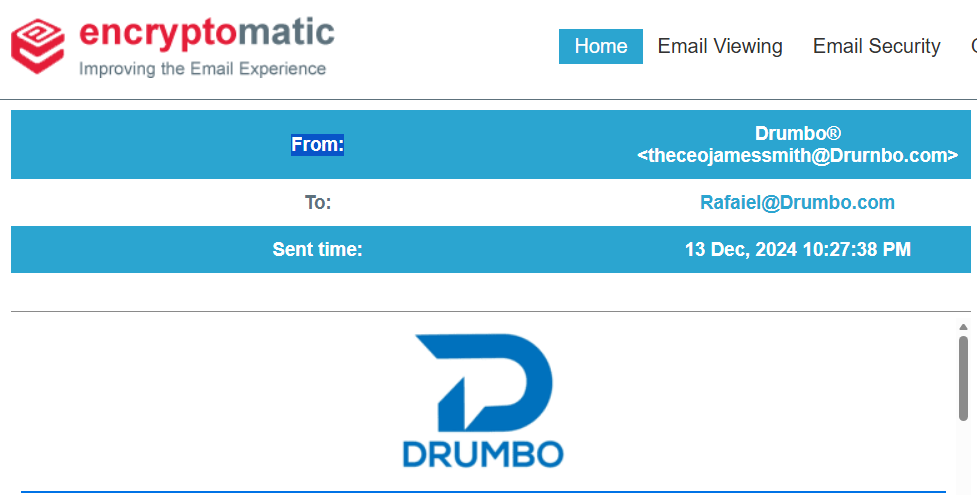
</a>

**Answer:** `theceojamessmith@Drurnbo.com`


### Q2 - What is the family name of the ransomware identified during the investigation?

Before going directly to the family name, I wanted to collect all the identifiers first.

So I searched for the sample name and found the Triage entry with the useful hashes, including `SHA256`, `MD5`, `SHA1`, `SHA512`, and `SSDEEP`.

Even if this was technically not needed to answer the question, I like having more than just the malware name from the beginning. It gives me better pivots in case I need to confirm the sample later or search it somewhere else.

<a href="screenshots/046-brabbit-threat-intel-cyberdefender-image-1.png">
  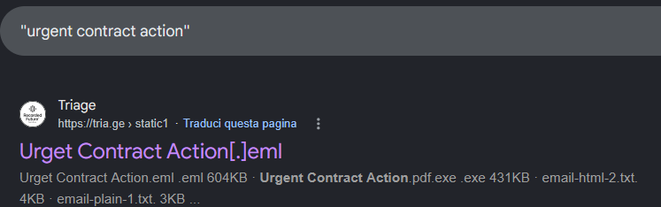
</a>

<a href="screenshots/046-brabbit-threat-intel-cyberdefender-image-2.png">
  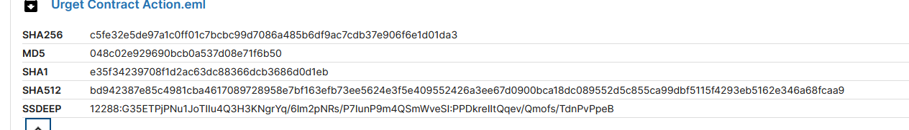
</a>

After that, I searched the hash and used Triage to check the family. For malware family identification, I like using this site because it usually gives the family immediately and I have always found it practical for this kind of check.

In this case, the signature section immediately showed `BadRabbit` / `Badrabbit family`, so the ransomware family was clear.

<a href="screenshots/046-brabbit-threat-intel-cyberdefender-image-3.png">
  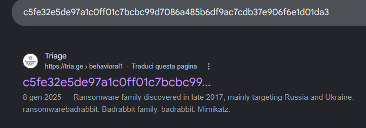
</a>

<a href="screenshots/046-brabbit-threat-intel-cyberdefender-image-4.png">
  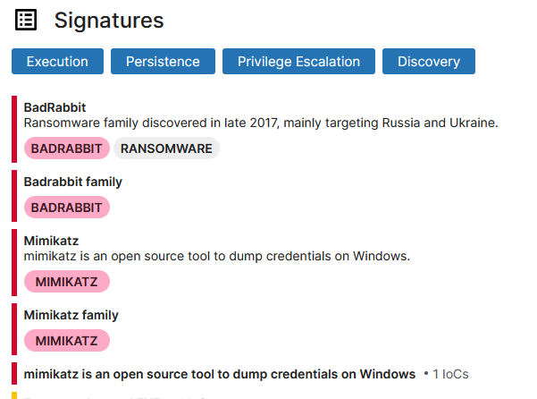
</a>

**Answer:** `BadRabbit`

### Q3 - What is the name of the first file dropped by the ransomware?

The question specifically asks for the **first file dropped** by the ransomware, so I kept that wording in mind and stayed on the same Triage page.

In the `Drops file in Windows directory` section, the first entry marked as `File created` shows the file:

```text
C:\Windows\infpub.dat
```

Since the question asks for the file name, not necessarily the full path, the answer is `infpub.dat`.

<a href="screenshots/046-brabbit-threat-intel-cyberdefender-image-5.png">
  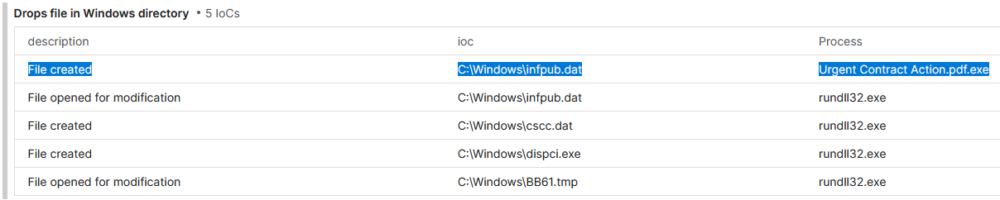
</a>

**Answer:** `infpub.dat`


### Q4 - What is the only person's username found within the dropped file?

I stayed on the same Triage page and went to the `Downloads` section.

From there, I opened the entry for `infpub.dat`, copied its `MD5`, and searched it on Google. I used the first relevant page I found, because for this question I only needed to inspect the embedded usernames, not do a full malware write-up.

<a href="screenshots/046-brabbit-threat-intel-cyberdefender-image-7.png">
  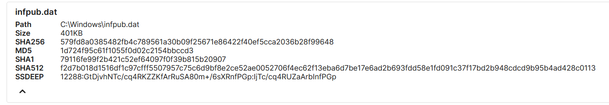
</a>

<a href="screenshots/046-brabbit-threat-intel-cyberdefender-image-6.png">
  
</a>

After scrolling through the page, I found the embedded usernames extracted from `infpub.dat`.

Most entries were generic account names like `Administrator`, `Admin`, `Guest`, `User`, `ftp`, `rdp`, `backup`, and similar. Comparing the list, the only one that looked like an actual person’s username was `alex`.

<a href="screenshots/046-brabbit-threat-intel-cyberdefender-image-8.png">
  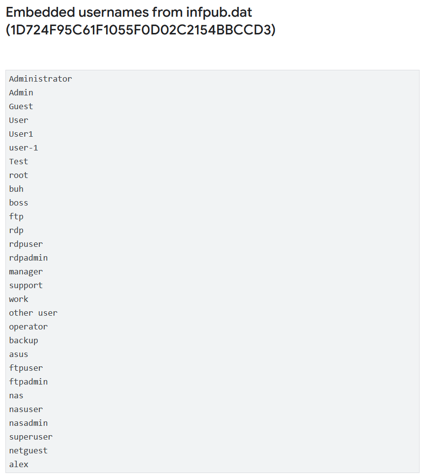
</a>

**Answer:** `alex`

### Q6 - What is the MITRE ATT&CK Sub-Technique ID associated with the ransomware's persistence technique?

I answered this one before Q5 because the persistence technique was already visible on the same Triage page, so there was no reason to pivot somewhere else yet.

In the `MITRE ATT&CK Enterprise` section, the sample is mapped under `Persistence` to:

```text
Scheduled Task/Job
T1053
```

and more specifically to the sub-technique:

```text
Scheduled Task
T1053.005
```

So for the persistence sub-technique ID, the value is directly visible there.

<a href="screenshots/046-brabbit-threat-intel-cyberdefender-image-9.png">
  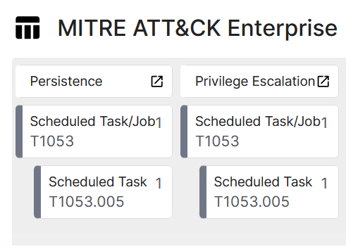
</a>

**Answer:** `T1053.005`

### Q5 - What MITRE ATT&CK sub-technique describes the ransomware's use of web protocols for sending and receiving data?

For Q5, I went to VirusTotal and pasted the malware `SHA256`, because VirusTotal usually shows the behavior techniques in a clear way.

From the `Behavior` section, I checked the MITRE ATT&CK mapping and immediately saw `Command and Control`, with `Application Layer Protocol` listed as technique `T1071`. That was already the technique area we needed.

<a href="screenshots/046-brabbit-threat-intel-cyberdefender-image-11.png">
  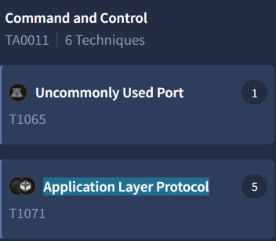
</a>

The problem is that the question asks for the **sub-technique**, and VirusTotal only showed the parent technique there.

So I went to the MITRE page for `Application Layer Protocol`. Once there, the sub-techniques were listed directly. Since the question specifically talks about the ransomware using **web protocols** for sending and receiving data, the matching sub-technique is `Web Protocols`, with ID `T1071.001`.

<a href="screenshots/046-brabbit-threat-intel-cyberdefender-image-10.png">
  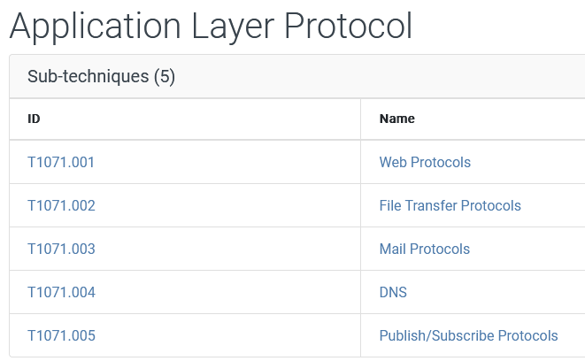
</a>

**Answer:** `T1071.001`

### Q7 - What are the names of the tasks created by the ransomware during execution?

I stayed on the same Triage page again.

First, in the `Scheduled Task/Job: Scheduled Task` section, Triage already shows the processes related to the persistence behavior. The useful part here is that it gives the associated `schtasks.exe` PIDs directly, so I did not need to search blindly through the full process tree.

<a href="screenshots/046-brabbit-threat-intel-cyberdefender-image-12.png">
  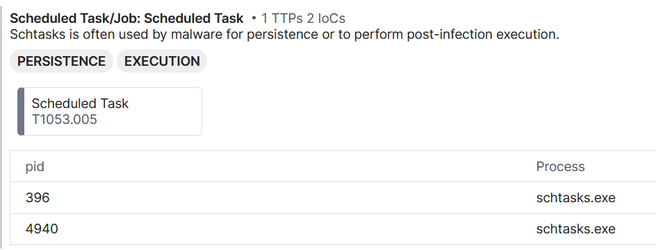
</a>

Then I went to the `Processes` section and checked those task creation commands in detail.

The first `schtasks` command creates a task with:

```text
/TN rhaegal
```

and the other task creation command creates:

```text
/TN drogon
```

So the ransomware created two scheduled tasks: `rhaegal` and `drogon`.

<a href="screenshots/046-brabbit-threat-intel-cyberdefender-image-13.png">
  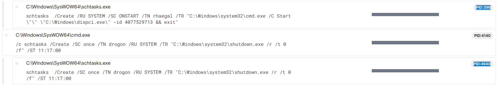
</a>

**Answer:** `rhaegal, drogon`


### Q8 - What suspicious message was displayed in the Console upon executing this binary?

I went back to the Google Cloud / Mandiant post about BadRabbit.

From there, I took the `MD5` of the file mentioned by the question, `dispi.exe`, and searched it directly.

<a href="screenshots/046-brabbit-threat-intel-cyberdefender-image-14.png">
  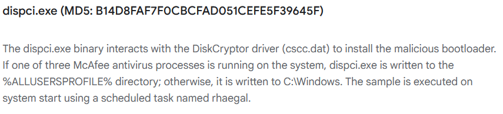
</a>

Among the results, Hybrid Analysis appeared immediately, and that was useful here because it gave me screenshots of the sample execution, not just static metadata.

<a href="screenshots/046-brabbit-threat-intel-cyberdefender-image-15.png">
  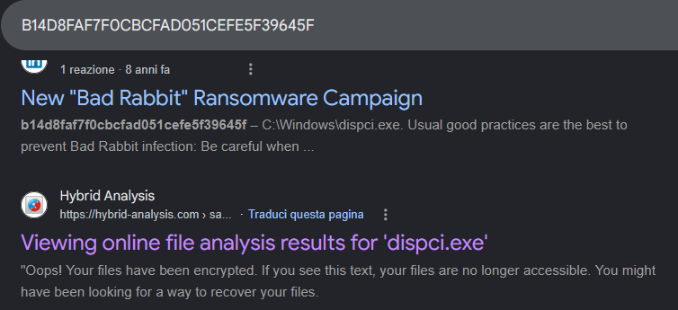
</a>

Opening that result, the console screenshot showed the suspicious message directly. The binary prints a message telling the user to disable security tools.

<a href="screenshots/046-brabbit-threat-intel-cyberdefender-image-16.png">
  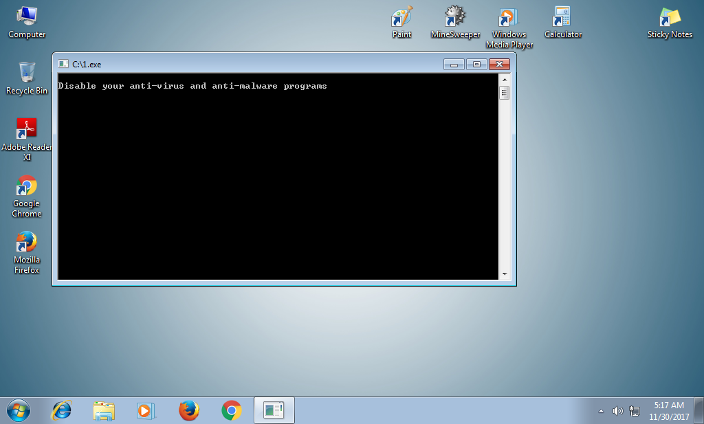
</a>

**Answer:** `Disable your anti-virus and anti-malware programs`


### Q9 - What is the name of the driver used to encrypt the hard drive and modify the MBR?

I could have answered this question from the previous Google Cloud / Mandiant page, because it already explains that `dispi.exe` interacts with the DiskCryptor driver.

But at this point I was already on the Hybrid Analysis page because Q8 asked for the exact console message, which is a bit of a weirdly specific thing to ask now that I think about it.

Anyway, staying on this new page was enough. In the `Version Info` section, the file metadata points directly to:

```text
http://diskcryptor.net/
```

So the driver name used for the disk encryption / MBR modification part is clearly `DiskCryptor`.

<a href="screenshots/046-brabbit-threat-intel-cyberdefender-image-17.png">
  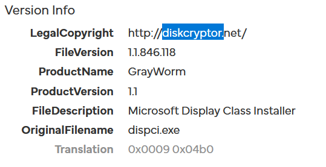
</a>

**Answer:** `DiskCryptor`


### Q10 - What is the name of the threat actor responsible for this ransomware campaign?

I searched directly for:

```text
BADRABBIT threat actor
```

I did not need anything too complex here, because at this point the family was already clear. I just needed a reliable pivot that connected BadRabbit to an actor name.

<a href="screenshots/046-brabbit-threat-intel-cyberdefender-image-18.png">
  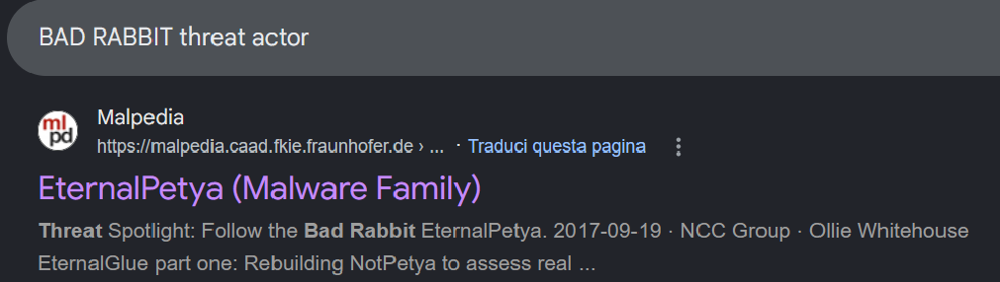
</a>

The Malpedia result was useful because it links BadRabbit under the EternalPetya / NotPetya cluster and shows the associated actors.

Inside the page, BadRabbit appears in the aliases, and the `Actor(s)` field lists `TeleBots` and `Sandworm`. Since the lab asks for the threat actor responsible for the campaign, the expected actor name is `Sandworm`.

<a href="screenshots/046-brabbit-threat-intel-cyberdefender-image-19.png">
  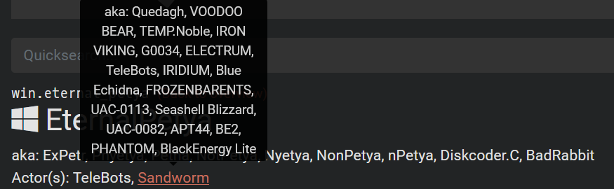
</a>

**Answer:** `Sandworm`


### Q11 - What is the MITRE ATT&CK ID for the technique used to corrupt the system firmware and prevent booting?

Since this one was not appearing clearly enough from the previous reports, I searched directly on MITRE.

That was the cleaner path here, because the question asks for the MITRE ATT&CK ID, so it makes sense to confirm it from the ATT&CK page instead of forcing the answer from secondary reports.

On the Bad Rabbit page, under `Techniques Used`, MITRE lists:

```text
Firmware Corruption
T1495
```

The description also matches the question, because it says Bad Rabbit used an executable that installs a modified bootloader to prevent normal boot-up.

<a href="screenshots/046-brabbit-threat-intel-cyberdefender-image-20.png">
  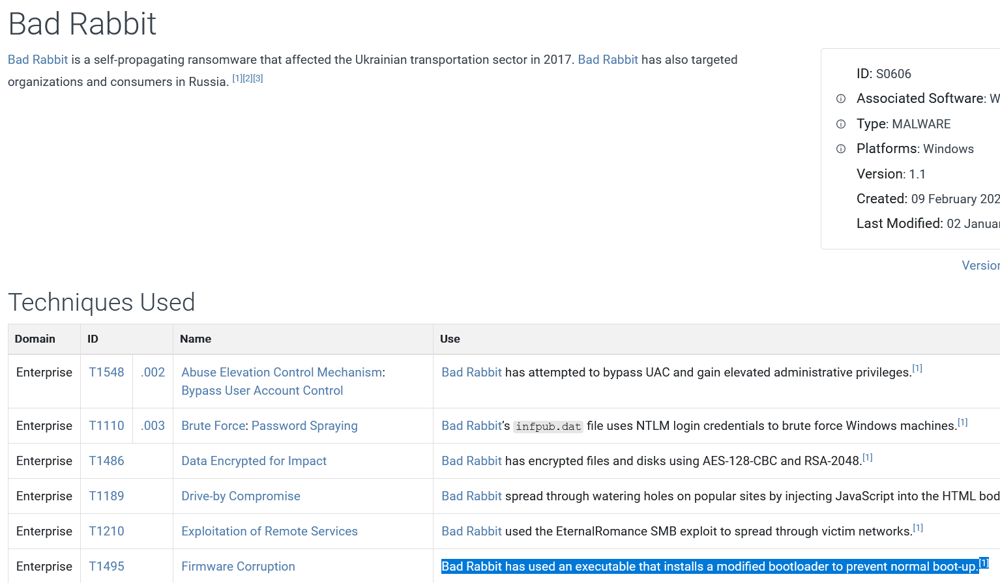
</a>

**Answer:** `T1495`
