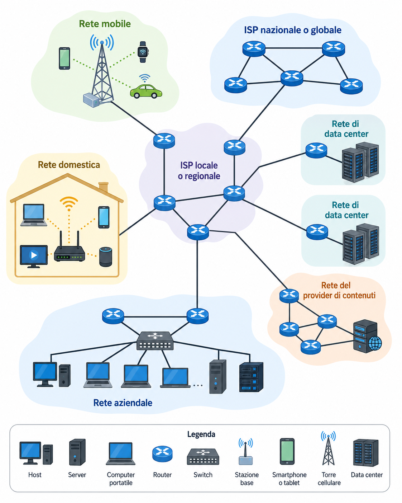
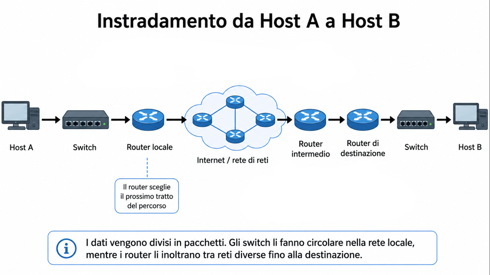
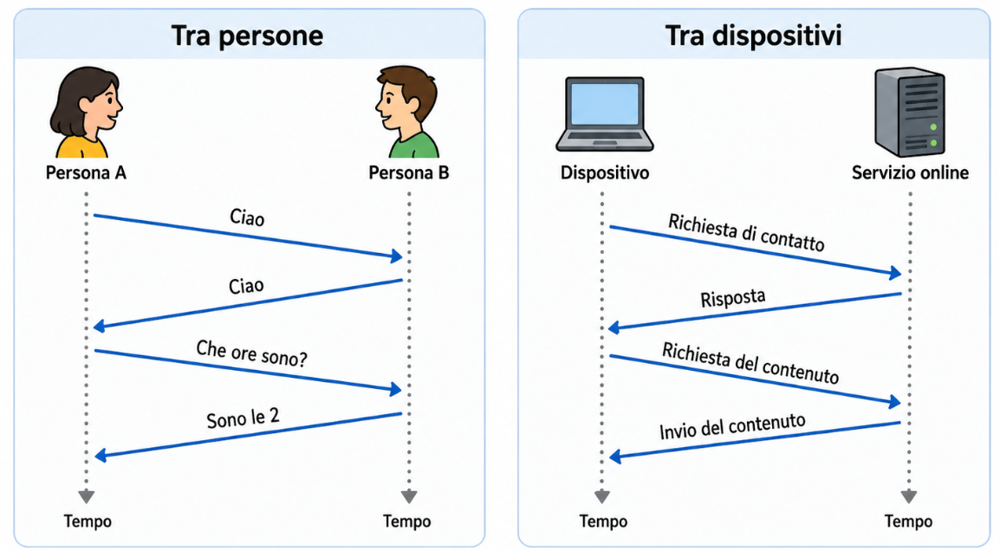
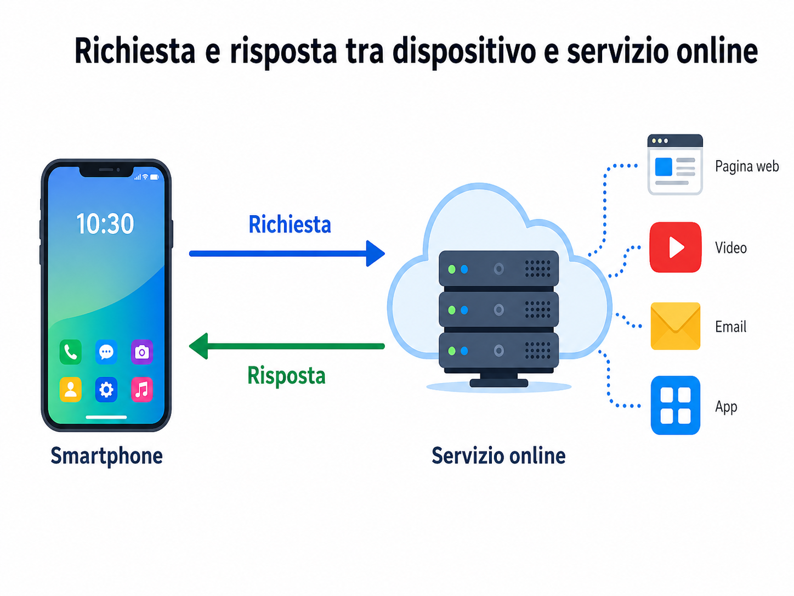

# Fondamenti di internet e reti

## Cos’è Internet

Internet è una grande infrastruttura che permette a dispositivi diversi di comunicare tra loro. 

Non è una singola rete centrale.

È più corretto vederla come una **rete di reti**: tante reti indipendenti, gestite da soggetti diversi, collegate tra loro.

Dentro questa infrastruttura ci sono dispositivi usati dagli utenti, server, reti aziendali, reti domestiche, reti mobili, provider, cavi, antenne, switch, router e altri apparati.

Internet quindi non è qualcosa di astratto: quando due dispositivi comunicano, i dati devono attraversare collegamenti reali.

Questi collegamenti possono essere fisici, come cavi in rame, cavi coassiali e fibra ottica, oppure wireless, come nel caso del Wi-Fi e delle reti mobili.

<a href="screenshots/000-fondamenti-di-internet-e-delle-reti-image-2.png">
  
</a>

Per attraversare la rete, i dati non vengono inviati come un unico blocco, ma vengono divisi in parti più piccole.

Queste parti viaggiano attraverso i collegamenti della rete e, lungo il percorso, passano anche attraverso apparati intermedi.

Tra questi apparati ci sono gli **switch**, usati soprattutto per far muovere i dati all’interno di una rete locale, e i **router**, usati per inoltrarli tra reti diverse.

<a href="screenshots/000-fondamenti-di-internet-e-delle-reti-image.png">
  
</a>

Il tutto funziona perché i dispositivi coinvolti seguono regole comuni, chiamate **protocolli**.

Non importa se si apre una pagina web, si invia un messaggio, si guarda un video o si usa un’app: in ogni caso, il dispositivo utilizzato sta scambiando dati con altri dispositivi da qualche parte nella rete.

> [!NOTE]
> Un modo semplice per immaginare il viaggio dei dati è pensare a un dato come a una macchina.
>
> La macchina parte da un punto iniziale e deve arrivare a una destinazione.
>
> Per farlo, non “salta” direttamente da un posto all’altro: percorre delle strade.
>
> Nella rete, queste strade sono i collegamenti fisici o wireless.
>
> Durante il percorso, la macchina trova incroci e cartelli che indicano quale direzione prendere.
>
> In modo simile, i dati attraversano switch e router.
>
> I router, in particolare, aiutano a scegliere il prossimo tratto del percorso verso la destinazione.

## Protocollo

Un protocollo definisce le regole di comunicazione tra due o più entità.

In particolare stabilisce:

- il formato dei messaggi
- l’ordine in cui i messaggi devono essere scambiati
- le azioni da eseguire quando un messaggio viene inviato
- le azioni da eseguire quando un messaggio viene ricevuto
- cosa fare se accade un evento particolare, per esempio nessuna risposta

Un protocollo funziona solo se le parti coinvolte seguono le stesse regole.

Su Internet tutto ciò che coinvolge comunicazione tra dispositivi remoti è governato da protocolli.

<a href="screenshots/000-fondamenti-di-internet-e-delle-reti-image-3.png">
  
</a>

> [!NOTE]
> Questa immagine serve a far vedere che la comunicazione non avviene a caso.
>
> C’è una sequenza: si inizia il contatto, si chiede qualcosa e si riceve una risposta.
>
> Anche i dispositivi fanno la stessa cosa, solo seguendo regole precise.

## Network Edge

Il **network edge** è la parte della rete dove si trovano gli **end systems**, cioè i dispositivi finali collegati a Internet.

Si chiamano **end systems** perché stanno ai bordi della rete: sono il punto di partenza o di arrivo della comunicazione. Esempi: 

- computer, smartphone, tablet, server, dispositivi smart / IoT

Gli end systems sono anche chiamati **hosts**, perché eseguono programmi applicativi.

Esempi di applicazioni eseguite dagli host:

- browser web, server web, client email, server email

## Servizi su Internet

Internet non serve solo a collegare dispositivi tra loro.

Serve anche a permettere l’uso di **servizi**.

Un servizio è qualcosa che un dispositivo può richiedere attraverso la rete.

Esempi di servizi:

- apertura di una pagina web, invio o ricezione di email, visione di un video in streaming, uso di un’app, ricerca di informazioni

In parole semplici, quando si usa Internet, spesso un dispositivo sta chiedendo qualcosa a un altro sistema.

<a href="screenshots/000-fondamenti-di-internet-e-delle-reti-image-1.png">
  
</a>

## Data Center

Un data center è una struttura che contiene molti server collegati tra loro.

I data center servono a:

- fornire contenuti e servizi online
- eseguire grandi quantità di calcoli
- offrire servizi cloud ad altre aziende

Molti servizi moderni non girano su un singolo server isolato, ma su infrastrutture distribuite dentro data center.

Esempi concreti:

```text
Netflix
```

Quando apri Netflix e guardi un video, quel contenuto non arriva “dal sito” in modo astratto. Arriva da server distribuiti in data center o infrastrutture CDN. Il data center conserva, distribuisce o coordina l’invio dei contenuti verso gli utenti.

```text
Airbnb su AWS
```
Airbnb può far girare i propri servizi su infrastrutture cloud come AWS invece di possedere direttamente tutti i server fisici. In quel caso usa data center di Amazon per ospitare il servizio.
