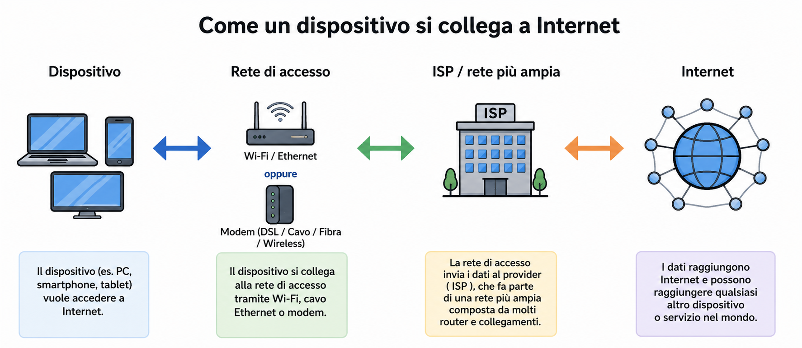
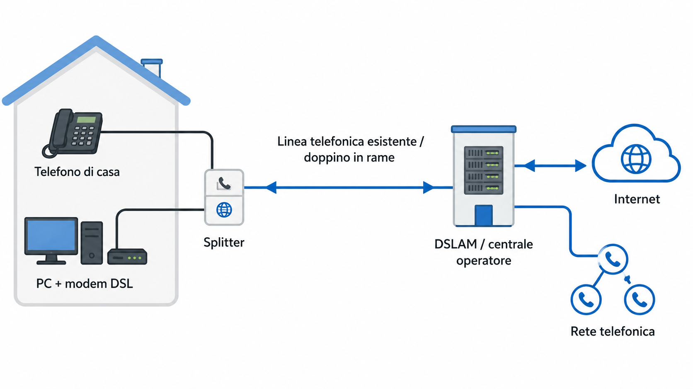
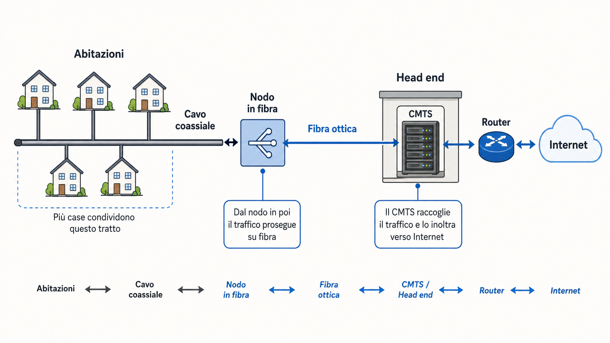
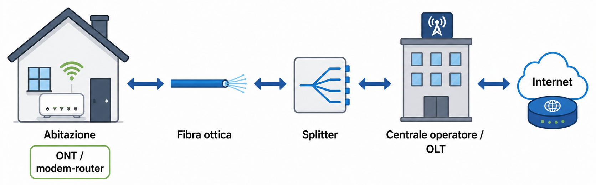
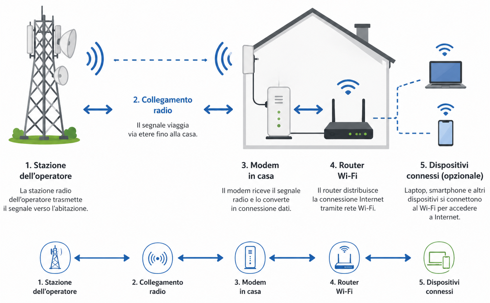
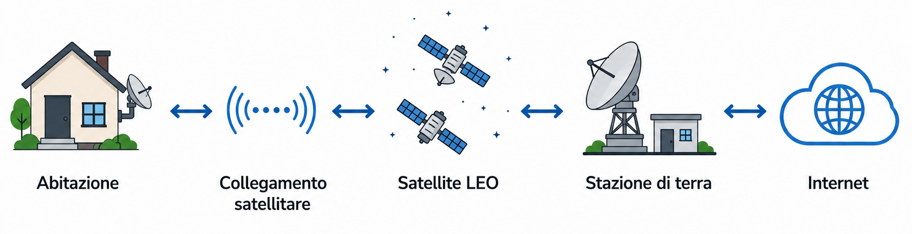
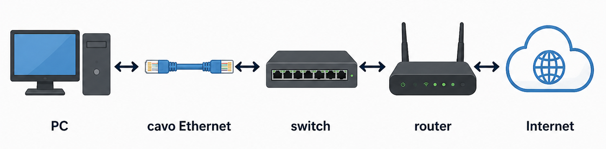
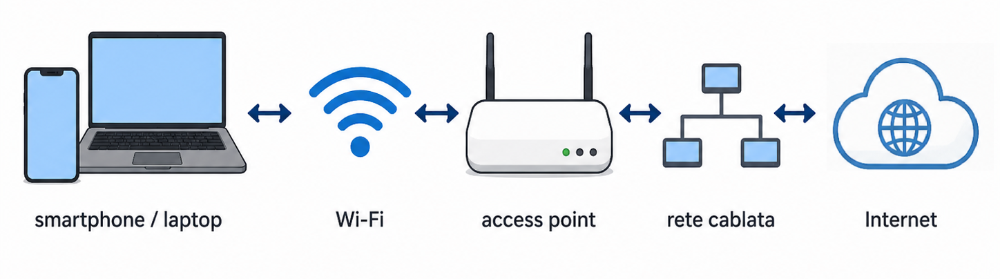
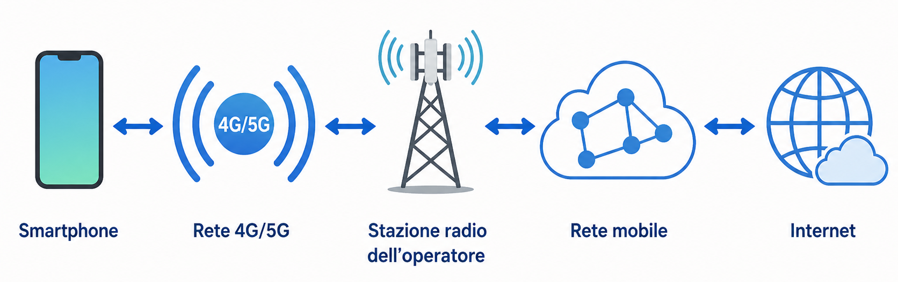
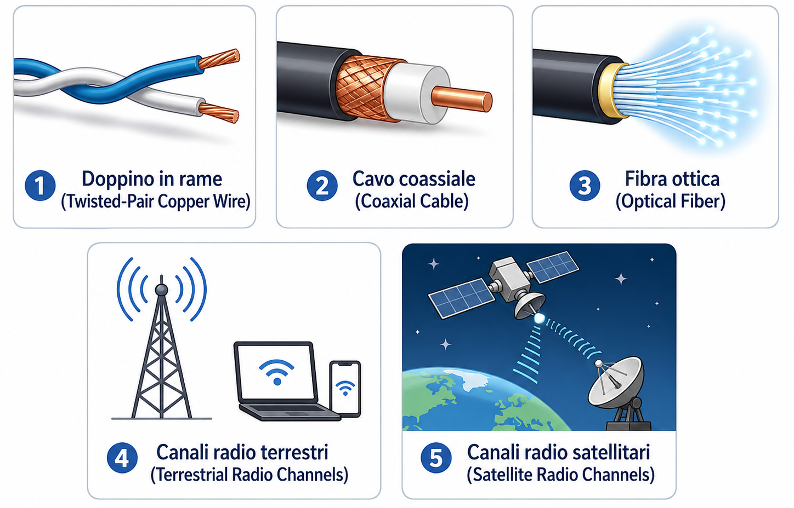

# Reti di accesso e mezzi di trasmissione

## A cosa serve una rete di accesso

Una rete di accesso è la parte della rete che collega un dispositivo, una casa, un’azienda o una rete locale al resto di Internet.

È il primo tratto del percorso: quello che permette a un dispositivo di entrare nella rete globale.

Esempi:

- connessione di casa, rete aziendale, rete Wi-Fi, rete mobile, collegamento satellitare, connessione di un data center

## Accesso domestico a Internet

Le connessioni domestiche possono usare tecnologie diverse:

### DSL (Digital Subscriber Line)

La DSL usa la linea telefonica esistente per trasportare sia il traffico telefonico sia i dati Internet.

I segnali telefonici e i dati Internet condividono lo stesso collegamento, ma usano frequenze diverse.

In casa, un modem DSL gestisce il collegamento con la rete dell’operatore.

Dal lato dell’operatore, il traffico viene raccolto da apparati dedicati e poi inoltrato verso Internet.

La DSL è spesso **asimmetrica**, cioè la velocità in download e quella in upload non sono uguali.

### Internet via cavo / HFC (Hybrid Fiber-Coaxial)

Internet via cavo usa l’infrastruttura della televisione via cavo.

Spesso combina fibra ottica e cavo coassiale.

Per questo viene chiamato **HFC**, cioè **Hybrid Fiber-Coaxial**.

Una caratteristica importante è che il mezzo può essere condiviso tra più utenti della stessa zona.

Se molti utenti usano intensamente la rete nello stesso momento, la velocità effettiva può diminuire.

### Fibra fino a casa / FTTH (Fiber to the Home)

FTTH significa **Fiber to the Home**.

In questo caso, la fibra ottica arriva direttamente fino all’abitazione.

È una delle soluzioni più veloci per l’accesso domestico, perché usa la fibra per gran parte, o per tutto, il percorso fino all’utente.

### Accesso wireless fisso / FWI (Fixed Wireless Internet)

L’accesso wireless fisso collega un’abitazione usando un collegamento radio tra una stazione dell’operatore e un modem in casa.

Non richiede di portare un cavo fisico fino all’abitazione.

> [!NOTE]
> In molti casi modem e router Wi-Fi sono integrati nello stesso dispositivo.

### Satelliti in orbita bassa / LEO (Low-Earth Orbit)

I satelliti LEO permettono l’accesso a Internet tramite satelliti in orbita bassa.

Sono utili soprattutto in zone rurali, isolate o difficili da raggiungere con cavi terrestri.

Rispetto ai satelliti geostazionari, hanno ritardi più bassi perché orbitano più vicino alla Terra.

## Accesso tramite rete locale

In case, aziende e università, i dispositivi spesso si collegano prima a una rete locale.

Esempi:

* Ethernet, Wi-Fi

### Ethernet

Ethernet usa normalmente cavi in rame per collegare dispositivi, switch e router all’interno di una rete locale.

È molto usata in reti aziendali, universitarie e domestiche.

### Wi-Fi

Il Wi-Fi permette ai dispositivi di collegarsi senza cavo a un access point.

L’access point è poi collegato alla rete cablata e, da lì, al resto di Internet.

Il Wi-Fi copre distanze limitate, tipicamente ambienti domestici, uffici, scuole, aeroporti o luoghi pubblici.

## Accesso mobile

Le reti mobili permettono a smartphone, tablet e altri dispositivi di collegarsi a Internet tramite stazioni radio dell’operatore.

A differenza del Wi-Fi, la copertura può arrivare a distanze molto maggiori.

Esempi:

* 4G, 5G

Queste reti permettono di usare Internet anche in movimento.

## Mezzi di trasmissione

I dati devono sempre viaggiare attraverso un mezzo di trasmissione.

I mezzi di trasmissione si dividono in due categorie principali:

* mezzi guidati
* mezzi non guidati

### Mezzi guidati (Guided Media)

Nei mezzi guidati, il segnale segue un supporto fisico preciso.

Esempi:

* doppino in rame, cavo coassiale, fibra ottica

### Mezzi non guidati (Unguided Media)

Nei mezzi non guidati, il segnale non segue un cavo fisico, ma viaggia nello spazio tramite onde radio.

Esempi:

* Wi-Fi, reti mobili, collegamenti satellitari

## Principali mezzi di trasmissione

### 1 - Doppino in rame (Twisted-Pair Copper Wire)

Il doppino in rame è formato da coppie di fili di rame intrecciati.

È stato usato a lungo nelle reti telefoniche ed è ancora molto usato nelle reti locali Ethernet.

L’intreccio dei fili aiuta a ridurre le interferenze elettriche.

### 2 - Cavo coassiale (Coaxial Cable)

Il cavo coassiale è usato soprattutto nelle reti televisive via cavo e in alcune forme di accesso Internet domestico.

Può trasportare segnali su frequenze diverse e supportare velocità elevate.

### 3 - Fibra ottica (Optical Fiber)

La fibra ottica trasporta impulsi luminosi.

È molto veloce, subisce poca attenuazione ed è adatta a collegamenti lunghi e ad alta capacità.

È molto usata nelle dorsali di rete, nei collegamenti tra grandi reti e nelle connessioni FTTH.

### 4 - Canali radio terrestri (Terrestrial Radio Channels)

I canali radio terrestri permettono comunicazioni senza fili tramite onde radio.

Sono usati in Wi-Fi, reti mobili, fixed wireless e altri sistemi radio.

Le prestazioni dipendono da distanza, ostacoli, interferenze e qualità del segnale.

### 5 - Canali radio satellitari (Satellite Radio Channels)

I canali radio satellitari usano satelliti per collegare dispositivi o reti sulla Terra.

Sono utili quando non è pratico portare infrastrutture terrestri.

Esempi:

* satelliti geostazionari, satelliti LEO

I satelliti geostazionari sono molto lontani e introducono più ritardo.

I satelliti LEO sono più vicini alla Terra e hanno ritardi più bassi.

